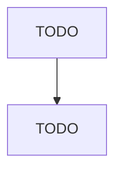

# Construction Machinery Manufacturing

> TODO: Business-as-Code definition

## Overview

This industry comprises establishments primarily engaged in manufacturing construction machinery, surface mining machinery, and logging equipment. Illustrative Examples: Backhoes manufacturing Bulldozers manufacturing Construction and surface mining-type rock drill bits manufacturing Construction-type tractors and attachments manufacturing Off-highway trucks manufacturing Pile-driving equipment manufacturing Portable crushing, pulverizing, and screening machinery manufacturing Powered post hole 

## Actors

| Actor | Description |
|-------|-------------|
| TODO | TODO |

## Roles

| Role | Description |
|------|-------------|
| TODO | TODO |

## Entities

| Entity | Description |
|--------|-------------|
| TODO | TODO |

## Actions

| Action | Description |
|--------|-------------|
| TODO | TODO |

## Events

| Event | Description |
|-------|-------------|
| TODO | TODO |

## Searches

| Search | Description |
|--------|-------------|
| TODO | TODO |

## Workflow

## Actor Relationships

