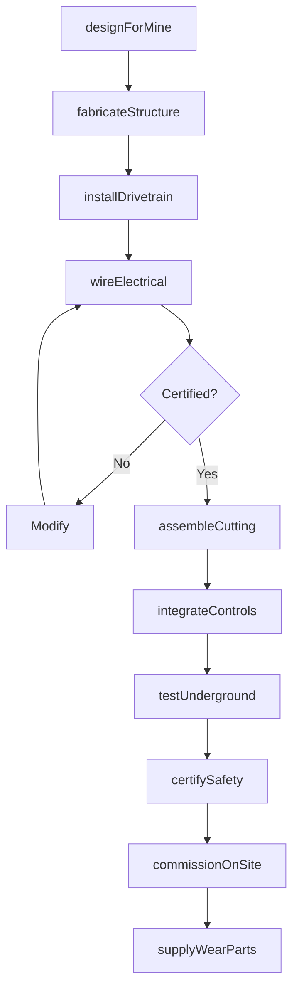
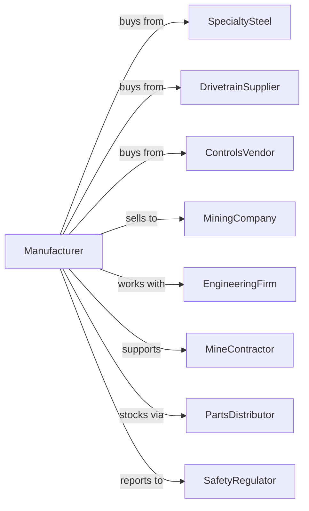

# Mining Machinery and Equipment Manufacturing

> Business-as-Code definition for mining machinery and equipment manufacturing operations. Models the complete production lifecycle from underground equipment design through mine site commissioning including mineral processing systems.

## Overview

Mining machinery and equipment manufacturing involves producing underground mining equipment including continuous miners, shuttle cars, longwall systems, and mineral beneficiation equipment. Operations coordinate with steel suppliers, electronics manufacturers, and global mining companies operating in harsh underground environments. This definition exposes actions for specialized equipment engineering, heavy fabrication, and mine site support with events for automation and searches for equipment performance analytics.

## Actors

| Actor | Description |
|-------|-------------|
| SpecialtySteel | Provides wear-resistant and high-strength alloys |
| DrivetrainSupplier | Supplies electric motors and variable frequency drives |
| ControlsVendor | Provides automation and safety interlock systems |
| MiningCompany | End customer operating mines |
| EngineeringFirm | Designs mine layouts and equipment specifications |
| MineContractor | Provides equipment operation and maintenance |
| SafetyRegulator | Oversees mine safety and equipment certification |
| PartsDistributor | Stocks wear parts and consumables near mines |

## Roles

| Role | Description |
|------|-------------|
| MiningEngineer | Designs equipment for underground conditions |
| ApplicationEngineer | Configures equipment to specific mine conditions |
| HeavyFabricator | Welds and assembles large structural components |
| ElectricalTechnician | Installs explosion-proof electrical systems |
| FieldServiceEngineer | Commissions and supports equipment at mines |
| WearPartsSpecialist | Manages consumable parts and rebuild programs |

## Entities

| Entity | Description |
|--------|-------------|
| Machine | Completed mining equipment unit |
| CuttingHead | Tool for breaking rock or coal |
| Conveyor | Material transport system |
| CrushingPlant | Ore size reduction equipment |
| ProcessingCircuit | Mineral separation and concentration system |
| ExplosionProofEnclosure | Certified electrical housing |
| WearLiner | Replaceable abrasion-resistant component |
| MineSpec | Customer requirements for specific mine |
| CommissioningPlan | Installation and startup procedure |
| RebuildKit | Parts package for major equipment overhaul |

## Actions

| Action | Description |
|--------|-------------|
| designForMine | Engineer equipment to specific mine conditions |
| fabricateStructure | Build heavy frames and housings |
| installDrivetrain | Mount motors and power transmission |
| wireElectrical | Install explosion-proof electrical systems |
| assembleCutting | Build rock and coal cutting heads |
| buildConveyor | Manufacture material handling systems |
| integrateControls | Program automation and safety systems |
| testUnderground | Validate operation in simulated conditions |
| certifySafety | Obtain regulatory approvals |
| commissionOnSite | Install and start up at mine |
| supplyWearParts | Provide replacement consumables |
| rebuildEquipment | Overhaul and refurbish used machines |

## Events

| Event | Description |
|-------|-------------|
| mineSpecReceived | Customer requirements documented |
| designCompleted | Engineering drawings released |
| structureFabricated | Major weldments completed |
| electricalCertified | Explosion-proof systems approved |
| machineAssembled | Unit completed in factory |
| safetyApproved | Regulatory certification granted |
| machineShipped | Equipment dispatched to mine |
| commissioningComplete | System operational underground |
| wearPartOrdered | Consumable requisitioned |
| rebuildScheduled | Major overhaul planned |

## Searches

| Search | Description |
|--------|-------------|
| getEquipmentStatus | Retrieve machine operating conditions |
| findWearPartInventory | Query consumables stock by location |
| getMineFleet | List equipment at specific mine |
| getProductionTonnage | Track material moved by equipment |
| findMaintenanceHistory | Get service records for machine |
| getRebuildSchedule | List planned equipment overhauls |
| getCuttingHeadLife | Track tool wear and replacement |
| getProcessingYield | Monitor mineral recovery rates |

## Workflow



## Actor Relationships



## Usage

### Calling Actions

```typescript
import { manufactureMiningMachinery } from '@headlessly/manufacture-mining-machinery'

const factory = manufactureMiningMachinery()

// Design continuous miner for specific seam
const miner = await factory.designForMine({
  type: 'continuous-miner',
  mineId: 'appalachian-coal-12',
  seamHeight: 60, // inches
  seamHardness: 'medium',
  methaneLevel: 'high',
  features: ['remote-operation', 'dust-suppression']
})

// Build with explosion-proof systems
await factory.wireElectrical({
  machineId: miner.id,
  voltage: 4160,
  enclosureRating: 'MSHA-approved',
  methaneMonitoring: true,
  autoShutdown: true
})

// Commission at mine site
await factory.commissionOnSite({
  machineId: miner.id,
  mineId: 'appalachian-coal-12',
  section: 'main-west',
  startupTeam: ['field-eng-042', 'field-eng-078'],
  trainingRequired: true
})
```

### Event-Driven Automation

```typescript
// Auto-replenish wear parts
factory.wearPartOrdered(async ({ mineId, partNumber, urgency }) => {
  const inventory = await factory.findWearPartInventory({
    mineId,
    partNumber
  })

  if (!inventory.localStock) {
    await factory.supplyWearParts({
      mineId,
      partNumber,
      quantity: getStandardOrder(partNumber),
      shipping: urgency === 'machine-down' ? 'air-freight' : 'ground'
    })
  }
})

// Schedule rebuilds based on hours
factory.rebuildScheduled(async ({ serialNumber, rebuildType }) => {
  const machine = await factory.getEquipmentStatus({ serialNumber })

  await factory.rebuildEquipment({
    serialNumber,
    rebuildType,
    location: machine.operatingHours > 20000 ? 'factory' : 'field',
    kitNumber: getRebuildKit(machine.model, rebuildType)
  })
})
```

## Related

- [Oil and Gas Field Machinery Manufacturing](./333132-OilAndGasFieldMachineryAndEquipmentManufacturing.mdx)
- [Construction Machinery Manufacturing](./333120-ConstructionMachineryManufacturing.mdx)
- [Conveyor Manufacturing](../3339-OtherGeneralPurposeMachineryManufacturing/333922-ConveyorAndConveyingEquipmentManufacturing.mdx)
