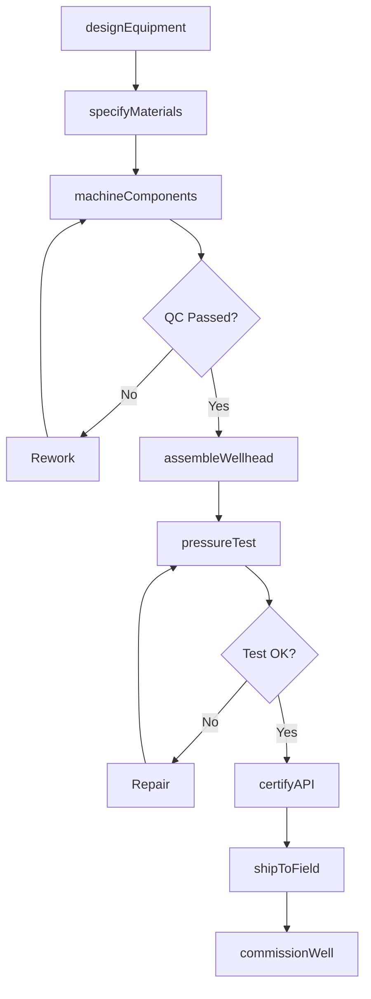
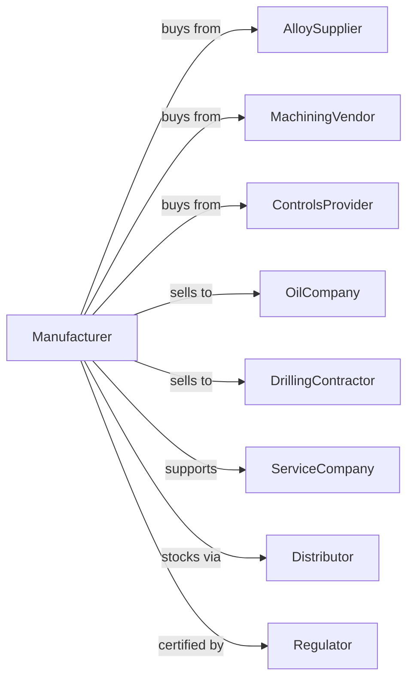

# Oil and Gas Field Machinery and Equipment Manufacturing

> Business-as-Code definition for oil and gas field machinery manufacturing operations. Models the complete production lifecycle from drilling equipment design through field commissioning including wellhead systems and production equipment.

## Overview

Oil and gas field machinery manufacturing involves producing drilling rigs, pumping units, wellhead equipment, and production machinery for upstream oil and gas operations. Operations coordinate with specialty steel suppliers, precision machining vendors, and global oil companies operating in challenging environments. This definition exposes actions for equipment engineering, API-certified manufacturing, and field service with events for automation and searches for equipment tracking analytics.

## Actors

| Actor | Description |
|-------|-------------|
| AlloySupplier | Provides corrosion-resistant and high-pressure alloys |
| MachiningVendor | Supplies precision-machined components |
| ControlsProvider | Provides SCADA and automation systems |
| OilCompany | Exploration and production customer |
| DrillingContractor | Operates drilling rigs under contract |
| ServiceCompany | Provides well services and equipment operation |
| Regulator | Oversees API standards and safety compliance |
| Distributor | Stocks equipment near oil field regions |

## Roles

| Role | Description |
|------|-------------|
| PetroleumEngineer | Designs equipment for well conditions |
| MetallurgicalEngineer | Specifies materials for corrosive environments |
| CNCMachinist | Produces precision wellhead components |
| AssemblyTechnician | Builds and tests equipment systems |
| FieldEngineer | Commissions equipment at well sites |
| QualityInspector | Verifies API compliance and testing |

## Entities

| Entity | Description |
|--------|-------------|
| DrillingRig | Complete well drilling system |
| Derrick | Tower structure for drilling operations |
| PumpJack | Surface pumping unit for oil wells |
| WellheadAssembly | Pressure control equipment at well surface |
| BlowoutPreventer | Emergency well control device |
| ChristmasTree | Production control valve assembly |
| Tubing | Downhole production pipe string |
| APISpec | Industry standard specification |
| PressureTest | Equipment integrity verification |
| FieldTicket | Service and installation record |

## Actions

| Action | Description |
|--------|-------------|
| designEquipment | Engineer systems for specific well conditions |
| specifyMaterials | Select alloys for pressure and corrosion |
| machineComponents | Produce precision-tolerance parts |
| assembleWellhead | Build pressure control assemblies |
| fabricateDerrick | Construct drilling rig structures |
| buildPumpUnit | Manufacture artificial lift equipment |
| pressureTest | Verify equipment integrity |
| certifyAPI | Obtain industry standard certification |
| shipToField | Transport equipment to well site |
| commissionWell | Install and start up at well |
| servicePumpJack | Maintain production equipment |
| rebuildEquipment | Overhaul used oilfield equipment |

## Events

| Event | Description |
|-------|-------------|
| wellSpecReceived | Customer requirements documented |
| designApproved | Engineering released for production |
| materialsCertified | Alloys verified to specification |
| componentsMachined | Precision parts completed |
| assemblyCompleted | Equipment built and ready |
| pressureTestPassed | Integrity verified to API standard |
| apiCertified | Standards compliance confirmed |
| equipmentShipped | Product dispatched to field |
| wellCommissioned | System operational at site |
| serviceCompleted | Maintenance performed |

## Searches

| Search | Description |
|--------|-------------|
| getEquipmentStatus | Retrieve product manufacturing progress |
| findFieldInventory | Query stock at regional locations |
| getWellHistory | List equipment installed at well |
| getPressureRecords | Retrieve test documentation |
| findCertifications | Get API compliance records |
| getServiceHistory | Track maintenance by serial number |
| findAvailableRigs | Query drilling equipment inventory |
| getProductionData | Monitor well output by equipment |

## Workflow



## Actor Relationships



## Usage

### Calling Actions

```typescript
import { manufactureOilGasFieldEquipment } from '@headlessly/manufacture-oil-gas-field-equipment'

const factory = manufactureOilGasFieldEquipment()

// Design wellhead for high-pressure gas well
const wellhead = await factory.designEquipment({
  type: 'wellhead-assembly',
  wellId: 'permian-lateral-47',
  pressure: 15000, // psi
  temperature: 350, // fahrenheit
  h2sContent: 'sour',
  features: ['dual-bore', 'tubing-hanger']
})

// Specify corrosion-resistant materials
await factory.specifyMaterials({
  equipmentId: wellhead.id,
  body: 'inconel-718',
  seals: 'aflas',
  bolting: 'b7m',
  coatings: 'tungsten-carbide'
})

// Pressure test to API specification
await factory.pressureTest({
  equipmentId: wellhead.id,
  testPressure: 22500, // 1.5x working
  holdTime: 15, // minutes
  medium: 'water',
  witnessRequired: true
})
```

### Event-Driven Automation

```typescript
// Auto-generate certifications
factory.pressureTestPassed(async ({ equipmentId, testPressure, testDate }) => {
  const equipment = await factory.getEquipmentStatus({ equipmentId })

  await factory.certifyAPI({
    equipmentId,
    specification: equipment.apiSpec,
    testRecords: [{ testPressure, testDate }],
    serialNumber: equipment.serialNumber
  })
})

// Proactive service scheduling
factory.wellCommissioned(async ({ wellId, equipmentIds, installDate }) => {
  for (const equipmentId of equipmentIds) {
    await scheduleService({
      equipmentId,
      wellId,
      serviceType: 'annual-inspection',
      dueDate: addYears(installDate, 1)
    })
  }
})
```

## Related

- [Mining Machinery Manufacturing](./333131-MiningMachineryAndEquipmentManufacturing.mdx)
- [Pump Manufacturing](../3339-OtherGeneralPurposeMachineryManufacturing/333914-MeasuringDispensingAndOtherPumpingEquipmentManufacturing.mdx)
- [Industrial Valve Manufacturing](../../332-FabricatedMetalProductManufacturing/3329-OtherFabricatedMetalProductManufacturing/332919-OtherMetalValveAndPipeFittingManufacturing.mdx)
