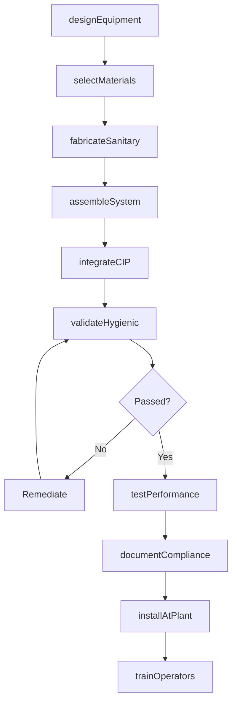
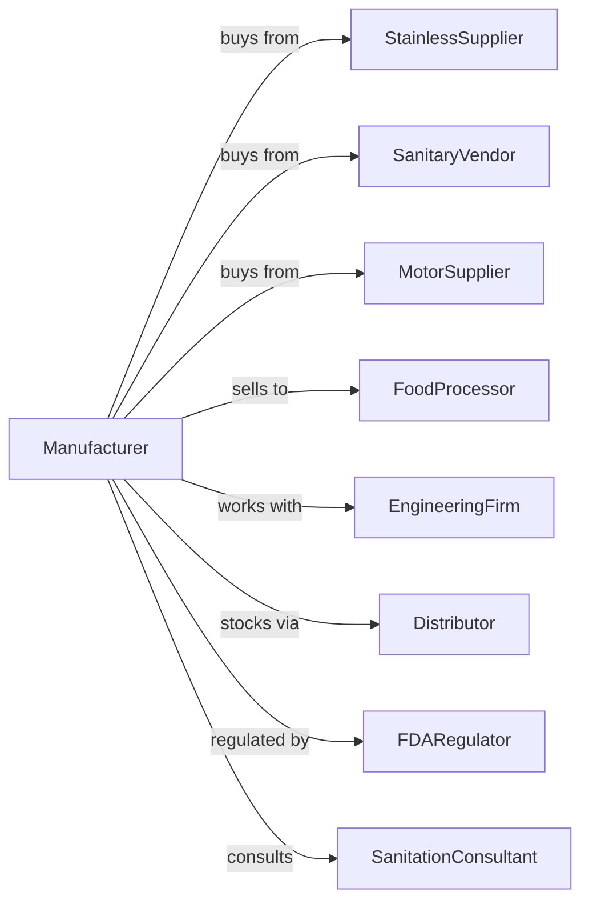

# Food Product Machinery Manufacturing

> Business-as-Code definition for food product machinery manufacturing operations. Models the complete production lifecycle from sanitary equipment design through food plant installation including FDA compliance and hygienic engineering.

## Overview

Food product machinery manufacturing involves producing equipment for food and beverage processing including mixers, pasteurizers, slicers, ovens, and packaging systems. Operations coordinate with stainless steel suppliers, sanitary component vendors, and food processors requiring FDA-compliant equipment. This definition exposes actions for hygienic equipment design, sanitary fabrication, and food plant integration with events for automation and searches for compliance analytics.

## Actors

| Actor | Description |
|-------|-------------|
| StainlessSupplier | Provides food-grade stainless steel and alloys |
| SanitaryVendor | Supplies pumps, valves, and fittings meeting 3-A standards |
| MotorSupplier | Provides washdown-rated motors and drives |
| FoodProcessor | End customer operating food manufacturing plants |
| EngineeringFirm | Designs food plant layouts and process flows |
| Distributor | Stocks equipment and replacement parts |
| FDARegulator | Oversees food safety and equipment compliance |
| SanitationConsultant | Advises on cleaning and sanitation protocols |

## Roles

| Role | Description |
|------|-------------|
| FoodEngineer | Designs equipment for food processing applications |
| SanitaryDesigner | Engineers hygienic surfaces and cleanability |
| WelderFabricator | Produces sanitary stainless steel weldments |
| AssemblyTechnician | Builds and tests food processing equipment |
| ValidationEngineer | Verifies equipment meets food safety standards |
| FieldServiceTech | Installs and maintains equipment at food plants |

## Entities

| Entity | Description |
|--------|-------------|
| Machine | Completed food processing equipment |
| SanitaryWeldment | Food-grade stainless fabrication |
| ProcessVessel | Tank or mixer for food processing |
| Conveyor | Food-grade material handling system |
| CleanInPlace | Automated cleaning system |
| ThreeAStandard | Sanitary equipment specification |
| ValidationProtocol | Food safety verification procedure |
| InstallationPlan | Plant integration documentation |
| SparePart | Replacement component for equipment |
| MaintenanceSchedule | Preventive service program |

## Actions

| Action | Description |
|--------|-------------|
| designEquipment | Engineer food processing machinery |
| selectMaterials | Specify food-grade alloys and finishes |
| fabricateSanitary | Weld and finish stainless components |
| assembleSystem | Build complete processing equipment |
| integrateCIP | Install clean-in-place systems |
| validateHygienic | Verify cleanability and food safety |
| testPerformance | Confirm processing capacity and quality |
| documentCompliance | Prepare FDA and regulatory documentation |
| installAtPlant | Set up equipment at food facility |
| trainOperators | Instruct on operation and sanitation |
| supplySpares | Provide replacement parts |
| performMaintenance | Execute preventive service |

## Events

| Event | Description |
|-------|-------------|
| designApproved | Equipment engineering completed |
| materialsVerified | Food-grade certifications confirmed |
| fabricationComplete | Sanitary weldments finished |
| systemAssembled | Equipment built and ready |
| hygienicValidated | Cleanability verified |
| performanceTested | Capacity and quality confirmed |
| complianceDocumented | Regulatory paperwork complete |
| equipmentInstalled | System operational at plant |
| operatorsTrained | Staff certified on equipment |
| maintenanceDue | Service interval reached |

## Searches

| Search | Description |
|--------|-------------|
| getEquipmentStatus | Retrieve manufacturing progress |
| findSanitaryCerts | Query food-grade material certifications |
| getValidationRecords | Retrieve hygienic test results |
| trackInstallations | Monitor equipment at customer sites |
| findSpareInventory | Query replacement parts stock |
| getMaintenanceSchedule | List upcoming service requirements |
| getComplianceHistory | Retrieve regulatory documentation |
| findProcessCapacity | Query equipment throughput specifications |

## Workflow



## Actor Relationships



## Usage

### Calling Actions

```typescript
import { manufactureFoodProcessingMachinery } from '@headlessly/manufacture-food-processing-machinery'

const factory = manufactureFoodProcessingMachinery()

// Design dairy pasteurization system
const pasteurizer = await factory.designEquipment({
  type: 'htst-pasteurizer',
  capacity: 5000, // gallons per hour
  product: 'milk',
  temperature: 161, // fahrenheit
  holdTime: 15, // seconds
  cip: true
})

// Specify sanitary materials
await factory.selectMaterials({
  equipmentId: pasteurizer.id,
  vessel: '316L-stainless',
  finish: '32-ra-electropolish',
  gaskets: 'epdm-fda',
  valves: '3a-sanitary'
})

// Validate hygienic design
await factory.validateHygienic({
  equipmentId: pasteurizer.id,
  tests: ['riboflavin', 'atp-swab', 'visual-inspection'],
  standard: '3-A-sanitary',
  witnessRequired: true
})
```

### Event-Driven Automation

```typescript
// Auto-generate compliance documentation
factory.hygienicValidated(async ({ equipmentId, testResults, standard }) => {
  await factory.documentCompliance({
    equipmentId,
    validationResults: testResults,
    standard,
    certificates: ['3-a-symbol', 'fda-fcn']
  })
})

// Schedule preventive maintenance
factory.maintenanceDue(async ({ equipmentId, serviceType, plantId }) => {
  const spares = await factory.findSpareInventory({
    equipmentId,
    serviceKit: serviceType
  })

  await factory.performMaintenance({
    equipmentId,
    plantId,
    serviceType,
    parts: spares.required,
    technician: 'assign-nearest'
  })
})
```

## Related

- [Packaging Machinery Manufacturing](../3339-OtherGeneralPurposeMachineryManufacturing/333993-PackagingMachineryManufacturing.mdx)
- [Industrial Process Furnace Manufacturing](../3339-OtherGeneralPurposeMachineryManufacturing/333994-IndustrialProcessFurnaceAndOvenManufacturing.mdx)
- [Conveyor Manufacturing](../3339-OtherGeneralPurposeMachineryManufacturing/333922-ConveyorAndConveyingEquipmentManufacturing.mdx)
