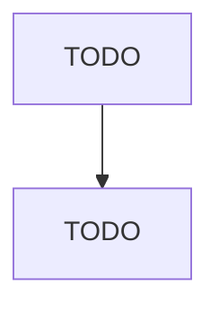

# Food Product Machinery Manufacturing

> TODO: Business-as-Code definition

## Overview

This U.S. industry comprises establishments primarily engaged in manufacturing food and beverage manufacturing-type machinery and equipment, such as dairy product plant machinery and equipment (e.g., homogenizers, pasteurizers, ice cream freezers), bakery machinery and equipment (e.g., dough mixers, bake ovens, pastry rolling machines), meat and poultry processing and preparation machinery, and other commercial food products machinery (e.g., slicers, choppers, and mixers). Cross-References. Esta

## Actors

| Actor | Description |
|-------|-------------|
| TODO | TODO |

## Roles

| Role | Description |
|------|-------------|
| TODO | TODO |

## Entities

| Entity | Description |
|--------|-------------|
| TODO | TODO |

## Actions

| Action | Description |
|--------|-------------|
| TODO | TODO |

## Events

| Event | Description |
|-------|-------------|
| TODO | TODO |

## Searches

| Search | Description |
|--------|-------------|
| TODO | TODO |

## Workflow

## Actor Relationships

