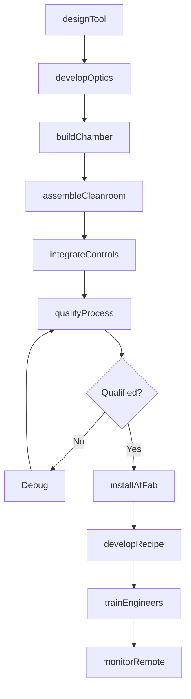
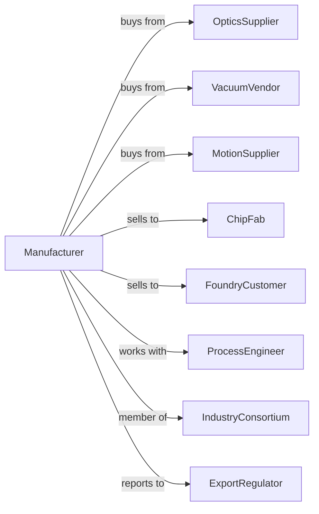

# Semiconductor Machinery Manufacturing

> Business-as-Code definition for semiconductor machinery manufacturing operations. Models the complete production lifecycle from wafer processing equipment design through fab installation including cleanroom integration and process qualification.

## Overview

Semiconductor machinery manufacturing involves producing wafer fabrication equipment including lithography systems, etch tools, deposition chambers, and inspection systems for chip manufacturing. Operations coordinate with precision optics suppliers, vacuum component vendors, and global chip fabs requiring nanometer-scale precision. This definition exposes actions for ultra-precision equipment engineering, cleanroom assembly, and fab integration with events for automation and searches for process analytics.

## Actors

| Actor | Description |
|-------|-------------|
| OpticsSupplier | Provides precision lenses and mirrors |
| VacuumVendor | Supplies chambers, pumps, and seals |
| MotionSupplier | Provides nanometer-precision stages and actuators |
| ChipFab | Semiconductor manufacturer operating fabs |
| FoundryCustomer | Contract chip manufacturer |
| ProcessEngineer | Develops recipes using equipment |
| IndustryConsortium | Sets semiconductor equipment standards |
| ExportRegulator | Controls technology export compliance |

## Roles

| Role | Description |
|------|-------------|
| SystemArchitect | Designs overall equipment architecture |
| OpticsEngineer | Develops precision optical subsystems |
| VacuumEngineer | Engineers process chamber and pumping |
| SoftwareEngineer | Develops equipment control software |
| CleanroomTech | Assembles equipment in controlled environment |
| ProcessAppEngineer | Qualifies equipment at customer fabs |

## Entities

| Entity | Description |
|--------|-------------|
| Tool | Completed semiconductor processing equipment |
| LithographySystem | Photomask pattern transfer equipment |
| EtchChamber | Plasma material removal system |
| DepositionTool | Thin film deposition equipment |
| InspectionSystem | Wafer defect detection equipment |
| ProcessRecipe | Equipment operating parameters |
| Cleanroom | Controlled manufacturing environment |
| Wafer | Silicon substrate processed by equipment |
| Qualification | Process capability verification |
| ServiceContract | Equipment maintenance agreement |

## Actions

| Action | Description |
|--------|-------------|
| designTool | Engineer semiconductor processing equipment |
| developOptics | Create precision optical subsystems |
| buildChamber | Fabricate vacuum process chambers |
| assembleCleanroom | Build equipment in controlled environment |
| integrateControls | Install automation and software |
| qualifyProcess | Verify equipment meets specifications |
| installAtFab | Set up equipment in customer cleanroom |
| developRecipe | Create process parameters for customer |
| trainEngineers | Certify customer staff on equipment |
| performService | Execute maintenance and upgrades |
| monitorRemote | Track equipment performance from factory |
| shipSpares | Provide replacement components |

## Events

| Event | Description |
|-------|-------------|
| designReleased | Equipment architecture finalized |
| opticsCompleted | Precision optical systems ready |
| chamberFabricated | Vacuum systems built |
| toolAssembled | Equipment completed in cleanroom |
| controlsIntegrated | Software and automation ready |
| processQualified | Equipment meets specifications |
| toolInstalled | Equipment operational at fab |
| recipeReleased | Process parameters qualified |
| serviceScheduled | Maintenance interval reached |
| alertDetected | Remote monitoring issue identified |

## Searches

| Search | Description |
|--------|-------------|
| getToolStatus | Retrieve equipment manufacturing progress |
| findInstalledBase | Query equipment at customer fabs |
| getProcessCapability | Retrieve qualification data |
| trackUptime | Monitor equipment availability |
| findServiceHistory | Get maintenance records |
| getRecipeLibrary | Retrieve qualified process parameters |
| monitorYield | Track wafer processing results |
| getSpareInventory | Query replacement parts stock |

## Workflow



## Actor Relationships



## Usage

### Calling Actions

```typescript
import { manufactureSemiconductorMachinery } from '@headlessly/manufacture-semiconductor-machinery'

const factory = manufactureSemiconductorMachinery()

// Design EUV lithography system
const lithography = await factory.designTool({
  type: 'euv-scanner',
  wavelength: 13.5, // nanometers
  resolution: 3, // nanometers
  throughput: 170, // wafers per hour
  overlay: 1.2 // nanometers
})

// Develop precision optics
await factory.developOptics({
  toolId: lithography.id,
  mirrorCount: 11,
  reflectivity: 0.70,
  aberrationBudget: 0.25, // nanometers rms
  contamControl: 'hydrogen-cleaning'
})

// Qualify at customer fab
await factory.qualifyProcess({
  toolId: lithography.id,
  fabId: 'tsmc-fab-18',
  node: '3nm',
  layers: ['metal-1', 'via-0', 'gate'],
  targetYield: 0.95
})
```

### Event-Driven Automation

```typescript
// Remote monitoring response
factory.alertDetected(async ({ toolId, alertType, fabId }) => {
  const tool = await factory.getToolStatus({ toolId })

  if (alertType === 'performance-drift') {
    await factory.performService({
      toolId,
      fabId,
      serviceType: 'calibration',
      priority: tool.wafersPending > 1000 ? 'emergency' : 'scheduled'
    })
  }
})

// Proactive spare parts
factory.serviceScheduled(async ({ toolId, serviceType, fabId }) => {
  const parts = await factory.getSpareInventory({
    toolId,
    serviceKit: serviceType
  })

  await factory.shipSpares({
    fabId,
    parts: parts.required,
    prePosition: true
  })
})
```

## Related

- [All Other Industrial Machinery Manufacturing](./333248-AllOtherIndustrialMachineryManufacturing.mdx)
- [Industrial Process Control Manufacturing](../../334-ComputerAndElectronicProductManufacturing/3345-NavigationalMeasuringElectromedicalAndControlInstrumentsManufacturing/334513-InstrumentsAndRelatedProductsManufacturingForMeasuringDisplayingAndControllingIndustrialProcessVariables.mdx)
- [Optical Instrument Manufacturing](../../333-MachineryManufacturing/3333-CommercialAndServiceIndustryMachineryManufacturing/333310-CommercialAndServiceIndustryMachineryManufacturing.mdx)
