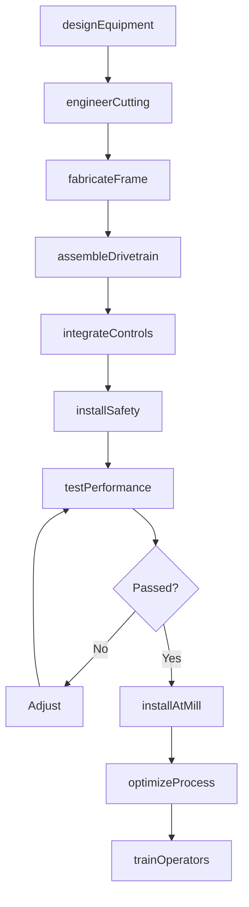
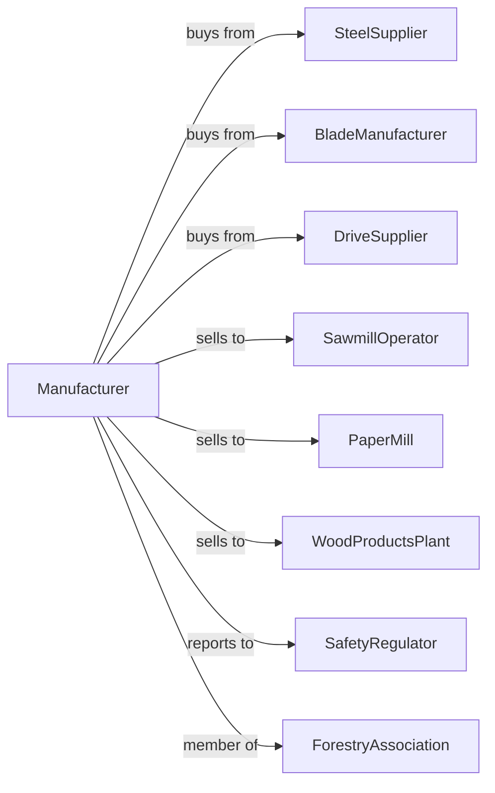

# Sawmill, Woodworking, and Paper Machinery Manufacturing

> Business-as-Code definition for sawmill, woodworking, and paper machinery manufacturing operations. Models the complete production lifecycle from industrial equipment design through mill installation including process optimization and safety systems.

## Overview

Sawmill, woodworking, and paper machinery manufacturing involves producing equipment for lumber processing, wood products manufacturing, and pulp and paper production. Operations coordinate with steel suppliers, blade manufacturers, and forest products companies requiring high-throughput processing equipment. This definition exposes actions for heavy equipment engineering, precision cutting systems, and mill integration with events for automation and searches for production analytics.

## Actors

| Actor | Description |
|-------|-------------|
| SteelSupplier | Provides structural steel and wear components |
| BladeManufacturer | Supplies saw blades, knives, and cutting tools |
| DriveSupplier | Provides motors, gearboxes, and variable drives |
| SawmillOperator | Lumber mill processing logs to boards |
| PaperMill | Pulp and paper manufacturing facility |
| WoodProductsPlant | Furniture and panel products manufacturer |
| SafetyRegulator | Oversees equipment safety standards |
| ForestryAssociation | Industry group setting best practices |

## Roles

| Role | Description |
|------|-------------|
| EquipmentEngineer | Designs sawmill and paper machinery |
| CuttingSpecialist | Engineers blade systems and cutting geometry |
| ControlsEngineer | Develops automation and optimization software |
| HeavyFabricator | Builds structural frames and housings |
| FieldEngineer | Installs and commissions equipment at mills |
| SafetyEngineer | Designs guarding and emergency stop systems |

## Entities

| Entity | Description |
|--------|-------------|
| Headrig | Primary log breakdown saw |
| Edger | Board width trimming machine |
| Planer | Surface finishing equipment |
| Debarker | Log bark removal machine |
| Chipper | Wood waste reduction equipment |
| PaperMachine | Pulp sheet forming and drying system |
| Pulper | Fiber preparation equipment |
| Coater | Paper surface treatment machine |
| BladeAssembly | Cutting tool and arbor system |
| ControlSystem | Process automation and optimization |

## Actions

| Action | Description |
|--------|-------------|
| designEquipment | Engineer sawmill or paper machinery |
| engineerCutting | Develop blade systems and geometry |
| fabricateFrame | Build structural machine components |
| assembleDrivetrain | Install motors and power transmission |
| integrateControls | Program automation and optimization |
| installSafety | Add guarding and emergency systems |
| testPerformance | Validate throughput and quality |
| installAtMill | Set up equipment at customer facility |
| optimizeProcess | Tune for maximum yield and efficiency |
| supplyBlades | Provide replacement cutting tools |
| performService | Execute maintenance and repairs |
| trainOperators | Certify staff on equipment operation |

## Events

| Event | Description |
|-------|-------------|
| designCompleted | Equipment engineering finalized |
| cuttingEngineered | Blade systems specified |
| frameFabricated | Structural components built |
| drivetrainAssembled | Power systems installed |
| controlsIntegrated | Automation programmed |
| safetyInstalled | Guarding and stops verified |
| performanceTested | Throughput and quality confirmed |
| equipmentInstalled | Machine operational at mill |
| processOptimized | Yield and efficiency maximized |
| bladeChangeRequired | Cutting tools need replacement |

## Searches

| Search | Description |
|--------|-------------|
| getEquipmentStatus | Retrieve manufacturing progress |
| findInstalledBase | Query equipment at customer mills |
| getProductionMetrics | Retrieve throughput and yield data |
| trackBladeLife | Monitor cutting tool wear |
| findServiceHistory | Get maintenance records |
| getOptimizationData | Retrieve process tuning parameters |
| getSafetyRecords | Query incident and compliance data |
| findSpareInventory | Check replacement parts stock |

## Workflow



## Actor Relationships



## Usage

### Calling Actions

```typescript
import { manufactureSawmillWoodworkingMachinery } from '@headlessly/manufacture-sawmill-woodworking-machinery'

const factory = manufactureSawmillWoodworkingMachinery()

// Design high-speed headrig for softwood
const headrig = await factory.designEquipment({
  type: 'curve-sawing-headrig',
  logDiameter: { min: 6, max: 36 }, // inches
  feedSpeed: 800, // feet per minute
  optimization: 'ct-scanning',
  shifts: 2
})

// Engineer cutting system
await factory.engineerCutting({
  equipmentId: headrig.id,
  bladeType: 'thin-kerf-carbide',
  bladeWidth: 0.065, // inches
  gulletDepth: 'deep',
  toothPattern: 'variable-pitch'
})

// Install at mill with optimization
await factory.installAtMill({
  equipmentId: headrig.id,
  millId: 'pacific-lumber-03',
  integration: ['log-scanner', 'board-tracker', 'plc-network'],
  startupSupport: '2-weeks'
})
```

### Event-Driven Automation

```typescript
// Auto-reorder blades
factory.bladeChangeRequired(async ({ equipmentId, bladeType, millId }) => {
  const inventory = await factory.findSpareInventory({
    millId,
    partType: bladeType
  })

  if (inventory.quantity < 2) {
    await factory.supplyBlades({
      millId,
      bladeType,
      quantity: 6,
      shipping: 'expedited'
    })
  }
})

// Production optimization alerts
factory.processOptimized(async ({ equipmentId, yieldImprovement }) => {
  if (yieldImprovement > 0.02) {
    await notifyMill({
      equipmentId,
      message: `Yield improved ${(yieldImprovement * 100).toFixed(1)}%`,
      parameters: await factory.getOptimizationData({ equipmentId })
    })
  }
})
```

## Related

- [All Other Industrial Machinery Manufacturing](./333248-AllOtherIndustrialMachineryManufacturing.mdx)
- [Conveyor Manufacturing](../3339-OtherGeneralPurposeMachineryManufacturing/333922-ConveyorAndConveyingEquipmentManufacturing.mdx)
- [Cutting Tool Manufacturing](../3335-MetalworkingMachineryManufacturing/333515-CuttingToolAndMachineToolAccessoryManufacturing.mdx)
