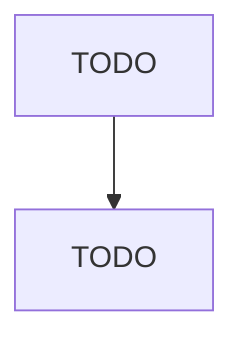

# Sawmill, Woodworking, and Paper Machinery Manufacturing

> TODO: Business-as-Code definition

## Overview

This U.S. industry comprises establishments primarily engaged in (1) manufacturing sawmill and woodworking machinery (except handheld), such as circular and band sawing equipment, planing machinery, and sanding machinery, and/or (2) manufacturing paper industry machinery for making paper and paper products, such as pulp making machinery, paper and paperboard making machinery, and paper and paperboard converting machinery. Cross-References. Establishments primarily engaged in--

## Actors

| Actor | Description |
|-------|-------------|
| TODO | TODO |

## Roles

| Role | Description |
|------|-------------|
| TODO | TODO |

## Entities

| Entity | Description |
|--------|-------------|
| TODO | TODO |

## Actions

| Action | Description |
|--------|-------------|
| TODO | TODO |

## Events

| Event | Description |
|-------|-------------|
| TODO | TODO |

## Searches

| Search | Description |
|--------|-------------|
| TODO | TODO |

## Workflow

## Actor Relationships

