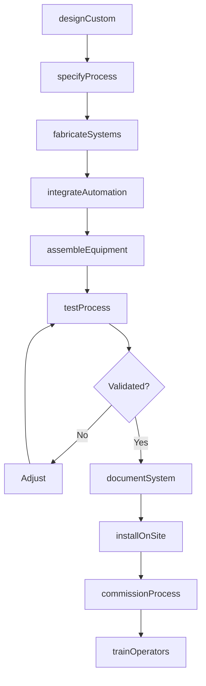
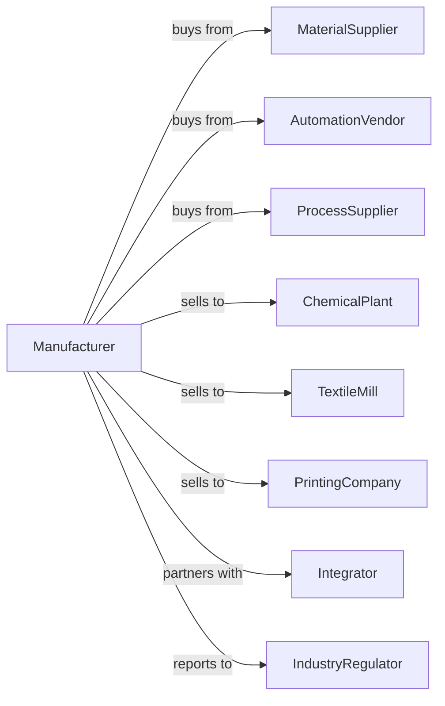

# All Other Industrial Machinery Manufacturing

> Business-as-Code definition for miscellaneous industrial machinery manufacturing operations. Models the complete production lifecycle from specialized equipment design through industrial installation including chemical processing, textile, printing, and additive manufacturing systems.

## Overview

All other industrial machinery manufacturing involves producing specialized equipment for chemical processing, textile production, printing, glass making, rubber processing, and additive manufacturing. Operations coordinate with specialty material suppliers, automation vendors, and diverse industrial customers requiring application-specific machinery. This definition exposes actions for custom equipment engineering, specialized fabrication, and industrial integration with events for automation and searches for application analytics.

## Actors

| Actor | Description |
|-------|-------------|
| MaterialSupplier | Provides specialty metals and polymers |
| AutomationVendor | Supplies robots, PLCs, and control systems |
| ProcessSupplier | Provides pumps, valves, and instrumentation |
| ChemicalPlant | Chemical processing facility customer |
| TextileMill | Fabric and fiber manufacturing customer |
| PrintingCompany | Commercial and industrial printing customer |
| Integrator | Systems integration and installation partner |
| IndustryRegulator | Oversees safety and environmental compliance |

## Roles

| Role | Description |
|------|-------------|
| ApplicationEngineer | Designs equipment for specific processes |
| ProcessEngineer | Develops operating parameters and recipes |
| MechanicalEngineer | Engineers structural and motion systems |
| ControlsEngineer | Programs automation and process control |
| ProjectManager | Coordinates custom equipment projects |
| FieldServiceEngineer | Installs and supports equipment on site |

## Entities

| Entity | Description |
|--------|-------------|
| ProcessMachine | Specialized industrial equipment |
| ChemicalReactor | Vessel for chemical processing |
| TextileLoom | Fabric weaving equipment |
| PrintingPress | Commercial printing machinery |
| AdditiveSystem | 3D printing and manufacturing equipment |
| ControlSystem | Process automation and monitoring |
| ProcessRecipe | Operating parameters for production |
| CustomSpec | Customer-specific requirements |
| InstallationPlan | Site preparation and integration plan |
| ServiceContract | Ongoing maintenance agreement |

## Actions

| Action | Description |
|--------|-------------|
| designCustom | Engineer application-specific equipment |
| specifyProcess | Define operating parameters and recipes |
| fabricateSystems | Build mechanical and structural components |
| integrateAutomation | Install controls and robotics |
| assembleEquipment | Build complete machinery systems |
| testProcess | Validate performance to specifications |
| documentSystem | Create operating and maintenance manuals |
| installOnSite | Set up equipment at customer facility |
| commissionProcess | Start up and optimize production |
| trainOperators | Certify staff on equipment operation |
| provideService | Execute maintenance and support |
| upgradeSystem | Enhance equipment with new capabilities |

## Events

| Event | Description |
|-------|-------------|
| specReceived | Customer requirements documented |
| designApproved | Engineering released for production |
| systemsFabricated | Mechanical components completed |
| automationIntegrated | Controls and robotics installed |
| equipmentAssembled | Machinery built and ready |
| processValidated | Performance meets specifications |
| documentationComplete | Manuals and procedures delivered |
| equipmentInstalled | System set up at customer site |
| processCommissioned | Production running to specification |
| serviceScheduled | Maintenance interval reached |

## Searches

| Search | Description |
|--------|-------------|
| getProjectStatus | Retrieve custom equipment progress |
| findInstalledBase | Query equipment by customer and type |
| getProcessData | Retrieve operating parameters and performance |
| trackProduction | Monitor customer output metrics |
| findServiceHistory | Get maintenance and repair records |
| getUpgradeOptions | List available enhancements |
| findApplications | Query equipment by industry and use |
| getComplianceRecords | Retrieve regulatory documentation |

## Workflow



## Actor Relationships



## Usage

### Calling Actions

```typescript
import { manufactureIndustrialMachinery } from '@headlessly/manufacture-industrial-machinery'

const factory = manufactureIndustrialMachinery()

// Design chemical reactor system
const reactor = await factory.designCustom({
  type: 'batch-reactor',
  application: 'pharmaceutical-api',
  volume: 5000, // liters
  pressure: 150, // psi
  temperature: { min: -20, max: 200 }, // celsius
  materials: 'hastelloy-c276'
})

// Specify process parameters
await factory.specifyProcess({
  equipmentId: reactor.id,
  recipes: [{
    name: 'hydrogenation-step-1',
    temperature: 80,
    pressure: 100,
    agitation: 200, // rpm
    duration: 240 // minutes
  }],
  safetyInterlocks: ['pressure-relief', 'emergency-cool', 'containment']
})

// Commission at customer site
await factory.commissionProcess({
  equipmentId: reactor.id,
  siteId: 'pharma-plant-east',
  validationRuns: 3,
  qualificationProtocol: 'iq-oq-pq',
  regulatoryWitness: true
})
```

### Event-Driven Automation

```typescript
// Production monitoring
factory.processCommissioned(async ({ equipmentId, siteId, processData }) => {
  await factory.trackProduction({
    equipmentId,
    siteId,
    metrics: ['throughput', 'quality', 'uptime'],
    alertThresholds: {
      uptimeMin: 0.95,
      qualityMin: 0.99
    }
  })
})

// Proactive service scheduling
factory.serviceScheduled(async ({ equipmentId, serviceType }) => {
  const equipment = await factory.getProjectStatus({ equipmentId })

  await factory.provideService({
    equipmentId,
    serviceType,
    scheduledDate: equipment.nextServiceDue,
    parts: getServiceKit(equipment.model, serviceType)
  })
})
```

## Related

- [Food Product Machinery Manufacturing](./333241-FoodProductMachineryManufacturing.mdx)
- [Semiconductor Machinery Manufacturing](./333242-SemiconductorMachineryManufacturing.mdx)
- [Packaging Machinery Manufacturing](../3339-OtherGeneralPurposeMachineryManufacturing/333993-PackagingMachineryManufacturing.mdx)
