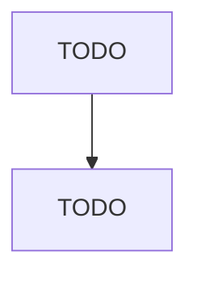

# All Other Industrial Machinery Manufacturing

> TODO: Business-as-Code definition

## Overview

This U.S. industry comprises establishments primarily engaged in manufacturing industrial machinery (except agricultural and farm-type; construction and mining machinery; food manufacturing-type machinery; semiconductor making machinery; and sawmill, woodworking, and paper making machinery). Illustrative Examples: Additive manufacturing machinery manufacturing Bookbinding machines manufacturing Chemical processing machinery and equipment manufacturing Cigarette making machinery manufacturing Gla

## Actors

| Actor | Description |
|-------|-------------|
| TODO | TODO |

## Roles

| Role | Description |
|------|-------------|
| TODO | TODO |

## Entities

| Entity | Description |
|--------|-------------|
| TODO | TODO |

## Actions

| Action | Description |
|--------|-------------|
| TODO | TODO |

## Events

| Event | Description |
|-------|-------------|
| TODO | TODO |

## Searches

| Search | Description |
|--------|-------------|
| TODO | TODO |

## Workflow

## Actor Relationships

