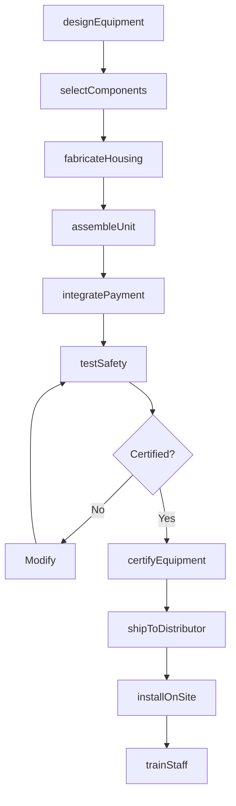
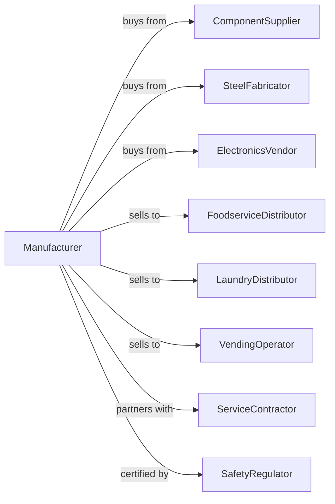

# Commercial and Service Industry Machinery Manufacturing

> Business-as-Code definition for commercial and service industry machinery manufacturing operations. Models the complete production lifecycle from equipment design through service installation including commercial kitchen, laundry, vending, and optical equipment.

## Overview

Commercial and service industry machinery manufacturing involves producing equipment for restaurants, laundries, vending operations, and service businesses including commercial cooking equipment, industrial laundry machines, vending systems, and optical instruments. Operations coordinate with component suppliers, foodservice distributors, and commercial equipment dealers serving hospitality and service industries. This definition exposes actions for commercial equipment engineering, production, and service channel distribution with events for automation and searches for market analytics.

## Actors

| Actor | Description |
|-------|-------------|
| ComponentSupplier | Provides motors, controls, and mechanical parts |
| SteelFabricator | Supplies stainless steel housings and frames |
| ElectronicsVendor | Provides control systems and payment systems |
| FoodserviceDistributor | Distributes restaurant and kitchen equipment |
| LaundryDistributor | Sells commercial laundry equipment |
| VendingOperator | Purchases and operates vending machines |
| ServiceContractor | Installs and maintains commercial equipment |
| SafetyRegulator | Oversees equipment safety certifications |

## Roles

| Role | Description |
|------|-------------|
| ProductEngineer | Designs commercial and service equipment |
| IndustrialDesigner | Creates equipment aesthetics and ergonomics |
| AssemblyTechnician | Builds commercial machinery |
| QualityInspector | Tests equipment for safety and performance |
| SalesEngineer | Supports distributor and customer applications |
| FieldServiceTech | Installs and repairs equipment on site |

## Entities

| Entity | Description |
|--------|-------------|
| CookingEquipment | Commercial ovens, fryers, and grills |
| LaundryMachine | Commercial washers, dryers, and folders |
| VendingMachine | Automated product dispensing equipment |
| OpticalInstrument | Precision optical equipment and lenses |
| PaymentSystem | Cashless and coin payment mechanisms |
| ControlPanel | Equipment operation and programming interface |
| SafetyCert | Equipment safety certification |
| ServiceManual | Installation and maintenance documentation |
| WarrantyProgram | Equipment coverage terms |
| SparePart | Replacement component |

## Actions

| Action | Description |
|--------|-------------|
| designEquipment | Engineer commercial machinery |
| selectComponents | Specify motors, controls, and materials |
| fabricateHousing | Build stainless enclosures and frames |
| assembleUnit | Build complete commercial equipment |
| integratePayment | Install cashless and coin systems |
| testSafety | Verify safety certifications |
| certifyEquipment | Obtain required safety listings |
| shipToDistributor | Deliver to distribution channels |
| installOnSite | Set up at customer location |
| trainStaff | Certify operators on equipment use |
| performService | Execute maintenance and repairs |
| manageWarranty | Process warranty claims |

## Events

| Event | Description |
|-------|-------------|
| designCompleted | Equipment engineering finalized |
| componentsReceived | Parts delivered for assembly |
| unitAssembled | Equipment built and ready |
| safetyTestPassed | Certification requirements met |
| equipmentCertified | Safety listings obtained |
| unitShipped | Equipment dispatched to distributor |
| equipmentInstalled | System operational at customer site |
| staffTrained | Operators certified |
| serviceScheduled | Maintenance interval reached |
| warrantyClaimFiled | Customer reported issue |

## Searches

| Search | Description |
|--------|-------------|
| getProductionStatus | Retrieve manufacturing progress |
| findDistributorInventory | Query stock at channel partners |
| getInstalledBase | List equipment by customer |
| trackServiceHistory | Get maintenance records |
| getWarrantyClaims | Retrieve claims by model |
| findSafetyRecords | Query certification documentation |
| getMarketTrends | Analyze demand by equipment type |
| findSpareInventory | Check replacement parts stock |

## Workflow



## Actor Relationships



## Usage

### Calling Actions

```typescript
import { manufactureCommercialServiceMachinery } from '@headlessly/manufacture-commercial-service-machinery'

const factory = manufactureCommercialServiceMachinery()

// Design commercial combi oven
const oven = await factory.designEquipment({
  type: 'combi-oven',
  capacity: '20-pan',
  modes: ['steam', 'convection', 'combination'],
  controls: 'touchscreen',
  connectivity: 'wifi-enabled'
})

// Integrate payment for vending machine
await factory.integratePayment({
  equipmentId: 'vm-snack-5000',
  paymentTypes: ['coin', 'bill', 'credit-card', 'mobile-pay'],
  telemetry: true,
  cashless: 'nayax'
})

// Install at customer site
await factory.installOnSite({
  equipmentId: oven.id,
  siteId: 'marriott-kitchen-456',
  services: ['gas', 'water', 'drain', 'electric'],
  startupDate: new Date('2024-06-15')
})
```

### Event-Driven Automation

```typescript
// Auto-process warranty claims
factory.warrantyClaimFiled(async ({ equipmentId, issueType, siteId }) => {
  const equipment = await factory.getInstalledBase({ equipmentId })

  if (equipment.warrantyExpiration > new Date()) {
    await factory.performService({
      equipmentId,
      siteId,
      serviceType: issueType,
      coverage: 'warranty',
      priority: 'standard'
    })
  }
})

// Proactive service scheduling
factory.serviceScheduled(async ({ equipmentId, serviceType }) => {
  const parts = await factory.findSpareInventory({
    equipmentId,
    serviceKit: serviceType
  })

  await factory.performService({
    equipmentId,
    serviceType,
    parts: parts.required,
    technicianAssignment: 'auto'
  })
})
```

## Related

- [Food Product Machinery Manufacturing](../3332-IndustrialMachineryManufacturing/333241-FoodProductMachineryManufacturing.mdx)
- [Air-Conditioning Equipment Manufacturing](../3334-VentilationHeatingAirConditioningAndCommercialRefrigerationEquipmentManufacturing/333415-AirConditioningAndWarmAirHeatingEquipmentAndCommercialAndIndustrialRefrigerationEquipmentManufacturing.mdx)
- [Commercial Refrigeration Equipment](../3334-VentilationHeatingAirConditioningAndCommercialRefrigerationEquipmentManufacturing/333415-AirConditioningAndWarmAirHeatingEquipmentAndCommercialAndIndustrialRefrigerationEquipmentManufacturing.mdx)
