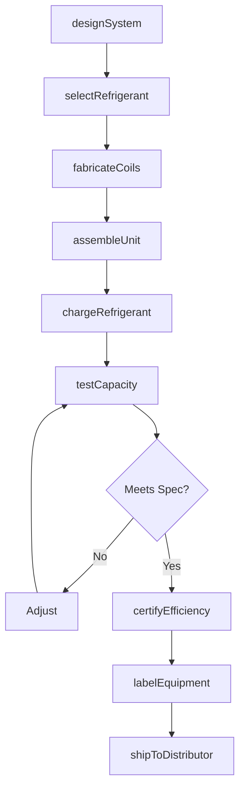
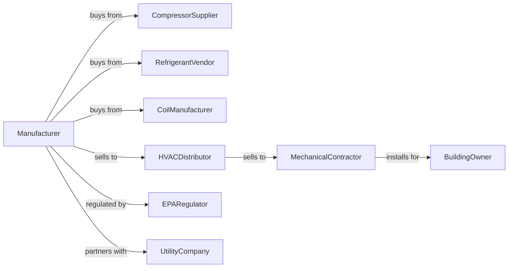

# Air-Conditioning and Warm Air Heating Equipment and Commercial and Industrial Refrigeration Equipment Manufacturing

> Business-as-Code definition for HVAC and refrigeration equipment manufacturing operations. Models the complete production lifecycle from system design through installation including residential and commercial air conditioning, furnaces, and industrial refrigeration systems.

## Overview

Air-conditioning, heating, and refrigeration equipment manufacturing involves producing HVAC systems including air conditioners, heat pumps, furnaces, and commercial refrigeration equipment. Operations coordinate with compressor suppliers, refrigerant vendors, and HVAC distributors serving contractors and building owners. This definition exposes actions for climate control equipment engineering, assembly, and distribution with events for automation and searches for energy efficiency analytics.

## Actors

| Actor | Description |
|-------|-------------|
| CompressorSupplier | Provides scroll, reciprocating, and screw compressors |
| RefrigerantVendor | Supplies R-410A, R-32, and other refrigerants |
| CoilManufacturer | Provides evaporator and condenser coils |
| HVACDistributor | Distributes equipment to contractors |
| MechanicalContractor | Installs HVAC and refrigeration systems |
| BuildingOwner | End customer operating climate-controlled facilities |
| EPARegulator | Oversees refrigerant handling and efficiency |
| UtilityCompany | Provides rebates for high-efficiency equipment |

## Roles

| Role | Description |
|------|-------------|
| SystemEngineer | Designs HVAC and refrigeration systems |
| RefrigerationEngineer | Develops refrigerant circuits and charge |
| ProductionTechnician | Assembles HVAC equipment |
| QualityInspector | Tests cooling capacity and efficiency |
| ApplicationEngineer | Supports contractor system design |
| ServiceTechnician | Diagnoses and repairs installed equipment |

## Entities

| Entity | Description |
|--------|-------------|
| AirConditioner | Cooling-only climate control unit |
| HeatPump | Reversible heating and cooling system |
| Furnace | Warm air heating appliance |
| Condenser | Heat rejection outdoor unit |
| AirHandler | Indoor air distribution unit |
| Compressor | Refrigerant compression component |
| Refrigerant | Heat transfer fluid |
| SEERRating | Cooling efficiency specification |
| RefrigerationUnit | Commercial cold storage equipment |
| WarrantyProgram | Equipment coverage terms |

## Actions

| Action | Description |
|--------|-------------|
| designSystem | Engineer HVAC or refrigeration equipment |
| selectRefrigerant | Choose heat transfer fluid |
| fabricateCoils | Build heat exchanger components |
| assembleUnit | Build complete HVAC equipment |
| chargeRefrigerant | Add and verify refrigerant charge |
| testCapacity | Verify cooling or heating output |
| certifyEfficiency | Document SEER, EER, and HSPF ratings |
| labelEquipment | Apply energy and safety labels |
| shipToDistributor | Deliver to distribution channel |
| supportApplication | Assist contractor system selection |
| provideService | Execute warranty and repairs |
| recycleRefrigerant | Recover and reclaim refrigerants |

## Events

| Event | Description |
|-------|-------------|
| designCompleted | System engineering finalized |
| refrigerantSelected | Heat transfer fluid specified |
| coilsFabricated | Heat exchangers built |
| unitAssembled | Equipment completed |
| refrigerantCharged | System charged and sealed |
| capacityVerified | Cooling or heating output confirmed |
| efficiencyCertified | Energy ratings documented |
| unitShipped | Equipment dispatched to distributor |
| systemInstalled | Equipment operational at building |
| serviceRequired | Maintenance or repair needed |

## Searches

| Search | Description |
|--------|-------------|
| getProductionStatus | Retrieve manufacturing progress |
| findDistributorInventory | Query stock at channel partners |
| getInstalledBase | List equipment by building |
| getEfficiencyRatings | Retrieve SEER and HSPF data |
| trackRefrigerantUsage | Monitor charge and recovery |
| getServiceHistory | Get maintenance records |
| findRebatePrograms | Query utility incentives |
| getWarrantyClaims | Retrieve claims by model |

## Workflow



## Actor Relationships



## Usage

### Calling Actions

```typescript
import { manufactureHVACRefrigerationEquipment } from '@headlessly/manufacture-hvac-refrigeration-equipment'

const factory = manufactureHVACRefrigerationEquipment()

// Design high-efficiency heat pump
const heatPump = await factory.designSystem({
  type: 'ducted-heat-pump',
  capacity: 48000, // btu/hr
  seer2: 20,
  hspf2: 10,
  refrigerant: 'r-410a',
  inverterDrive: true
})

// Select low-GWP refrigerant
await factory.selectRefrigerant({
  systemId: heatPump.id,
  refrigerant: 'r-32',
  charge: 8.5, // pounds
  gwp: 675
})

// Certify efficiency ratings
await factory.certifyEfficiency({
  systemId: heatPump.id,
  testLab: 'ahri-certified',
  ratings: {
    seer2: 20.5,
    eer2: 13.5,
    hspf2: 10.2
  },
  energyStarQualified: true
})
```

### Event-Driven Automation

```typescript
// Auto-notify utility rebates
factory.efficiencyCertified(async ({ systemId, seer2, energyStar }) => {
  if (energyStar) {
    const rebates = await factory.findRebatePrograms({
      efficiency: seer2,
      type: 'heat-pump'
    })

    await notifyDistributors({
      systemId,
      rebates,
      message: `Energy Star qualified - ${rebates.length} rebate programs available`
    })
  }
})

// Service scheduling
factory.serviceRequired(async ({ serialNumber, issueType, buildingId }) => {
  const equipment = await factory.getInstalledBase({ serialNumber })

  await factory.provideService({
    serialNumber,
    buildingId,
    serviceType: issueType,
    underWarranty: equipment.warrantyExpiration > new Date(),
    technicianAssignment: 'nearest-available'
  })
})
```

## Related

- [Heating Equipment Manufacturing](./333414-HeatingEquipmentExceptWarmAirFurnacesManufacturing.mdx)
- [Industrial Fan and Blower Manufacturing](./333413-IndustrialAndCommercialFanAndBlowerAndAirPurificationEquipmentManufacturing.mdx)
- [Commercial Service Industry Machinery Manufacturing](../3333-CommercialAndServiceIndustryMachineryManufacturing/333310-CommercialAndServiceIndustryMachineryManufacturing.mdx)
