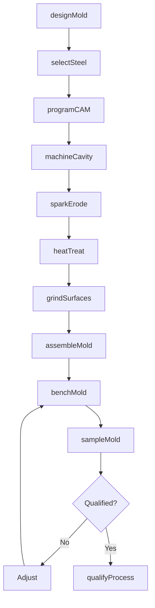
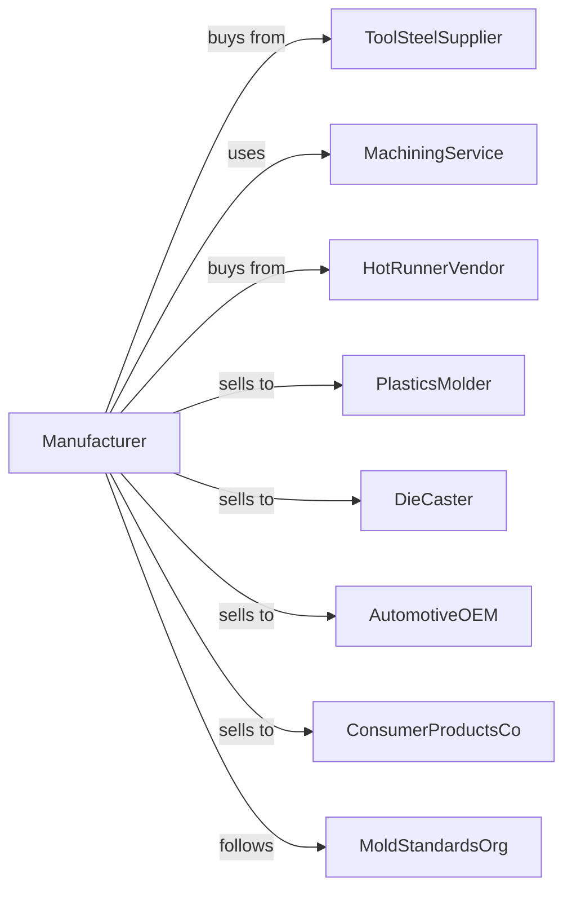

# Industrial Mold Manufacturing

> Business-as-Code definition for industrial mold manufacturing operations. Models the complete production lifecycle from mold design through qualification including injection molds, die cast tooling, and blow molds for plastics, metals, and glass.

## Overview

Industrial mold manufacturing involves producing precision tooling for injection molding, die casting, blow molding, and compression molding operations. Operations coordinate with tool steel suppliers, machining services, and manufacturers requiring custom molds for high-volume production. This definition exposes actions for mold engineering, precision machining, and process qualification with events for automation and searches for tooling performance analytics.

## Actors

| Actor | Description |
|-------|-------------|
| ToolSteelSupplier | Provides mold base and cavity steels |
| MachiningService | Supplies CNC machining and EDM services |
| HotRunnerVendor | Provides temperature control systems |
| PlasticsMolder | Customer operating injection molding |
| DieCaster | Customer producing metal castings |
| AutomotiveOEM | Automotive manufacturer requiring molds |
| ConsumerProductsCo | Consumer goods company needing tooling |
| MoldStandardsOrg | Sets mold classification and standards |

## Roles

| Role | Description |
|------|-------------|
| MoldDesigner | Engineers mold geometry and cooling |
| CAMProgrammer | Creates machining toolpaths |
| EDMTechnician | Operates electrical discharge machines |
| MoldMaker | Hand-fits and assembles mold components |
| QualityInspector | Measures and verifies mold dimensions |
| ProcessEngineer | Qualifies molds for production |

## Entities

| Entity | Description |
|--------|-------------|
| InjectionMold | Tooling for plastic injection molding |
| DieCastMold | Tooling for metal die casting |
| BlowMold | Tooling for blow molding bottles |
| MoldBase | Standard frame holding cavities |
| Cavity | Mold component forming part exterior |
| Core | Mold component forming part interior |
| HotRunner | Temperature-controlled material delivery |
| CoolingChannel | Mold temperature control passages |
| EjectorSystem | Part removal mechanism |
| MoldDrawing | Engineering specification document |

## Actions

| Action | Description |
|--------|-------------|
| designMold | Engineer cavity, core, and cooling |
| selectSteel | Choose appropriate tool steels |
| programCAM | Create CNC and EDM toolpaths |
| machineCavity | CNC mill mold components |
| sparkErode | EDM complex geometries |
| heatTreat | Harden tool steel components |
| grindSurfaces | Precision finish mating surfaces |
| assembleMold | Fit and assemble mold components |
| benchMold | Hand-fit and polish cavity surfaces |
| sampleMold | Run trial parts for qualification |
| qualifyProcess | Verify part quality and cycle time |
| maintainMold | Service and repair tooling |

## Events

| Event | Description |
|-------|-------------|
| designApproved | Mold engineering released |
| steelReceived | Tool steel delivered |
| machiningComplete | CNC operations finished |
| heatTreatComplete | Steel hardening finished |
| moldAssembled | Components fitted together |
| samplesProduced | Trial parts molded |
| moldQualified | Process validation complete |
| moldShipped | Tooling delivered to customer |
| maintenanceRequired | Service interval reached |
| cavityDamaged | Mold requires repair |

## Searches

| Search | Description |
|--------|-------------|
| getMoldStatus | Retrieve manufacturing progress |
| findMoldHistory | Query molds by customer and part |
| getShotCount | Track cycles run on mold |
| getQualityData | Retrieve sample part measurements |
| findMaintenanceRecords | Get service history |
| getCycleTimeData | Track molding performance |
| findMoldInventory | Query molds in storage |
| getRepairHistory | Retrieve damage and repair records |

## Workflow



## Actor Relationships



## Usage

### Calling Actions

```typescript
import { manufactureIndustrialMolds } from '@headlessly/manufacture-industrial-molds'

const moldshop = manufactureIndustrialMolds()

// Design multi-cavity injection mold
const mold = await moldshop.designMold({
  type: 'injection',
  cavities: 8,
  partNumber: 'bottle-cap-32mm',
  material: 'hdpe',
  cycleTime: 8, // seconds
  hotRunner: 'valve-gated'
})

// Select appropriate steels
await moldshop.selectSteel({
  moldId: mold.id,
  cavity: 'h13-hardened',
  core: 'h13-hardened',
  moldBase: 'p20',
  hardness: 52 // hrc
})

// Sample and qualify
await moldshop.sampleMold({
  moldId: mold.id,
  pressId: 'sample-press-300t',
  shots: 100,
  measurements: ['weight', 'dimensions', 'visual'],
  cpkTarget: 1.33
})
```

### Event-Driven Automation

```typescript
// Proactive maintenance scheduling
moldshop.maintenanceRequired(async ({ moldId, shotCount, interval }) => {
  await moldshop.maintainMold({
    moldId,
    serviceType: shotCount > interval * 2 ? 'major' : 'minor',
    tasks: ['clean', 'inspect', 'lubricate', 'measure-wear']
  })
})

// Damage response
moldshop.cavityDamaged(async ({ moldId, cavityNumber, damageType }) => {
  const mold = await moldshop.getMoldStatus({ moldId })

  await notifyCustomer({
    moldId,
    customer: mold.customerId,
    issue: damageType,
    estimatedRepairTime: getRepairEstimate(damageType),
    backupMoldAvailable: mold.hasBackup
  })
})
```

## Related

- [Special Die and Tool Manufacturing](./333514-SpecialDieAndToolDieSetJigAndFixtureManufacturing.mdx)
- [Machine Tool Manufacturing](./333517-MachineToolManufacturing.mdx)
- [Plastics Product Manufacturing](../../326-PlasticsAndRubberProductsManufacturing/3261-PlasticsProductManufacturing/326199-AllOtherPlasticsProductManufacturing.mdx)
