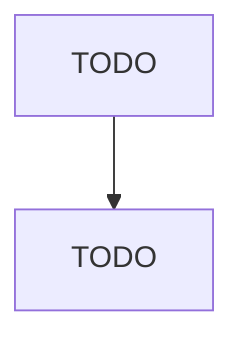

# Special Die and Tool, Die Set, Jig, and Fixture Manufacturing

> TODO: Business-as-Code definition

## Overview

This U.S. industry comprises establishments, known as tool and die shops, primarily engaged in manufacturing special tools and fixtures, such as cutting dies and jigs. Cross-References. Establishments primarily engaged in--

## Actors

| Actor | Description |
|-------|-------------|
| TODO | TODO |

## Roles

| Role | Description |
|------|-------------|
| TODO | TODO |

## Entities

| Entity | Description |
|--------|-------------|
| TODO | TODO |

## Actions

| Action | Description |
|--------|-------------|
| TODO | TODO |

## Events

| Event | Description |
|-------|-------------|
| TODO | TODO |

## Searches

| Search | Description |
|--------|-------------|
| TODO | TODO |

## Workflow

## Actor Relationships

