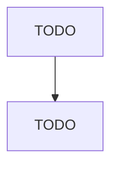

# Cutting Tool and Machine Tool Accessory Manufacturing

> TODO: Business-as-Code definition

## Overview

This U.S. industry comprises establishments primarily engaged in manufacturing accessories and attachments for metal cutting and metal forming machine tools. Illustrative Examples: Knives and bits for metalworking lathes, planers, and shapers manufacturing Measuring attachments (e.g., sine bars) for machine tool manufacturing Metalworking drill bits manufacturing Taps and dies (i.e., machine tool accessories) manufacturing Cross-References.

## Actors

| Actor | Description |
|-------|-------------|
| TODO | TODO |

## Roles

| Role | Description |
|------|-------------|
| TODO | TODO |

## Entities

| Entity | Description |
|--------|-------------|
| TODO | TODO |

## Actions

| Action | Description |
|--------|-------------|
| TODO | TODO |

## Events

| Event | Description |
|-------|-------------|
| TODO | TODO |

## Searches

| Search | Description |
|--------|-------------|
| TODO | TODO |

## Workflow

## Actor Relationships

