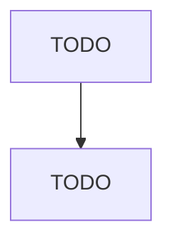

# Machine Tool Manufacturing

> TODO: Business-as-Code definition

## Overview

This U.S. industry comprises establishments primarily engaged in (1) manufacturing metal cutting machine tools (except handtools) and/or (2) manufacturing metal forming machine tools (except handtools), such as punching, sheering, bending, forming, pressing, forging and die-casting machines. Illustrative Examples: Bending and forming machines, metalworking, manufacturing Buffing and polishing machines, metalworking, manufacturing Drilling machines, metalworking, manufacturing Grinding machines, 

## Actors

| Actor | Description |
|-------|-------------|
| TODO | TODO |

## Roles

| Role | Description |
|------|-------------|
| TODO | TODO |

## Entities

| Entity | Description |
|--------|-------------|
| TODO | TODO |

## Actions

| Action | Description |
|--------|-------------|
| TODO | TODO |

## Events

| Event | Description |
|-------|-------------|
| TODO | TODO |

## Searches

| Search | Description |
|--------|-------------|
| TODO | TODO |

## Workflow

## Actor Relationships

