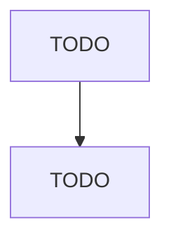

# Rolling Mill and Other Metalworking Machinery Manufacturing

> TODO: Business-as-Code definition

## Overview

This U.S. industry comprises establishments primarily engaged in manufacturing rolling mill machinery and equipment and/or other metalworking machinery (except industrial molds; special dies and tools, die sets, jigs, and fixtures; cutting tools and machine tool accessories; and machine tools). Illustrative Examples: Assembly machines (i.e., wire making equipment) manufacturing Cradle assembly machinery (i.e., wire making equipment) manufacturing Metalworking coil winding and cutting machinery m

## Actors

| Actor | Description |
|-------|-------------|
| TODO | TODO |

## Roles

| Role | Description |
|------|-------------|
| TODO | TODO |

## Entities

| Entity | Description |
|--------|-------------|
| TODO | TODO |

## Actions

| Action | Description |
|--------|-------------|
| TODO | TODO |

## Events

| Event | Description |
|-------|-------------|
| TODO | TODO |

## Searches

| Search | Description |
|--------|-------------|
| TODO | TODO |

## Workflow

## Actor Relationships

