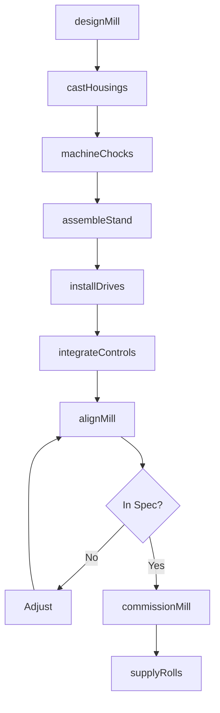
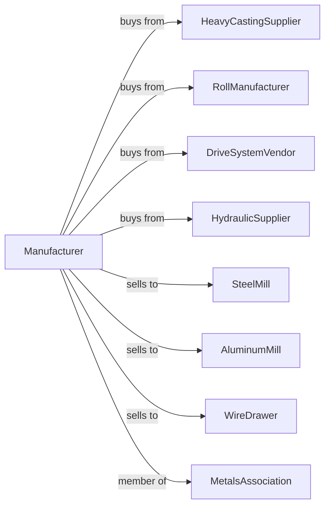

# Rolling Mill and Other Metalworking Machinery Manufacturing

> Business-as-Code definition for rolling mill and metalworking machinery manufacturing operations. Models the complete production lifecycle from heavy equipment design through steel mill installation including rolling mills, wire drawing equipment, and metal processing lines.

## Overview

Rolling mill and metalworking machinery manufacturing involves producing heavy equipment for steel and metals processing including hot and cold rolling mills, wire drawing machines, and coil processing lines. Operations coordinate with heavy casting suppliers, drive system vendors, and steel mills requiring production equipment for metals transformation. This definition exposes actions for heavy equipment engineering, precision assembly, and mill installation with events for automation and searches for production analytics.

## Actors

| Actor | Description |
|-------|-------------|
| HeavyCastingSupplier | Provides mill housings and roll chocks |
| RollManufacturer | Supplies work rolls and backup rolls |
| DriveSystemVendor | Provides motors, gearboxes, and controls |
| HydraulicSupplier | Supplies hydraulic systems and actuators |
| SteelMill | Primary metals producer customer |
| AluminumMill | Aluminum sheet and foil producer |
| WireDrawer | Wire and cable manufacturer |
| MetalsAssociation | Industry standards and trade organization |

## Roles

| Role | Description |
|------|-------------|
| MillEngineer | Designs rolling and processing equipment |
| MechanicalEngineer | Engineers drive trains and structures |
| ControlsEngineer | Develops automation and process control |
| HeavyAssembler | Builds large machinery assemblies |
| FieldEngineer | Installs and commissions mill equipment |
| ProcessEngineer | Optimizes rolling and processing |

## Entities

| Entity | Description |
|--------|-------------|
| RollingMill | Equipment for reducing metal thickness |
| HotMill | High-temperature rolling equipment |
| ColdMill | Room-temperature finishing mill |
| WireDrawingMachine | Equipment reducing wire diameter |
| CoilLine | Processing line for sheet metal coils |
| MillStand | Housing containing work rolls |
| WorkRoll | Roll contacting material being processed |
| BackupRoll | Support roll for work roll |
| AutomaticGaugeControl | Thickness control system |
| CoilBox | Hot strip coiling equipment |

## Actions

| Action | Description |
|--------|-------------|
| designMill | Engineer rolling or processing equipment |
| castHousings | Produce heavy structural castings |
| machineChocks | Precision machine roll bearings |
| assembleStand | Build mill stand with rolls |
| installDrives | Mount motors and gear systems |
| integrateControls | Program automation and gauge control |
| alignMill | Set roll gap and parallelism |
| commissionMill | Start up and optimize at customer |
| supplyRolls | Provide replacement work rolls |
| grindRolls | Resurface worn rolls |
| rebuildMill | Major overhaul of mill equipment |
| upgradeControls | Modernize automation systems |

## Events

| Event | Description |
|-------|-------------|
| designCompleted | Mill engineering approved |
| housingsReceived | Heavy castings delivered |
| chocksMachined | Precision bearing housings complete |
| standAssembled | Mill stand built |
| drivesInstalled | Power systems mounted |
| controlsIntegrated | Automation operational |
| millAligned | Roll settings verified |
| millCommissioned | Operating at customer site |
| rollChangeRequired | Work rolls need replacement |
| millOverhaulScheduled | Major rebuild planned |

## Searches

| Search | Description |
|--------|-------------|
| getMillStatus | Retrieve manufacturing progress |
| findInstalledMills | Query equipment by customer |
| getProductionTonnage | Track material processed |
| getRollWear | Monitor roll condition |
| findServiceHistory | Get maintenance records |
| getGaugeData | Retrieve thickness measurements |
| findRollInventory | Query spare rolls in stock |
| getMillUptime | Track availability metrics |

## Workflow



## Actor Relationships



## Usage

### Calling Actions

```typescript
import { manufactureRollingMillMachinery } from '@headlessly/manufacture-rolling-mill-machinery'

const factory = manufactureRollingMillMachinery()

// Design tandem cold rolling mill
const mill = await factory.designMill({
  type: 'tandem-cold-mill',
  stands: 5,
  entryGauge: 2.5, // mm
  exitGauge: 0.3, // mm
  stripWidth: 1850, // mm
  lineSpeed: 1500, // m/min
  material: 'automotive-sheet'
})

// Integrate controls
await factory.integrateControls({
  millId: mill.id,
  agc: 'hydraulic-gap-control',
  afc: 'automatic-flatness',
  tension: 'multi-zone',
  gaugeAccuracy: 0.001 // mm
})

// Commission at customer
await factory.commissionMill({
  millId: mill.id,
  customerId: 'midwest-steel-works',
  location: 'finishing-building',
  startupSupport: '12-weeks',
  performanceGuarantee: true
})
```

### Event-Driven Automation

```typescript
// Auto-schedule roll changes
factory.rollChangeRequired(async ({ millId, standNumber, wearLevel }) => {
  const rolls = await factory.findRollInventory({
    millId,
    standNumber
  })

  await factory.supplyRolls({
    millId,
    standNumber,
    rollSet: rolls.nextAvailable,
    changeWindow: wearLevel > 0.9 ? 'immediate' : 'next-coil-change'
  })
})

// Production optimization
factory.millCommissioned(async ({ millId, customerId }) => {
  await factory.getProductionTonnage({
    millId,
    customerId,
    metrics: ['thickness', 'flatness', 'speed', 'yield'],
    reportInterval: 'hourly'
  })
})
```

## Related

- [Machine Tool Manufacturing](./333517-MachineToolManufacturing.mdx)
- [Industrial Process Furnace Manufacturing](../3339-OtherGeneralPurposeMachineryManufacturing/333994-IndustrialProcessFurnaceAndOvenManufacturing.mdx)
- [Conveyor Manufacturing](../3339-OtherGeneralPurposeMachineryManufacturing/333922-ConveyorAndConveyingEquipmentManufacturing.mdx)
