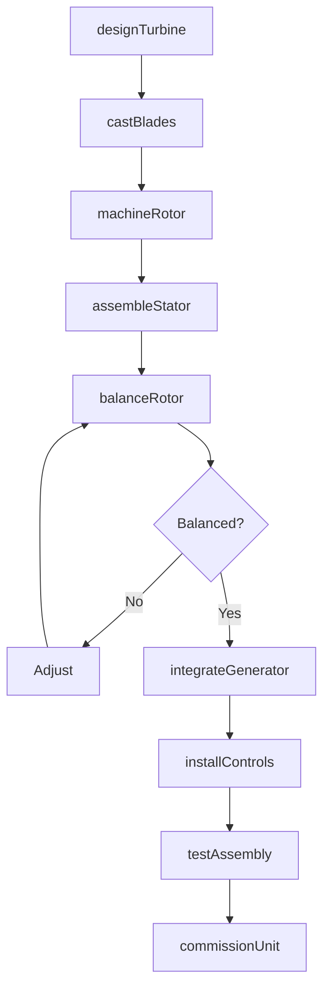
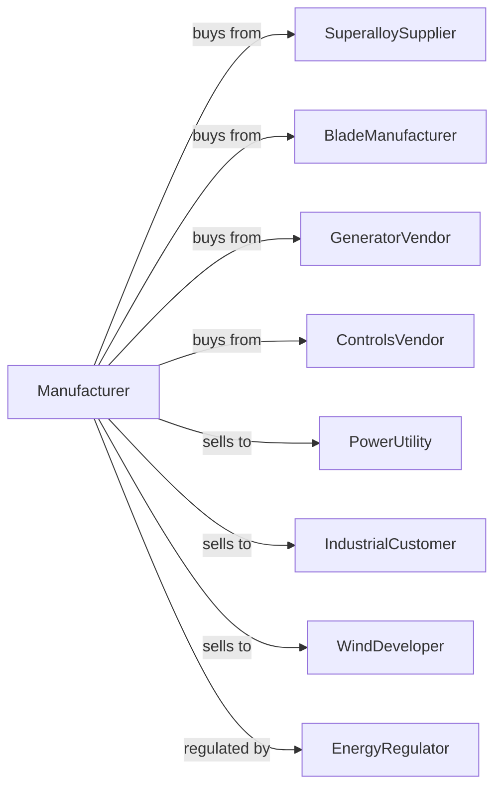

# Turbine and Turbine Generator Set Units Manufacturing

> Business-as-Code definition for turbine and generator manufacturing operations. Models the complete production lifecycle from turbine design through power plant commissioning including gas turbines, steam turbines, hydro turbines, and wind turbines.

## Overview

Turbine and turbine generator set manufacturing involves producing power generation equipment including gas turbines, steam turbines, hydraulic turbines, and wind turbines for utility-scale and industrial power generation. Operations coordinate with specialty alloy suppliers, precision machining services, and power utilities requiring reliable generating equipment. This definition exposes actions for turbine engineering, precision manufacturing, and power plant commissioning with events for automation and searches for performance analytics.

## Actors

| Actor | Description |
|-------|-------------|
| SuperalloySupplier | Provides high-temperature nickel and cobalt alloys |
| BladeManufacturer | Supplies precision turbine blades |
| GeneratorVendor | Provides electrical generators |
| ControlsVendor | Supplies turbine control systems |
| PowerUtility | Electric utility operating power plants |
| IndustrialCustomer | Industrial facility with cogeneration |
| WindDeveloper | Wind farm project developer |
| EnergyRegulator | Oversees power generation equipment |

## Roles

| Role | Description |
|------|-------------|
| TurbineEngineer | Designs turbine aerodynamics and thermodynamics |
| MaterialsEngineer | Specifies high-temperature alloys |
| MachiningSpecialist | Produces precision turbine components |
| AssemblyTechnician | Builds turbine and generator sets |
| FieldEngineer | Commissions equipment at power plants |
| PerformanceEngineer | Optimizes turbine efficiency |

## Entities

| Entity | Description |
|--------|-------------|
| GasTurbine | Combustion turbine for power generation |
| SteamTurbine | Steam-driven power generation turbine |
| HydroTurbine | Water-driven hydroelectric turbine |
| WindTurbine | Wind-powered generating system |
| Generator | Electrical power generation equipment |
| TurbineBlade | Rotating airfoil component |
| Rotor | Rotating turbine assembly |
| Stator | Stationary turbine housing |
| ControlSystem | Turbine operation and protection |
| HeatRecovery | Steam generator for combined cycle |

## Actions

| Action | Description |
|--------|-------------|
| designTurbine | Engineer aerodynamics and thermodynamics |
| castBlades | Produce precision turbine airfoils |
| machineRotor | Precision manufacture rotating assembly |
| assembleStator | Build stationary housing components |
| balanceRotor | Dynamically balance rotating assembly |
| integrateGenerator | Couple turbine to electrical generator |
| installControls | Program turbine operation systems |
| testAssembly | Factory test complete unit |
| shipToSite | Transport to power plant |
| commissionUnit | Start up and optimize at plant |
| performOverhaul | Major inspection and refurbishment |
| upgradeEfficiency | Implement performance improvements |

## Events

| Event | Description |
|-------|-------------|
| designApproved | Turbine engineering released |
| bladesCast | Airfoil components produced |
| rotorMachined | Rotating assembly completed |
| statorAssembled | Housing components built |
| rotorBalanced | Dynamic balance verified |
| generatorIntegrated | Electrical system coupled |
| controlsInstalled | Operation systems ready |
| factoryTestPassed | Assembly verified |
| unitCommissioned | Operating at power plant |
| overhaulScheduled | Major maintenance planned |

## Searches

| Search | Description |
|--------|-------------|
| getTurbineStatus | Retrieve manufacturing progress |
| findInstalledFleet | Query turbines by customer |
| getPerformanceData | Retrieve efficiency and output |
| trackOperatingHours | Monitor runtime |
| findMaintenanceHistory | Get service records |
| getBladeCondition | Monitor component wear |
| findOverhaulSchedule | Query planned maintenance |
| getEmissionsData | Retrieve environmental performance |

## Workflow



## Actor Relationships



## Usage

### Calling Actions

```typescript
import { manufactureTurbinesGenerators } from '@headlessly/manufacture-turbines-generators'

const factory = manufactureTurbinesGenerators()

// Design combined cycle gas turbine
const turbine = await factory.designTurbine({
  type: 'heavy-duty-gas',
  output: 340, // MW
  efficiency: 43, // percent simple cycle
  firingTemp: 1600, // celsius
  emissions: 'dry-low-nox'
})

// Cast single-crystal blades
await factory.castBlades({
  turbineId: turbine.id,
  material: 'single-crystal-superalloy',
  coating: 'thermal-barrier',
  cooling: 'film-cooled',
  stages: 4
})

// Commission at power plant
await factory.commissionUnit({
  turbineId: turbine.id,
  plantId: 'riverside-cc-2',
  configuration: 'combined-cycle-2x1',
  startupSupport: '8-weeks',
  performanceTest: true
})
```

### Event-Driven Automation

```typescript
// Schedule major overhauls
factory.overhaulScheduled(async ({ turbineId, operatingHours, interval }) => {
  const turbine = await factory.getTurbineStatus({ turbineId })

  await factory.performOverhaul({
    turbineId,
    overhaulType: operatingHours > interval * 2 ? 'major' : 'hot-gas-path',
    outageWindow: '4-weeks',
    partsPrePosition: true
  })
})

// Performance monitoring
factory.unitCommissioned(async ({ turbineId, plantId }) => {
  await factory.getPerformanceData({
    turbineId,
    plantId,
    metrics: ['output', 'heat-rate', 'emissions', 'availability'],
    reportInterval: 'hourly'
  })
})
```

## Related

- [Speed Changer and Gear Manufacturing](./333612-SpeedChangerIndustrialHighSpeedDriveAndGearManufacturing.mdx)
- [Other Engine Equipment Manufacturing](./333618-OtherEngineEquipmentManufacturing.mdx)
- [Air and Gas Compressor Manufacturing](../3339-OtherGeneralPurposeMachineryManufacturing/333912-AirAndGasCompressorManufacturing.mdx)
