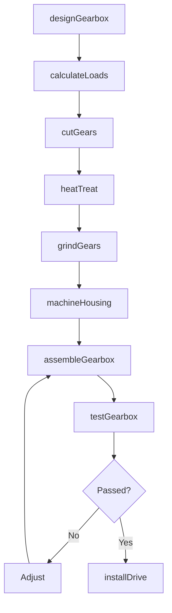
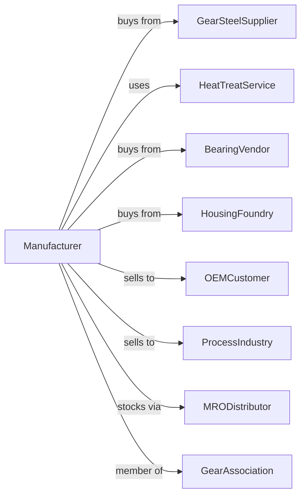

# Speed Changer, Industrial High-Speed Drive, and Gear Manufacturing

> Business-as-Code definition for speed changer and gear manufacturing operations. Models the complete production lifecycle from gearbox design through industrial installation including speed reducers, increasers, and precision gear sets.

## Overview

Speed changer and gear manufacturing involves producing industrial gearboxes, speed reducers, increasers, and precision gear sets for power transmission applications. Operations coordinate with gear steel suppliers, heat treatment services, and industrial equipment manufacturers requiring reliable torque multiplication and speed conversion. This definition exposes actions for gear engineering, precision tooth cutting, and gearbox assembly with events for automation and searches for performance analytics.

## Actors

| Actor | Description |
|-------|-------------|
| GearSteelSupplier | Provides alloy steels for gear blanks |
| HeatTreatService | Provides carburizing and hardening |
| BearingVendor | Supplies precision bearings and seals |
| HousingFoundry | Provides gearbox castings |
| OEMCustomer | Equipment manufacturer requiring drives |
| ProcessIndustry | Continuous process plant customer |
| MRODistributor | Stocks replacement gearboxes |
| GearAssociation | Industry standards organization |

## Roles

| Role | Description |
|------|-------------|
| GearEngineer | Designs gear geometry and gearboxes |
| MetallurgistEngineer | Specifies materials and heat treatment |
| GearCutter | Operates hobbing and grinding machines |
| AssemblyTechnician | Builds and tests gearboxes |
| ApplicationEngineer | Selects gearboxes for customer needs |
| FieldServiceEngineer | Installs and maintains equipment |

## Entities

| Entity | Description |
|--------|-------------|
| SpeedReducer | Gearbox reducing input speed |
| SpeedIncreaser | Gearbox increasing input speed |
| GearSet | Mating gear pair or train |
| HelicalGear | Angled-tooth precision gear |
| BevelGear | Angular power transmission gear |
| PlanetaryGear | Compact epicyclic gear system |
| GearboxHousing | Enclosure containing gear train |
| Bearing | Shaft support and alignment |
| Seal | Oil retention and contamination prevention |
| Lubricant | Gear and bearing lubrication |

## Actions

| Action | Description |
|--------|-------------|
| designGearbox | Engineer gear ratios and housing |
| calculateLoads | Analyze torque and stress |
| cutGears | Hob or shape gear teeth |
| heatTreat | Carburize and harden gears |
| grindGears | Precision finish tooth profiles |
| machineHousing | Produce gearbox enclosure |
| assembleGearbox | Build complete gear unit |
| testGearbox | Verify performance and noise |
| selectGearbox | Choose unit for application |
| installDrive | Set up at customer facility |
| monitorCondition | Track vibration and temperature |
| rebuildGearbox | Overhaul worn unit |

## Events

| Event | Description |
|-------|-------------|
| designApproved | Gearbox engineering released |
| gearsCut | Teeth machined |
| heatTreatComplete | Hardening finished |
| gearsGround | Precision finishing done |
| housingMachined | Enclosure produced |
| gearboxAssembled | Unit built |
| testPassed | Performance verified |
| gearboxShipped | Delivered to customer |
| driveInstalled | Operational at facility |
| conditionAlert | Vibration or temperature warning |

## Searches

| Search | Description |
|--------|-------------|
| getGearboxStatus | Retrieve manufacturing progress |
| findByApplication | Query gearboxes by use case |
| getTestData | Retrieve performance measurements |
| trackInstalledBase | Monitor gearboxes by customer |
| findServiceHistory | Get maintenance records |
| getConditionData | Retrieve vibration and temperature |
| findReplacementUnits | Query stock for upgrades |
| getEfficiencyData | Retrieve power transmission losses |

## Workflow



## Actor Relationships



## Usage

### Calling Actions

```typescript
import { manufactureSpeedChangersGears } from '@headlessly/manufacture-speed-changers-gears'

const factory = manufactureSpeedChangersGears()

// Design helical gear reducer
const gearbox = await factory.designGearbox({
  type: 'parallel-shaft-helical',
  ratio: 25,
  inputSpeed: 1800, // rpm
  outputTorque: 50000, // lb-ft
  serviceClass: 'continuous-24hr',
  environment: 'outdoor-industrial'
})

// Cut and heat treat gears
await factory.cutGears({
  gearboxId: gearbox.id,
  process: 'hobbing',
  material: '4320-alloy',
  toothForm: 'involute'
})

await factory.heatTreat({
  gearboxId: gearbox.id,
  process: 'carburize-and-quench',
  caseDepth: 0.040, // inches
  coreHardness: 32, // hrc
  surfaceHardness: 60 // hrc
})
```

### Event-Driven Automation

```typescript
// Condition-based maintenance
factory.conditionAlert(async ({ gearboxId, alertType, severity }) => {
  if (severity === 'critical') {
    await factory.rebuildGearbox({
      gearboxId,
      priority: 'emergency',
      spareUnit: await findSpareGearbox(gearboxId)
    })
  } else {
    await scheduleInspection({
      gearboxId,
      alertType,
      timeframe: severity === 'warning' ? '30-days' : '90-days'
    })
  }
})

// Performance tracking
factory.driveInstalled(async ({ gearboxId, customerId, applicationId }) => {
  await factory.monitorCondition({
    gearboxId,
    customerId,
    metrics: ['vibration', 'temperature', 'oil-analysis'],
    alertThresholds: getThresholds(applicationId)
  })
})
```

## Related

- [Turbine Manufacturing](./333611-TurbineAndTurbineGeneratorSetUnitsManufacturing.mdx)
- [Mechanical Power Transmission Manufacturing](./333613-MechanicalPowerTransmissionEquipmentManufacturing.mdx)
- [Pump Manufacturing](../3339-OtherGeneralPurposeMachineryManufacturing/333914-MeasuringDispensingAndOtherPumpingEquipmentManufacturing.mdx)
