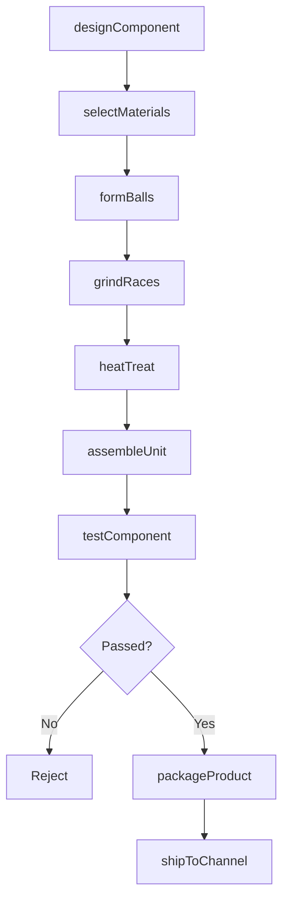
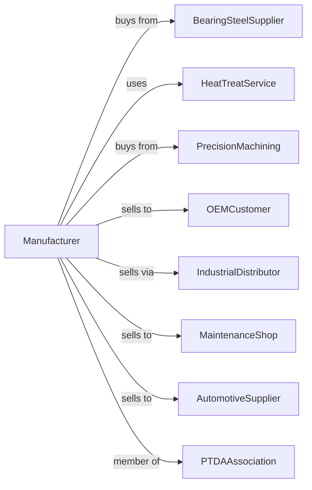

# Mechanical Power Transmission Equipment Manufacturing

> Business-as-Code definition for mechanical power transmission equipment manufacturing operations. Models the complete production lifecycle from component design through distribution including bearings, couplings, clutches, and drive chains.

## Overview

Mechanical power transmission equipment manufacturing involves producing components for transferring rotational power including bearings, couplings, clutches, joints, and roller chains. Operations coordinate with steel suppliers, heat treatment services, and industrial distributors serving OEMs and maintenance operations. This definition exposes actions for precision component engineering, manufacturing, and distribution channel management with events for automation and searches for application analytics.

## Actors

| Actor | Description |
|-------|-------------|
| BearingSteelSupplier | Provides high-carbon chrome bearing steel |
| HeatTreatService | Provides hardening and tempering |
| PrecisionMachining | Supplies precision-machined components |
| OEMCustomer | Equipment manufacturer integrating components |
| IndustrialDistributor | Stocks components for MRO market |
| MaintenanceShop | Facility replacing worn components |
| AutomotiveSupplier | Automotive drivetrain customer |
| PTDAAssociation | Power transmission distributors association |

## Roles

| Role | Description |
|------|-------------|
| BearingEngineer | Designs bearing geometry and materials |
| ApplicationEngineer | Selects components for customer needs |
| GrindingTechnician | Produces precision bearing races |
| AssemblyWorker | Builds bearing and coupling assemblies |
| QualityInspector | Verifies component specifications |
| TechnicalSalesRep | Supports distributor and OEM accounts |

## Entities

| Entity | Description |
|--------|-------------|
| BallBearing | Rolling element bearing with balls |
| RollerBearing | Rolling element bearing with rollers |
| PlainBearing | Sliding contact bearing |
| Coupling | Shaft connection component |
| Clutch | Engagement and disengagement device |
| UniversalJoint | Angular power transmission joint |
| DriveChain | Roller chain for power transmission |
| Sprocket | Chain engagement wheel |
| Seal | Bearing protection component |
| Lubricant | Bearing and chain lubrication |

## Actions

| Action | Description |
|--------|-------------|
| designComponent | Engineer bearing or coupling |
| selectMaterials | Choose steels and coatings |
| formBalls | Produce precision bearing balls |
| grindRaces | Precision finish bearing races |
| heatTreat | Harden bearing components |
| assembleUnit | Build bearing or coupling assembly |
| testComponent | Verify performance and life |
| packageProduct | Prepare for distribution |
| selectApplication | Choose components for use case |
| shipToChannel | Deliver to distributors |
| analyzeFailure | Investigate returned components |
| upgradeDesign | Improve component performance |

## Events

| Event | Description |
|-------|-------------|
| designReleased | Component engineering approved |
| materialsReceived | Steel delivered |
| componentsFormed | Balls or rollers produced |
| racesGround | Precision surfaces finished |
| unitAssembled | Bearing or coupling built |
| testPassed | Performance verified |
| productPackaged | Ready for shipment |
| productShipped | Delivered to channel |
| failureReported | Component returned for analysis |
| designUpgraded | Improvement released |

## Searches

| Search | Description |
|--------|-------------|
| findByApplication | Query components by use case |
| getInventoryLevels | Check stock by location |
| getPerformanceData | Retrieve test and field data |
| trackFailures | Monitor warranty returns |
| findDistributorStock | Query channel inventory |
| getApplicationHistory | Retrieve customer usage |
| findUpgrades | Query improved replacements |
| getLifeData | Retrieve bearing life calculations |

## Workflow



## Actor Relationships



## Usage

### Calling Actions

```typescript
import { manufacturePowerTransmissionEquipment } from '@headlessly/manufacture-power-transmission-equipment'

const factory = manufacturePowerTransmissionEquipment()

// Design spherical roller bearing
const bearing = await factory.designComponent({
  type: 'spherical-roller',
  bore: 120, // mm
  od: 215, // mm
  width: 58, // mm
  load: 'heavy-shock',
  speed: 1200, // rpm
  misalignment: 2 // degrees
})

// Select materials
await factory.selectMaterials({
  componentId: bearing.id,
  innerRace: '52100-chrome-steel',
  outerRace: '52100-chrome-steel',
  rollers: '52100-chrome-steel',
  cage: 'machined-brass',
  seals: 'nitrile-rubber'
})

// Test bearing performance
await factory.testComponent({
  componentId: bearing.id,
  tests: ['life-test', 'noise-test', 'load-rating'],
  loadCycles: 1000000,
  speedTest: 1500 // rpm
})
```

### Event-Driven Automation

```typescript
// Failure analysis workflow
factory.failureReported(async ({ componentId, customerId, failureMode }) => {
  const analysis = await factory.analyzeFailure({
    componentId,
    customerId,
    failureMode,
    rootCause: 'investigate'
  })

  if (analysis.designRelated) {
    await factory.upgradeDesign({
      componentId,
      improvement: analysis.recommendation,
      affectedCustomers: await findAffectedCustomers(componentId)
    })
  }
})

// Inventory replenishment
factory.productShipped(async ({ productId, distributorId, quantity }) => {
  const inventory = await factory.getInventoryLevels({ productId })

  if (inventory.total < inventory.reorderPoint) {
    await scheduleProduction({
      productId,
      quantity: inventory.economicOrderQuantity
    })
  }
})
```

## Related

- [Speed Changer and Gear Manufacturing](./333612-SpeedChangerIndustrialHighSpeedDriveAndGearManufacturing.mdx)
- [Other Engine Equipment Manufacturing](./333618-OtherEngineEquipmentManufacturing.mdx)
- [Fluid Power Pump and Motor Manufacturing](../3339-OtherGeneralPurposeMachineryManufacturing/333996-FluidPowerPumpAndMotorManufacturing.mdx)
