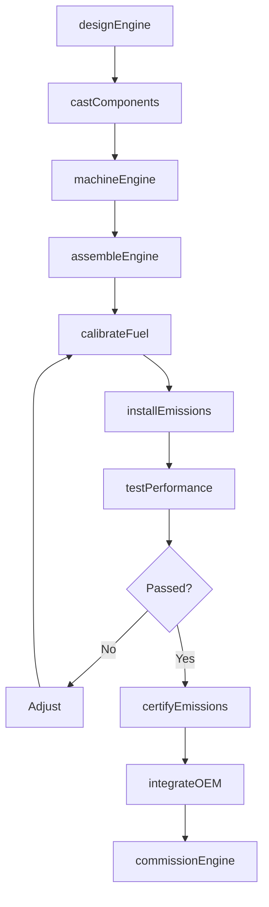
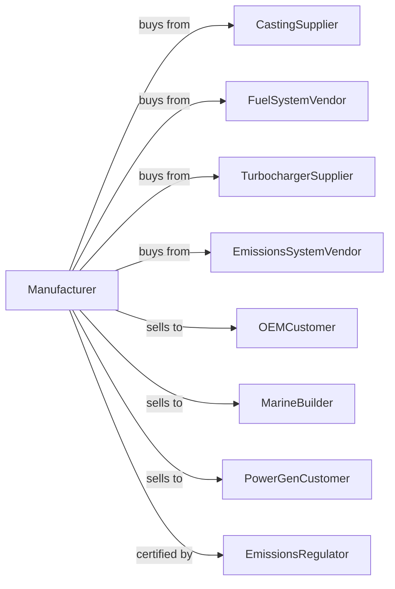

# Other Engine Equipment Manufacturing

> Business-as-Code definition for industrial engine equipment manufacturing operations. Models the complete production lifecycle from engine design through installation including diesel engines, natural gas engines, and marine propulsion systems.

## Overview

Other engine equipment manufacturing involves producing internal combustion engines for industrial, marine, and stationary power applications including diesel engines, natural gas engines, and locomotive engines. Operations coordinate with component suppliers, fuel system vendors, and OEMs requiring reliable prime movers for equipment and power generation. This definition exposes actions for engine engineering, assembly, and field service with events for automation and searches for performance analytics.

## Actors

| Actor | Description |
|-------|-------------|
| CastingSupplier | Provides engine blocks and heads |
| FuelSystemVendor | Supplies injectors and fuel systems |
| TurbochargerSupplier | Provides forced induction systems |
| EmissionsSystemVendor | Supplies aftertreatment systems |
| OEMCustomer | Equipment manufacturer integrating engines |
| MarineBuilder | Shipyard or boat manufacturer |
| PowerGenCustomer | Generator set manufacturer |
| EmissionsRegulator | Oversees engine emissions compliance |

## Roles

| Role | Description |
|------|-------------|
| EngineEngineer | Designs engine systems and components |
| CombustionEngineer | Develops fuel and combustion systems |
| AssemblyTechnician | Builds engines on production line |
| TestCellOperator | Tests engines for performance |
| ApplicationEngineer | Integrates engines into customer equipment |
| FieldServiceEngineer | Maintains and repairs installed engines |

## Entities

| Entity | Description |
|--------|-------------|
| DieselEngine | Compression ignition engine |
| NaturalGasEngine | Spark ignition gas-fueled engine |
| MarineEngine | Propulsion engine for vessels |
| LocomotiveEngine | Railroad motive power engine |
| EngineBlock | Main structural casting |
| CylinderHead | Combustion chamber top |
| FuelInjector | Precision fuel delivery device |
| Turbocharger | Exhaust-driven air compressor |
| Aftertreatment | Emissions control system |
| EngineControl | Electronic management unit |

## Actions

| Action | Description |
|--------|-------------|
| designEngine | Engineer combustion and systems |
| castComponents | Produce blocks and heads |
| machineEngine | Precision finish critical surfaces |
| assembleEngine | Build complete engine |
| calibrateFuel | Program injection and timing |
| installEmissions | Add aftertreatment systems |
| testPerformance | Verify power and emissions |
| certifyEmissions | Obtain regulatory approval |
| integrateOEM | Support customer installation |
| commissionEngine | Start up at end application |
| performService | Execute maintenance |
| rebuildEngine | Major overhaul of used unit |

## Events

| Event | Description |
|-------|-------------|
| designReleased | Engine engineering approved |
| componentsCast | Blocks and heads produced |
| engineMachined | Critical surfaces finished |
| engineAssembled | Unit built |
| fuelCalibrated | Injection programmed |
| emissionsInstalled | Aftertreatment added |
| performanceTested | Power and emissions verified |
| emissionsCertified | Regulatory approval obtained |
| engineShipped | Delivered to customer |
| engineCommissioned | Operating in application |

## Searches

| Search | Description |
|--------|-------------|
| getEngineStatus | Retrieve manufacturing progress |
| findByApplication | Query engines by use case |
| getTestData | Retrieve performance measurements |
| trackInstalledBase | Monitor engines by customer |
| findServiceHistory | Get maintenance records |
| getEmissionsData | Retrieve compliance records |
| findRebuildCandidates | Query engines for overhaul |
| getFuelConsumption | Track efficiency metrics |

## Workflow



## Actor Relationships



## Usage

### Calling Actions

```typescript
import { manufactureEngineEquipment } from '@headlessly/manufacture-engine-equipment'

const factory = manufactureEngineEquipment()

// Design heavy-duty diesel engine
const engine = await factory.designEngine({
  type: 'diesel-inline-6',
  displacement: 15, // liters
  power: 600, // hp
  torque: 1850, // lb-ft
  application: 'off-highway',
  emissions: 'tier-4-final'
})

// Calibrate fuel system
await factory.calibrateFuel({
  engineId: engine.id,
  injectionSystem: 'common-rail',
  pressure: 2400, // bar
  timing: 'electronic-variable',
  maps: ['power', 'economy', 'low-idle']
})

// Certify emissions compliance
await factory.certifyEmissions({
  engineId: engine.id,
  standard: 'epa-tier-4-final',
  aftertreatment: ['doc', 'dpf', 'scr'],
  testCycle: 'nrtc'
})
```

### Event-Driven Automation

```typescript
// Proactive service scheduling
factory.engineCommissioned(async ({ engineId, customerId, operatingHours }) => {
  await scheduleService({
    engineId,
    customerId,
    intervals: [
      { hours: 500, type: 'first-service' },
      { hours: 2000, type: 'major-service' },
      { hours: 10000, type: 'top-end-overhaul' }
    ]
  })
})

// Emissions compliance monitoring
factory.emissionsCertified(async ({ engineId, standard, expirationDate }) => {
  await factory.trackInstalledBase({
    engineId,
    complianceMonitoring: true,
    alertBefore: 90, // days before expiration
    standard
  })
})
```

## Related

- [Turbine Manufacturing](./333611-TurbineAndTurbineGeneratorSetUnitsManufacturing.mdx)
- [Speed Changer and Gear Manufacturing](./333612-SpeedChangerIndustrialHighSpeedDriveAndGearManufacturing.mdx)
- [Air and Gas Compressor Manufacturing](../3339-OtherGeneralPurposeMachineryManufacturing/333912-AirAndGasCompressorManufacturing.mdx)
