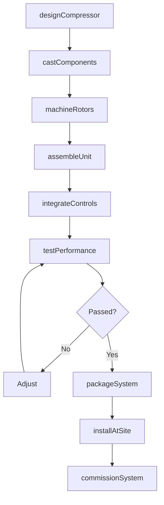
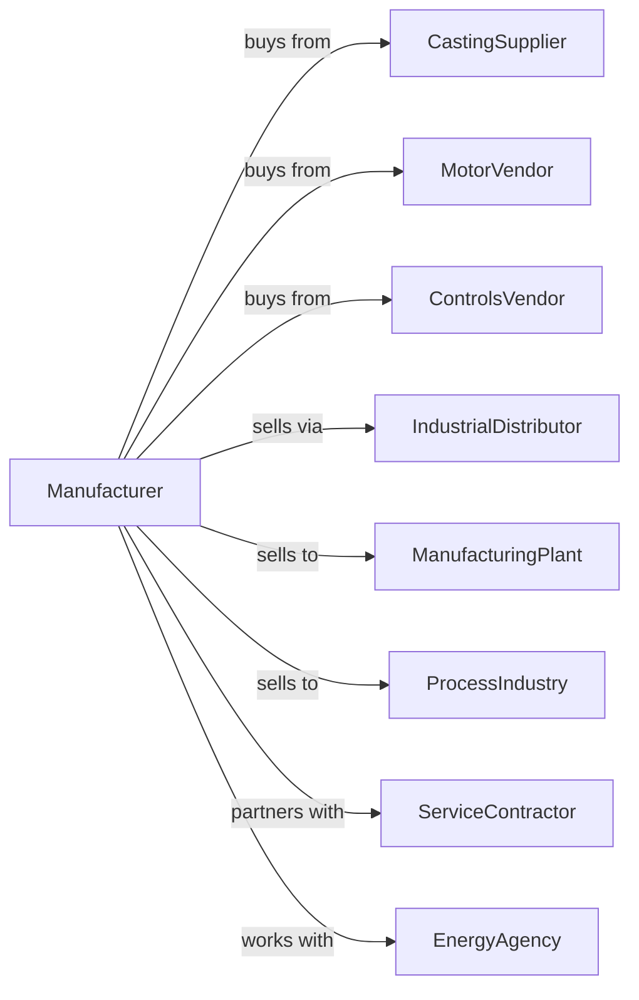

# Air and Gas Compressor Manufacturing

> Business-as-Code definition for air and gas compressor manufacturing operations. Models the complete production lifecycle from compressor design through installation including reciprocating, rotary screw, centrifugal, and vacuum pump systems.

## Overview

Air and gas compressor manufacturing involves producing equipment for compressing air and gases including reciprocating compressors, rotary screw compressors, centrifugal compressors, and vacuum pumps. Operations coordinate with casting suppliers, motor vendors, and industrial customers requiring compressed air and gas handling. This definition exposes actions for compressor engineering, assembly, and installation with events for automation and searches for performance analytics.

## Actors

| Actor | Description |
|-------|-------------|
| CastingSupplier | Provides compressor housings and cylinders |
| MotorVendor | Supplies electric motors and drives |
| ControlsVendor | Provides automation and monitoring systems |
| IndustrialDistributor | Sells compressors to end users |
| ManufacturingPlant | Factory requiring compressed air |
| ProcessIndustry | Chemical and petroleum gas handling |
| ServiceContractor | Installs and maintains compressors |
| EnergyAgency | Promotes compressed air efficiency |

## Roles

| Role | Description |
|------|-------------|
| CompressorEngineer | Designs compression systems |
| ThermodynamicsEngineer | Optimizes efficiency and cooling |
| AssemblyTechnician | Builds compressor units |
| TestEngineer | Validates performance and capacity |
| ApplicationEngineer | Selects compressors for customer needs |
| ServiceTechnician | Maintains and repairs equipment |

## Entities

| Entity | Description |
|--------|-------------|
| ReciprocatingCompressor | Piston-type compression unit |
| RotaryScrewCompressor | Helical rotor compression unit |
| CentrifugalCompressor | Dynamic impeller-based unit |
| VacuumPump | Negative pressure generating equipment |
| AirReceiver | Compressed air storage tank |
| Dryer | Moisture removal system |
| FilterSeparator | Contaminant removal system |
| ControlPanel | Compressor automation system |
| Aftercooler | Discharge temperature reduction |
| ServicePart | Replacement filter, oil, or valve |

## Actions

| Action | Description |
|--------|-------------|
| designCompressor | Engineer compression system |
| castComponents | Produce housings and cylinders |
| machineRotors | Precision finish helical elements |
| assembleUnit | Build complete compressor |
| integrateControls | Install automation system |
| testPerformance | Verify capacity and efficiency |
| packageSystem | Combine with dryer and filters |
| installAtSite | Set up at customer facility |
| commissionSystem | Start up and optimize |
| monitorRemote | Track performance via telemetry |
| performService | Execute maintenance |
| auditEfficiency | Evaluate compressed air system |

## Events

| Event | Description |
|-------|-------------|
| designApproved | Compressor engineering released |
| componentsCast | Housings produced |
| rotorsMachined | Precision elements finished |
| unitAssembled | Compressor built |
| controlsIntegrated | Automation installed |
| performanceTested | Capacity verified |
| systemPackaged | Complete system ready |
| systemInstalled | Operating at customer |
| serviceScheduled | Maintenance due |
| efficiencyAlert | Performance degradation detected |

## Searches

| Search | Description |
|--------|-------------|
| getCompressorStatus | Retrieve manufacturing progress |
| findByApplication | Query compressors by use case |
| getPerformanceData | Retrieve efficiency metrics |
| trackInstalledBase | Monitor compressors by customer |
| findServiceHistory | Get maintenance records |
| getEnergyUsage | Track power consumption |
| findReplacementParts | Query service part inventory |
| getLeakDetection | Retrieve compressed air audit data |

## Workflow



## Actor Relationships



## Usage

### Calling Actions

```typescript
import { manufactureCompressors } from '@headlessly/manufacture-compressors'

const factory = manufactureCompressors()

// Design oil-free rotary screw compressor
const compressor = await factory.designCompressor({
  type: 'rotary-screw-oil-free',
  capacity: 500, // cfm
  pressure: 125, // psi
  driveType: 'vsd',
  cooling: 'water-cooled',
  class: 'class-0'
})

// Package complete system
await factory.packageSystem({
  compressorId: compressor.id,
  components: ['dryer', 'filters', 'receiver'],
  dryerType: 'refrigerated',
  receiverSize: 500 // gallons
})

// Commission at customer site
await factory.commissionSystem({
  compressorId: compressor.id,
  siteId: 'pharma-plant-3',
  integration: ['plc-network', 'scada'],
  loadTest: true
})
```

### Event-Driven Automation

```typescript
// Remote monitoring alerts
factory.efficiencyAlert(async ({ compressorId, efficiency, baseline }) => {
  if (efficiency < baseline * 0.9) {
    await factory.auditEfficiency({
      compressorId,
      checks: ['leaks', 'pressure-drop', 'demand-profile'],
      recommendations: true
    })
  }
})

// Service scheduling
factory.serviceScheduled(async ({ compressorId, serviceType, runningHours }) => {
  const parts = await factory.findReplacementParts({
    compressorId,
    serviceKit: serviceType
  })

  await factory.performService({
    compressorId,
    serviceType,
    parts: parts.required,
    technicianAssignment: 'nearest'
  })
})
```

## Related

- [Pump Manufacturing](./333914-MeasuringDispensingAndOtherPumpingEquipmentManufacturing.mdx)
- [Turbine Manufacturing](../3336-EngineTurbineAndPowerTransmissionEquipmentManufacturing/333611-TurbineAndTurbineGeneratorSetUnitsManufacturing.mdx)
- [Industrial Fan Manufacturing](../3334-VentilationHeatingAirConditioningAndCommercialRefrigerationEquipmentManufacturing/333413-IndustrialAndCommercialFanAndBlowerAndAirPurificationEquipmentManufacturing.mdx)
