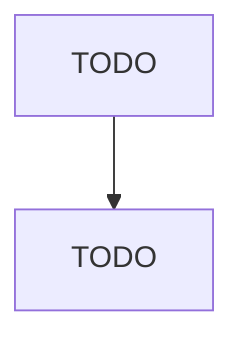

# Measuring, Dispensing, and Other Pumping Equipment Manufacturing

> TODO: Business-as-Code definition

## Overview

This U.S. industry comprises establishments primarily engaged in (1) manufacturing measuring and dispensing pumps, such as gasoline pumps and lubricating oil measuring and dispensing pumps and/or (2) manufacturing general purpose pumps and pumping equipment (except fluid power pumps and motors), such as reciprocating pumps, turbine pumps, centrifugal pumps, rotary pumps, diaphragm pumps, domestic water system pumps, oil well and oil field pumps, and sump pumps. Cross-References. Establishments p

## Actors

| Actor | Description |
|-------|-------------|
| TODO | TODO |

## Roles

| Role | Description |
|------|-------------|
| TODO | TODO |

## Entities

| Entity | Description |
|--------|-------------|
| TODO | TODO |

## Actions

| Action | Description |
|--------|-------------|
| TODO | TODO |

## Events

| Event | Description |
|-------|-------------|
| TODO | TODO |

## Searches

| Search | Description |
|--------|-------------|
| TODO | TODO |

## Workflow

## Actor Relationships

