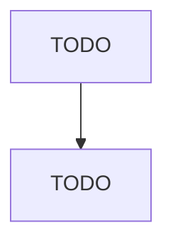

# Overhead Traveling Crane, Hoist, and Monorail System Manufacturing

> TODO: Business-as-Code definition

## Overview

This U.S. industry comprises establishments primarily engaged in manufacturing overhead traveling cranes, hoists, and monorail systems. Illustrative Examples: Aerial work platforms manufacturing Automobile wrecker (i.e., tow truck) hoists manufacturing Block and tackle manufacturing Metal pulleys (except power transmission) manufacturing Winches manufacturing Cross-References. Establishments primarily engaged in--

## Actors

| Actor | Description |
|-------|-------------|
| TODO | TODO |

## Roles

| Role | Description |
|------|-------------|
| TODO | TODO |

## Entities

| Entity | Description |
|--------|-------------|
| TODO | TODO |

## Actions

| Action | Description |
|--------|-------------|
| TODO | TODO |

## Events

| Event | Description |
|-------|-------------|
| TODO | TODO |

## Searches

| Search | Description |
|--------|-------------|
| TODO | TODO |

## Workflow

## Actor Relationships

