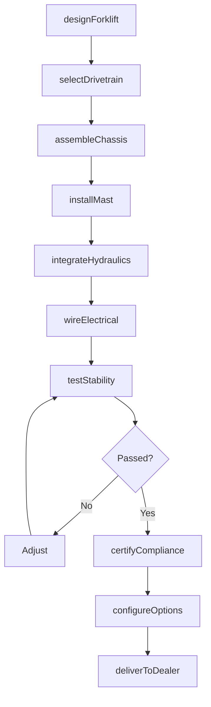
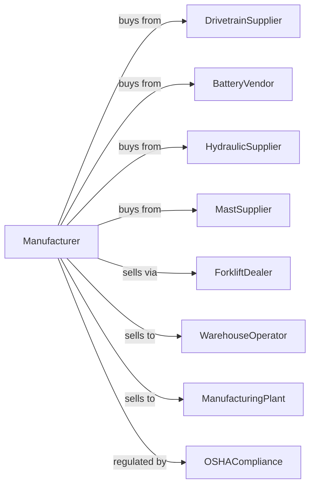

# Industrial Truck, Tractor, Trailer, and Stacker Machinery Manufacturing

> Business-as-Code definition for forklift and industrial truck manufacturing operations. Models the complete production lifecycle from material handling vehicle design through dealer delivery including counterbalance forklifts, reach trucks, pallet jacks, and order pickers.

## Overview

Industrial truck and stacker machinery manufacturing involves producing powered material handling vehicles including counterbalance forklifts, reach trucks, order pickers, pallet jacks, and tow tractors. Operations coordinate with drivetrain suppliers, battery vendors, and distribution operations requiring efficient warehouse mobility. This definition exposes actions for forklift engineering, safety compliance, and dealer distribution with events for automation and searches for fleet analytics.

## Actors

| Actor | Description |
|-------|-------------|
| DrivetrainSupplier | Provides transmissions and axles |
| BatteryVendor | Supplies lead-acid and lithium-ion batteries |
| HydraulicSupplier | Provides cylinders, pumps, and valves |
| MastSupplier | Supplies lift mast assemblies |
| ForkliftDealer | Sells and services forklifts |
| WarehouseOperator | Distribution center customer |
| ManufacturingPlant | Factory material handling customer |
| OSHACompliance | Oversees powered industrial truck safety |

## Roles

| Role | Description |
|------|-------------|
| ForkliftEngineer | Designs material handling vehicles |
| ElectricalEngineer | Develops power and control systems |
| AssemblyTechnician | Builds forklift units |
| QualityInspector | Verifies safety and performance |
| ApplicationEngineer | Matches trucks to customer needs |
| ServiceTechnician | Maintains and repairs forklifts |

## Entities

| Entity | Description |
|--------|-------------|
| CounterbalanceForklift | Sit-down lift truck |
| ReachTruck | Narrow-aisle warehouse truck |
| OrderPicker | Elevated operator platform truck |
| PalletJack | Powered pallet transporter |
| TowTractor | Industrial tugger vehicle |
| ElectricDrive | Battery-powered propulsion |
| LPGEngine | Propane-fueled power unit |
| LiftMast | Vertical lifting mechanism |
| LoadBackrest | Cargo stability guard |
| OperatorCompartment | Driver station and controls |

## Actions

| Action | Description |
|--------|-------------|
| designForklift | Engineer material handling vehicle |
| selectDrivetrain | Choose power source and transmission |
| assembleChassis | Build frame and axle structure |
| installMast | Mount lift mechanism |
| integrateHydraulics | Connect cylinders and controls |
| wireElectrical | Install battery, motor, and electronics |
| testStability | Verify tip-over resistance |
| certifyCompliance | Obtain safety approval |
| configureOptions | Add attachments and accessories |
| deliverToDealer | Ship to distribution network |
| trainOperators | Certify customer forklift drivers |
| performService | Execute scheduled maintenance |

## Events

| Event | Description |
|-------|-------------|
| designApproved | Forklift engineering released |
| drivetrainSelected | Power source specified |
| chassisAssembled | Frame structure built |
| mastInstalled | Lift mechanism mounted |
| hydraulicsIntegrated | Cylinders connected |
| electricalWired | Power system complete |
| stabilityTested | Tip-over resistance verified |
| complianceCertified | Safety approval obtained |
| optionsConfigured | Accessories installed |
| deliveredToDealer | Shipped to distribution |

## Searches

| Search | Description |
|--------|-------------|
| getForkliftStatus | Retrieve manufacturing progress |
| findByCapacity | Query trucks by lift rating |
| getFleetData | Retrieve customer fleet information |
| trackServiceHistory | Get maintenance records |
| findAvailableInventory | Query dealer stock |
| getUtilizationMetrics | Retrieve usage statistics |
| findAttachments | Query compatible accessories |
| getComplianceRecords | Retrieve safety documentation |

## Workflow



## Actor Relationships



## Usage

### Calling Actions

```typescript
import { manufactureForklifts } from '@headlessly/manufacture-forklifts'

const factory = manufactureForklifts()

// Design electric reach truck
const forklift = await factory.designForklift({
  type: 'reach-truck',
  capacity: 4500, // pounds
  liftHeight: 30, // feet
  power: 'lithium-ion',
  voltage: 48,
  aisleWidth: 9.5, // feet
  application: 'cold-storage'
})

// Configure for cold storage operation
await factory.configureOptions({
  forkliftId: forklift.id,
  attachments: ['side-shift', 'fork-positioner'],
  accessories: [
    'heated-cabin',
    'cold-storage-seals',
    'led-lights'
  ],
  telematics: 'fleet-management'
})

// Certify compliance
await factory.certifyCompliance({
  forkliftId: forklift.id,
  standards: ['ansi-b56.1', 'ul-2267'],
  testing: ['stability', 'braking', 'electrical'],
  labeling: true
})
```

### Event-Driven Automation

```typescript
// Fleet management integration
factory.deliveredToDealer(async ({ forkliftId, dealerId, serialNumber }) => {
  await factory.getFleetData({
    forkliftId,
    tracking: {
      telematics: true,
      usage: true,
      impacts: true
    },
    alerts: ['maintenance', 'safety', 'utilization']
  })
})

// Proactive service scheduling
factory.getUtilizationMetrics(async ({ forkliftId, operatingHours }) => {
  if (operatingHours >= 2000) {
    await factory.performService({
      forkliftId,
      type: 'pm-a',
      items: ['hydraulic-fluid', 'filters', 'brakes'],
      technicianAssignment: 'dealer'
    })
  }
})
```

## Related

- [Conveyor Manufacturing](./333922-ConveyorAndConveyingEquipmentManufacturing.mdx)
- [Crane and Hoist Manufacturing](./333923-OverheadTravelingCraneHoistAndMonorailSystemManufacturing.mdx)
- [Construction Machinery Manufacturing](../3331-AgricultureConstructionAndMiningMachineryManufacturing/333120-ConstructionMachineryManufacturing.mdx)
