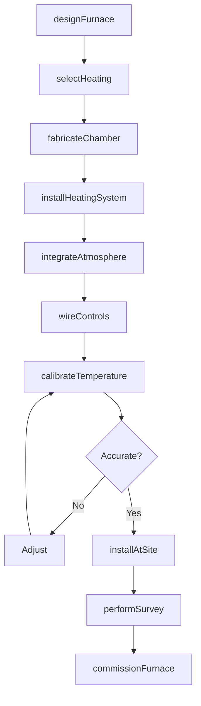
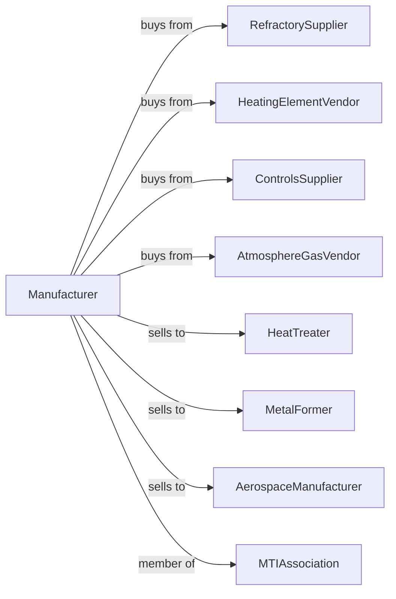

# Industrial Process Furnace and Oven Manufacturing

> Business-as-Code definition for industrial furnace and oven manufacturing operations. Models the complete production lifecycle from thermal equipment design through installation including heat treating furnaces, batch ovens, continuous ovens, and induction heating systems.

## Overview

Industrial furnace and oven manufacturing involves producing thermal processing equipment including batch furnaces, continuous ovens, vacuum furnaces, induction heaters, and industrial kilns. Operations coordinate with refractory suppliers, heating element vendors, and metal treating facilities requiring precise thermal processing. This definition exposes actions for furnace engineering, temperature profiling, and facility installation with events for automation and searches for process analytics.

## Actors

| Actor | Description |
|-------|-------------|
| RefractorySupplier | Provides insulation and lining materials |
| HeatingElementVendor | Supplies resistance and radiant heaters |
| ControlsSupplier | Provides temperature controllers and recorders |
| AtmosphereGasVendor | Supplies process gases |
| HeatTreater | Commercial heat treating customer |
| MetalFormer | Metal forming industry customer |
| AerospaceManufacturer | High-spec processing customer |
| MTIAssociation | Metal Treating Institute industry organization |

## Roles

| Role | Description |
|------|-------------|
| ThermalEngineer | Designs heat processing equipment |
| CombustionEngineer | Develops burner and heating systems |
| ControlsEngineer | Creates temperature control systems |
| Fabricator | Builds furnace structures |
| InstallationTechnician | Erects equipment at sites |
| ProcessEngineer | Develops heat treating recipes |

## Entities

| Entity | Description |
|--------|-------------|
| BatchFurnace | Discrete load thermal processor |
| ContinuousOven | Conveyor-based thermal processor |
| VacuumFurnace | Low-pressure heat treating unit |
| InductionHeater | Electromagnetic heating system |
| Kiln | High-temperature ceramic processor |
| HeatingElement | Resistance heating component |
| Refractory | Insulation and lining material |
| Thermocouple | Temperature sensing device |
| AtmosphereSystem | Process gas delivery |
| DataRecorder | Temperature documentation |

## Actions

| Action | Description |
|--------|-------------|
| designFurnace | Engineer thermal processing equipment |
| selectHeating | Choose heating method and elements |
| fabricateChamber | Build insulated enclosure |
| installHeatingSystem | Mount elements and burners |
| integrateAtmosphere | Install gas delivery system |
| wireControls | Connect temperature management |
| calibrateTemperature | Verify thermal accuracy |
| developRecipe | Create heat treating profile |
| installAtSite | Erect at customer facility |
| performSurvey | Evaluate temperature uniformity |
| commissionFurnace | Start up and verify performance |
| performMaintenance | Execute scheduled service |

## Events

| Event | Description |
|-------|-------------|
| designApproved | Furnace engineering released |
| heatingSelected | Heating method specified |
| chamberFabricated | Insulated structure built |
| heatingSystemInstalled | Elements mounted |
| atmosphereIntegrated | Gas system installed |
| controlsWired | Temperature management connected |
| temperatureCalibrated | Accuracy verified |
| recipeDeveloped | Heat treating profile created |
| installedAtSite | Equipment erected |
| surveyCompleted | Uniformity verified |

## Searches

| Search | Description |
|--------|-------------|
| getFurnaceStatus | Retrieve manufacturing progress |
| findByProcess | Query furnaces by heat treat type |
| getTemperatureData | Retrieve thermal profiles |
| trackInstalledBase | Monitor furnaces by customer |
| findRecipeLibrary | Query heat treating recipes |
| getUniformitySurveys | Retrieve temperature surveys |
| findMaintenanceHistory | Get service records |
| getEnergyUsage | Track power consumption |

## Workflow



## Actor Relationships



## Usage

### Calling Actions

```typescript
import { manufactureIndustrialFurnaces } from '@headlessly/manufacture-industrial-furnaces'

const factory = manufactureIndustrialFurnaces()

// Design vacuum heat treating furnace
const furnace = await factory.designFurnace({
  type: 'vacuum-oil-quench',
  workZone: { width: 36, height: 36, depth: 48 }, // inches
  temperature: { max: 2400, uniformity: 10 }, // fahrenheit, +/-
  vacuum: { ultimate: 0.001, backfill: 'nitrogen' }, // torr
  loadCapacity: 2000, // pounds
  application: 'tool-steel-hardening'
})

// Select heating system
await factory.selectHeating({
  furnaceId: furnace.id,
  type: 'graphite-elements',
  zones: 6,
  controlType: 'scr',
  powerDensity: 25 // watts per square inch
})

// Perform uniformity survey
await factory.performSurvey({
  furnaceId: furnace.id,
  temperature: 1850, // fahrenheit
  loadCondition: 'production-load',
  thermocouples: 9,
  standard: 'ams-2750',
  class: 2
})
```

### Event-Driven Automation

```typescript
// Pyrometry compliance
factory.surveyCompleted(async ({ furnaceId, results, nextDue }) => {
  await scheduleNextSurvey({
    furnaceId,
    date: nextDue,
    type: results.uniformityClass === 1 ? 'quarterly' : 'semi-annual'
  })

  if (!results.passed) {
    await factory.performMaintenance({
      furnaceId,
      focus: 'heating-elements',
      priority: 'urgent'
    })
  }
})

// Energy optimization
factory.getEnergyUsage(async ({ furnaceId, kwhPerPound, benchmark }) => {
  if (kwhPerPound > benchmark * 1.2) {
    await factory.findMaintenanceHistory({
      furnaceId,
      focus: ['insulation', 'seals', 'door-gaskets'],
      recommendations: true
    })
  }
})
```

## Related

- [Welding Equipment Manufacturing](./333992-WeldingAndSolderingEquipmentManufacturing.mdx)
- [Air and Gas Compressor Manufacturing](./333912-AirAndGasCompressorManufacturing.mdx)
- [Turbine Manufacturing](../3336-EngineTurbineAndPowerTransmissionEquipmentManufacturing/333611-TurbineAndTurbineGeneratorSetUnitsManufacturing.mdx)
