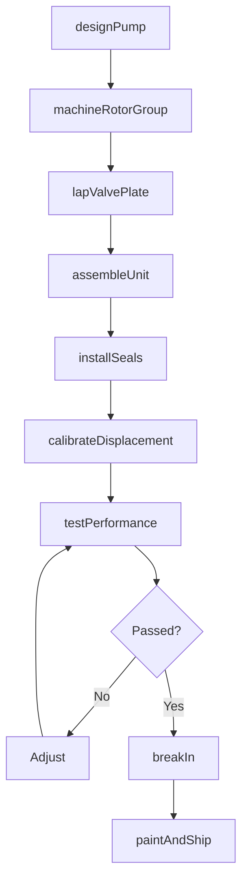
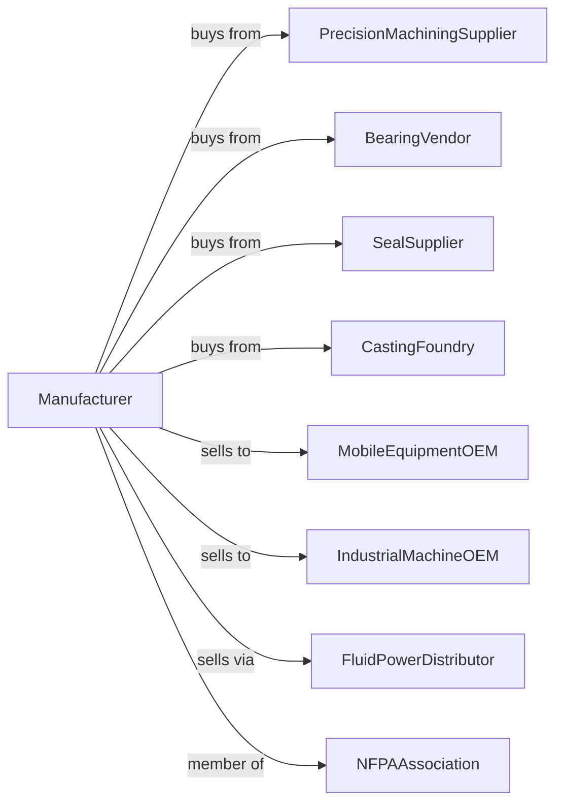

# Fluid Power Pump and Motor Manufacturing

> Business-as-Code definition for hydraulic and pneumatic pump and motor manufacturing operations. Models the complete production lifecycle from fluid power component design through OEM delivery including piston pumps, vane pumps, gear pumps, and hydraulic motors.

## Overview

Fluid power pump and motor manufacturing involves producing hydraulic and pneumatic power transmission components including axial piston pumps, radial piston motors, vane pumps, gear pumps, and air motors. Operations coordinate with precision machining suppliers, seal vendors, and mobile and industrial OEMs requiring reliable fluid power. This definition exposes actions for pump engineering, precision manufacturing, and system integration with events for automation and searches for performance analytics.

## Actors

| Actor | Description |
|-------|-------------|
| PrecisionMachiningSupplier | Provides machined housings and rotors |
| BearingVendor | Supplies precision bearings and bushings |
| SealSupplier | Provides shaft seals and o-rings |
| CastingFoundry | Supplies aluminum and iron castings |
| MobileEquipmentOEM | Construction and ag machinery customer |
| IndustrialMachineOEM | Factory equipment customer |
| FluidPowerDistributor | Sells to aftermarket and MRO |
| NFPAAssociation | National Fluid Power Association |

## Roles

| Role | Description |
|------|-------------|
| HydraulicEngineer | Designs fluid power components |
| ApplicationEngineer | Specifies pumps for customer systems |
| MachinistOperator | Produces precision components |
| AssemblyTechnician | Builds pump and motor units |
| TestEngineer | Validates flow, pressure, and efficiency |
| QualityEngineer | Ensures manufacturing precision |

## Entities

| Entity | Description |
|--------|-------------|
| AxialPistonPump | Variable displacement piston pump |
| RadialPistonMotor | High-torque low-speed motor |
| VanePump | Fixed or variable vane pump |
| GearPump | External or internal gear pump |
| GerotorPump | Generated rotor pump |
| HydraulicMotor | Rotary fluid power output |
| AirMotor | Pneumatic rotary motor |
| SwashPlate | Displacement control element |
| ValvePlate | Pump timing element |
| ShaftSeal | Rotating seal assembly |

## Actions

| Action | Description |
|--------|-------------|
| designPump | Engineer fluid power component |
| machineRotorGroup | Produce precision rotating assembly |
| lapValvePlate | Finish sealing surfaces |
| assembleUnit | Build complete pump or motor |
| installSeals | Fit shaft and port seals |
| calibrateDisplacement | Set displacement control |
| testPerformance | Verify flow, pressure, efficiency |
| breakIn | Run conditioning cycle |
| paintAndShip | Finish and deliver to customer |
| supportSystemDesign | Assist OEM hydraulic circuits |
| rebuildUnit | Overhaul worn pump or motor |
| stockExchange | Maintain remanufactured inventory |

## Events

| Event | Description |
|-------|-------------|
| designApproved | Pump engineering released |
| rotorGroupMachined | Rotating assembly produced |
| valvePlateLapped | Sealing surfaces finished |
| unitAssembled | Pump or motor built |
| sealsInstalled | Shaft sealing complete |
| displacementCalibrated | Control adjusted |
| performanceTested | Specifications verified |
| breakInComplete | Conditioning finished |
| paintedAndShipped | Delivered to customer |
| systemDesignSupported | OEM circuit assisted |

## Searches

| Search | Description |
|--------|-------------|
| getPumpStatus | Retrieve manufacturing progress |
| findByPerformance | Query by flow and pressure |
| getTestData | Retrieve efficiency curves |
| trackOEMPrograms | Monitor customer production |
| findSealKits | Query replacement seal sets |
| getRebuildCandidates | Identify units for reman |
| getExchangeInventory | Retrieve remanufactured stock |
| findCircuitDiagrams | Query hydraulic schematics |

## Workflow



## Actor Relationships



## Usage

### Calling Actions

```typescript
import { manufactureHydraulicPumps } from '@headlessly/manufacture-hydraulic-pumps'

const factory = manufactureHydraulicPumps()

// Design variable displacement piston pump
const pump = await factory.designPump({
  type: 'axial-piston-variable',
  displacement: 100, // cc/rev
  pressure: { continuous: 350, peak: 420 }, // bar
  speed: { max: 3000 }, // rpm
  control: 'load-sensing',
  mounting: 'sae-c',
  rotation: 'cw'
})

// Machine precision rotor group
await factory.machineRotorGroup({
  pumpId: pump.id,
  pistons: 9,
  material: 'hardened-steel',
  tolerances: {
    bore: 0.005, // mm
    piston: 0.003, // mm
    spherical: 0.002 // mm
  },
  surfaceFinish: 4 // ra
})

// Test performance curve
await factory.testPerformance({
  pumpId: pump.id,
  tests: [
    { speed: 1500, pressure: [0, 100, 200, 300, 350] },
    { speed: 2500, pressure: [0, 100, 200, 300, 350] },
    { speed: 3000, pressure: [0, 100, 200, 300] }
  ],
  measurements: ['flow', 'torque', 'case-drain', 'noise'],
  efficiency: { volumetric: true, mechanical: true }
})
```

### Event-Driven Automation

```typescript
// OEM program support
factory.performanceTested(async ({ pumpId, results, specification }) => {
  if (results.overallEfficiency >= 0.90) {
    await factory.supportSystemDesign({
      pumpId,
      circuitType: 'load-sensing',
      data: results,
      cadModel: true
    })
  }
})

// Remanufacturing program
factory.getRebuildCandidates(async ({ serialNumbers, operatingHours }) => {
  for (const serial of serialNumbers) {
    if (operatingHours[serial] > 10000) {
      await factory.rebuildUnit({
        serialNumber: serial,
        scope: 'full-overhaul',
        components: ['rotor-group', 'seals', 'bearings'],
        warranty: 'same-as-new'
      })
    }
  }
})
```

## Related

- [Fluid Power Cylinder Manufacturing](./333995-FluidPowerCylinderAndActuatorManufacturing.mdx)
- [Pump Manufacturing](./333914-MeasuringDispensingAndOtherPumpingEquipmentManufacturing.mdx)
- [Power Transmission Equipment Manufacturing](../3336-EngineTurbineAndPowerTransmissionEquipmentManufacturing/333613-MechanicalPowerTransmissionEquipmentManufacturing.mdx)
