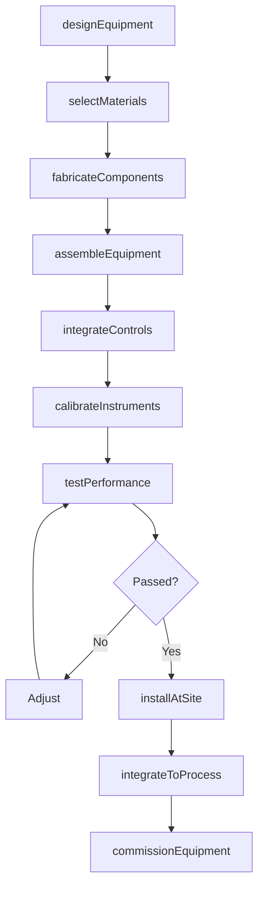
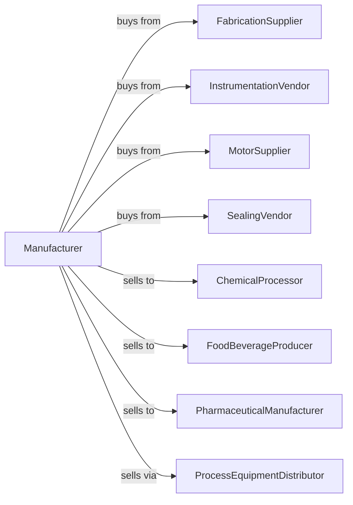

# All Other Miscellaneous General Purpose Machinery Manufacturing

> Business-as-Code definition for miscellaneous general purpose machinery manufacturing operations. Models the complete production lifecycle from equipment design through installation including industrial scales, centrifuges, filter presses, and specialty process equipment.

## Overview

Miscellaneous general purpose machinery manufacturing involves producing specialized industrial equipment including industrial scales and balances, centrifuges, filter presses, industrial spraying equipment, and other process machinery not classified elsewhere. Operations coordinate with fabrication suppliers, instrumentation vendors, and process industries requiring specialized equipment. This definition exposes actions for equipment engineering, custom fabrication, and process integration with events for automation and searches for application analytics.

## Actors

| Actor | Description |
|-------|-------------|
| FabricationSupplier | Provides custom metal fabrication |
| InstrumentationVendor | Supplies sensors and controls |
| MotorSupplier | Provides drives and motors |
| SealingVendor | Supplies gaskets and seals |
| ChemicalProcessor | Process industry customer |
| FoodBeverageProducer | Food industry customer |
| PharmaceuticalManufacturer | Pharma and biotech customer |
| ProcessEquipmentDistributor | Sells to end users |

## Roles

| Role | Description |
|------|-------------|
| ProcessEngineer | Designs specialized equipment |
| MechanicalEngineer | Develops mechanical systems |
| ControlsEngineer | Creates automation systems |
| Fabricator | Builds custom equipment |
| ApplicationEngineer | Specifies equipment for processes |
| FieldServiceEngineer | Installs and supports equipment |

## Entities

| Entity | Description |
|--------|-------------|
| IndustrialScale | Precision weighing equipment |
| Centrifuge | Separation equipment |
| FilterPress | Solid-liquid separation equipment |
| SprayingEquipment | Industrial coating systems |
| Mixer | Blending and agitation equipment |
| Separator | Process separation device |
| Classifier | Particle sizing equipment |
| Homogenizer | Emulsion creation equipment |
| Crystallizer | Crystal formation equipment |
| Evaporator | Concentration equipment |

## Actions

| Action | Description |
|--------|-------------|
| designEquipment | Engineer process machinery |
| selectMaterials | Choose construction materials |
| fabricateComponents | Build custom parts |
| assembleEquipment | Construct complete units |
| integrateControls | Install automation systems |
| calibrateInstruments | Verify measurement accuracy |
| testPerformance | Validate process capability |
| installAtSite | Erect at customer facility |
| integrateToProcess | Connect to production systems |
| commissionEquipment | Start up and optimize |
| performValidation | Execute IQ/OQ/PQ protocols |
| supportProcess | Assist with process optimization |

## Events

| Event | Description |
|-------|-------------|
| designApproved | Equipment engineering released |
| materialsSelected | Construction specified |
| componentsFabricated | Custom parts built |
| equipmentAssembled | Unit constructed |
| controlsIntegrated | Automation installed |
| instrumentsCalibrated | Measurements verified |
| performanceTested | Capability validated |
| installedAtSite | Equipment erected |
| processIntegrated | Connected to production |
| equipmentCommissioned | Operations optimized |

## Searches

| Search | Description |
|--------|-------------|
| getEquipmentStatus | Retrieve manufacturing progress |
| findByApplication | Query equipment by process |
| getPerformanceData | Retrieve capacity and efficiency |
| trackInstalledBase | Monitor equipment by customer |
| findValidationRecords | Query IQ/OQ/PQ documentation |
| getCalibrationHistory | Retrieve instrument records |
| findReplacementParts | Query spare part inventory |
| getProcessData | Retrieve operating parameters |

## Workflow



## Actor Relationships



## Usage

### Calling Actions

```typescript
import { manufactureGeneralMachinery } from '@headlessly/manufacture-general-machinery'

const factory = manufactureGeneralMachinery()

// Design pharmaceutical centrifuge
const equipment = await factory.designEquipment({
  type: 'peeler-centrifuge',
  application: 'api-crystallization',
  capacity: 500, // liters
  gForce: 1200,
  material: '316l-stainless',
  containment: 'oba-level-4',
  cleaning: 'cip-sip'
})

// Select materials for pharma compliance
await factory.selectMaterials({
  equipmentId: equipment.id,
  wetted: {
    material: '316l-stainless',
    finish: '20-ra-electropolish',
    welds: 'full-penetration-passivated'
  },
  seals: 'fda-approved-elastomers',
  documentation: ['material-certs', 'finish-reports', 'weld-logs']
})

// Perform validation
await factory.performValidation({
  equipmentId: equipment.id,
  protocols: [
    { type: 'iq', items: ['dimensions', 'materials', 'utilities'] },
    { type: 'oq', items: ['containment', 'cleaning', 'alarms'] },
    { type: 'pq', items: ['batch-processing', 'yield', 'product-quality'] }
  ],
  documentation: 'gmp-compliant'
})
```

### Event-Driven Automation

```typescript
// Validation tracking
factory.equipmentCommissioned(async ({ equipmentId, customerId, validationStatus }) => {
  if (validationStatus.pqComplete) {
    await factory.findValidationRecords({
      equipmentId,
      package: 'complete',
      format: 'electronic-signatures',
      archive: 'customer-quality-system'
    })
  }
})

// Calibration management
factory.instrumentsCalibrated(async ({ equipmentId, instruments, nextDue }) => {
  for (const instrument of instruments) {
    await scheduleCalibration({
      equipmentId,
      instrument: instrument.id,
      dueDate: nextDue,
      standard: instrument.traceable ? 'nist' : 'manufacturer'
    })
  }
})
```

## Related

- [Packaging Machinery Manufacturing](./333993-PackagingMachineryManufacturing.mdx)
- [Industrial Furnace Manufacturing](./333994-IndustrialProcessFurnaceAndOvenManufacturing.mdx)
- [Food Product Machinery Manufacturing](../3332-IndustrialMachineryManufacturing/333241-FoodProductMachineryManufacturing.mdx)
