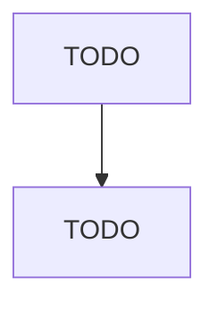

# All Other Miscellaneous General Purpose Machinery Manufacturing

> TODO: Business-as-Code definition

## Overview

This U.S. industry comprises establishments primarily engaged in manufacturing general purpose machinery (except ventilating, heating, air-conditioning, and commercial refrigeration equipment; metalworking machinery; engines, turbines, and power transmission equipment; pumps and compressors; material handling equipment; power-driven handtools; welding and soldering equipment; packaging machinery; industrial process furnaces and ovens; fluid power cylinders and actuators; and fluid power pumps an

## Actors

| Actor | Description |
|-------|-------------|
| TODO | TODO |

## Roles

| Role | Description |
|------|-------------|
| TODO | TODO |

## Entities

| Entity | Description |
|--------|-------------|
| TODO | TODO |

## Actions

| Action | Description |
|--------|-------------|
| TODO | TODO |

## Events

| Event | Description |
|-------|-------------|
| TODO | TODO |

## Searches

| Search | Description |
|--------|-------------|
| TODO | TODO |

## Workflow

## Actor Relationships

