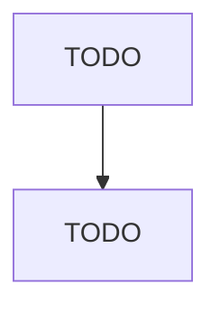

# Electronic Computer Manufacturing

> TODO: Business-as-Code definition

## Overview

This U.S. industry comprises establishments primarily engaged in manufacturing and/or assembling electronic computers, such as mainframes, personal computers, workstations, laptops, and computer servers. Computers can be analog, digital, or hybrid. Digital computers, the most common type, are devices that do all of the following: (1) store the processing program or programs and the data immediately necessary for the execution of the program; (2) can be freely programmed in accordance with the re

## Actors

| Actor | Description |
|-------|-------------|
| TODO | TODO |

## Roles

| Role | Description |
|------|-------------|
| TODO | TODO |

## Entities

| Entity | Description |
|--------|-------------|
| TODO | TODO |

## Actions

| Action | Description |
|--------|-------------|
| TODO | TODO |

## Events

| Event | Description |
|-------|-------------|
| TODO | TODO |

## Searches

| Search | Description |
|--------|-------------|
| TODO | TODO |

## Workflow

## Actor Relationships

