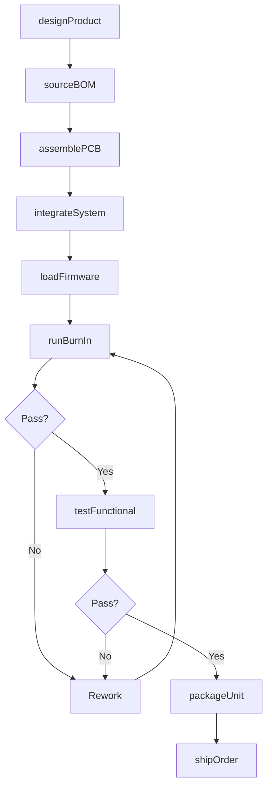
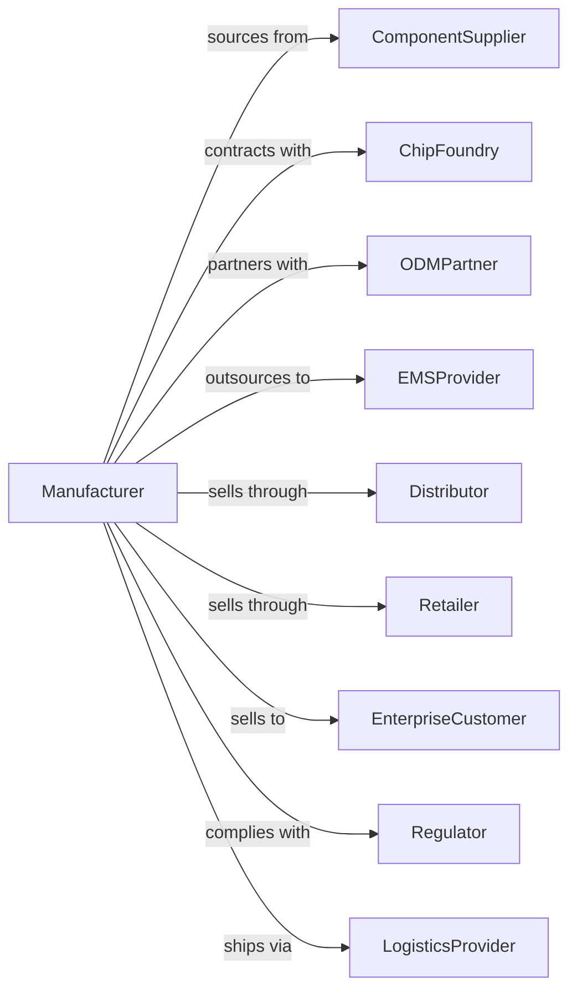

# Electronic Computer Manufacturing

> Business-as-Code definition for electronic computer manufacturing operations. Models the complete product lifecycle from design through assembly, testing, and distribution.

## Overview

Electronic computer manufacturing involves designing, assembling, and testing computers including mainframes, servers, workstations, laptops, and personal computers. This definition exposes actions for product development, supply chain management, manufacturing operations, and quality assurance with events for workflow automation.

## Actors

| Actor | Description |
|-------|-------------|
| ComponentSupplier | Provides processors, memory, motherboards, and other components |
| ChipFoundry | Fabricates custom or semi-custom integrated circuits |
| ODMPartner | Original design manufacturer providing contract design and production |
| EMSProvider | Electronics manufacturing services for assembly operations |
| Distributor | Channels products to retailers and enterprise customers |
| Retailer | Sells directly to consumers and small businesses |
| EnterpriseCustomer | Large organizations purchasing in volume |
| Regulator | Enforces safety, environmental, and trade compliance |
| LogisticsProvider | Handles shipping, warehousing, and fulfillment |

## Roles

| Role | Description |
|------|-------------|
| ProductManager | Defines product requirements and roadmap |
| HardwareEngineer | Designs circuit boards and system architecture |
| FirmwareEngineer | Develops BIOS, drivers, and embedded software |
| SupplyChainManager | Coordinates component sourcing and inventory |
| ManufacturingEngineer | Optimizes production processes and yields |
| QualityEngineer | Ensures product reliability and compliance |
| TestTechnician | Performs functional and stress testing |
| ProductionSupervisor | Manages assembly line operations |

## Entities

| Entity | Description |
|--------|-------------|
| Product | A computer model with specific configuration and SKU |
| BillOfMaterials | Complete list of components required for assembly |
| Component | Individual parts such as CPU, RAM, storage, displays |
| Assembly | Sub-assembly or complete system unit |
| Firmware | Embedded software loaded onto hardware |
| TestResult | Quality and performance validation data |
| SerialNumber | Unique identifier for tracking individual units |
| Warranty | Service and support terms for the product |
| Order | Customer purchase request with quantity and configuration |
| Shipment | Outbound delivery to customer or distribution center |

## Actions

| Action | Description |
|--------|-------------|
| designProduct | Create specifications and engineering designs for new model |
| sourceBOM | Procure all components listed in bill of materials |
| assemblePCB | Mount components onto printed circuit boards |
| integrateSystem | Combine sub-assemblies into complete computer |
| loadFirmware | Flash BIOS and install factory software image |
| runBurnIn | Execute extended stress testing to identify defects |
| testFunctional | Validate all features and performance specifications |
| packageUnit | Prepare finished product with accessories and documentation |
| shipOrder | Dispatch products to customer or distribution point |
| processRMA | Handle returned units for repair or replacement |
| updateFirmware | Release and deploy firmware updates to field units |
| forecastDemand | Predict future sales to guide production planning |

## Events

| Event | Description |
|-------|-------------|
| productDesigned | Engineering design approved for production |
| bomSourced | All components procured and available |
| pcbAssembled | Circuit board assembly completed |
| systemIntegrated | Complete unit assembled and ready for testing |
| firmwareLoaded | System software installed successfully |
| burnInCompleted | Stress testing passed without failures |
| testPassed | Unit met all quality specifications |
| unitPackaged | Product packaged and ready for shipment |
| orderShipped | Products dispatched to customer |
| rmaProcessed | Return handled and resolved |
| firmwareUpdated | Field units updated with new firmware |
| demandForecasted | Sales projections generated for planning |

## Searches

| Search | Description |
|--------|-------------|
| findProducts | List computer models by category, specs, or availability |
| getInventory | Check component and finished goods stock levels |
| getOrders | Retrieve customer orders by status or date range |
| findSuppliers | List approved suppliers for specific components |
| getTestResults | Retrieve quality data for specific units or batches |
| getShipments | Track outbound deliveries and status |
| getDefectRate | Calculate failure rates by model or production line |

## Workflow

## Actor Relationships

