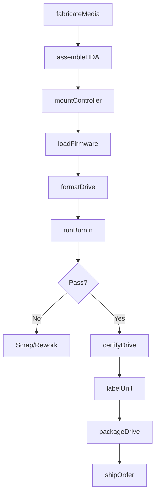
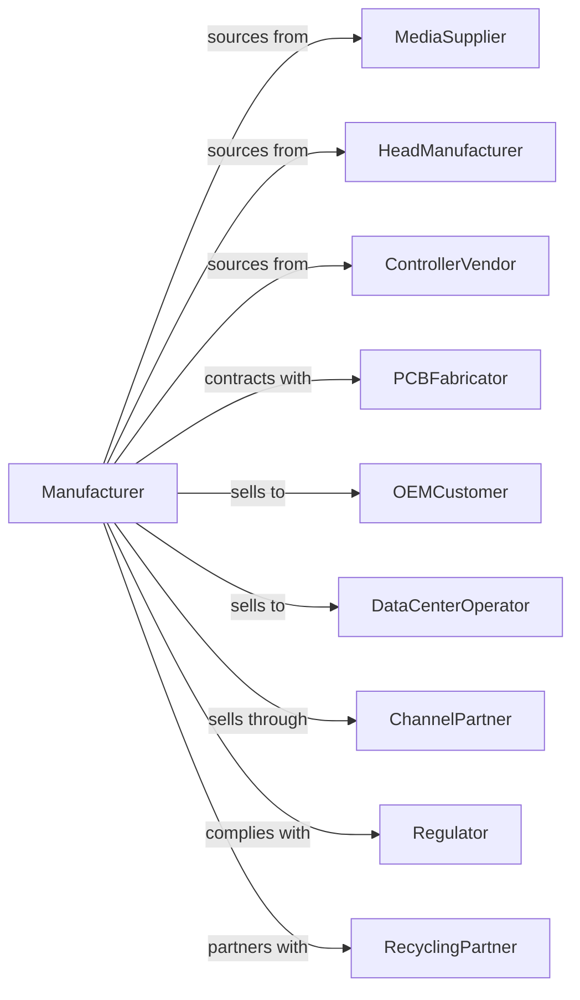

# Computer Storage Device Manufacturing

> Business-as-Code definition for computer storage device manufacturing operations. Models the complete lifecycle from media fabrication through drive assembly, testing, and distribution.

## Overview

Computer storage device manufacturing involves producing disk drives, solid-state drives, USB flash drives, and tape storage units. This definition covers cleanroom media production, head/disk assembly, firmware development, and rigorous quality testing essential for data integrity.

## Actors

| Actor | Description |
|-------|-------------|
| MediaSupplier | Provides magnetic platters, NAND flash, or tape substrates |
| HeadManufacturer | Produces read/write heads for magnetic drives |
| ControllerVendor | Supplies storage controller chips and ASICs |
| PCBFabricator | Manufactures printed circuit boards for drives |
| OEMCustomer | Computer manufacturers integrating storage into systems |
| DataCenterOperator | Enterprise customers for high-capacity storage |
| ChannelPartner | Distributors and resellers for retail market |
| Regulator | Enforces product safety and environmental standards |
| RecyclingPartner | Handles end-of-life drive disposal and data destruction |

## Roles

| Role | Description |
|------|-------------|
| DriveEngineer | Designs mechanical and electronic drive systems |
| FirmwareEngineer | Develops controller firmware and error correction |
| ProcessEngineer | Optimizes cleanroom manufacturing processes |
| QualityEngineer | Ensures reliability and data integrity standards |
| TestEngineer | Designs and executes drive validation protocols |
| CleanroomTechnician | Operates head/disk assembly in controlled environment |
| ProductionPlanner | Coordinates manufacturing schedules and capacity |
| SupplyChainManager | Manages component procurement and inventory |

## Entities

| Entity | Description |
|--------|-------------|
| Drive | Complete storage device with specified capacity |
| Media | Magnetic platters, NAND chips, or tape substrates |
| HeadStackAssembly | Read/write mechanism for magnetic drives |
| Controller | Electronics managing data transfer and error correction |
| Firmware | Embedded software controlling drive operations |
| Enclosure | Protective housing with interface connectors |
| TestData | Validation results including SMART attributes |
| Warranty | Service terms covering defect replacement |
| Batch | Production lot for traceability and quality tracking |
| Capacity | Storage size specification in GB or TB |

## Actions

| Action | Description |
|--------|-------------|
| fabricateMedia | Produce magnetic platters or NAND flash arrays |
| assembleHDA | Combine heads and media in cleanroom environment |
| mountController | Attach controller board to drive assembly |
| loadFirmware | Program drive controller with operating firmware |
| formatDrive | Initialize file system and verify sectors |
| runBurnIn | Execute extended read/write stress testing |
| certifyDrive | Validate performance meets specifications |
| labelUnit | Apply serial numbers and capacity markings |
| packageDrive | Prepare for shipment with ESD protection |
| shipOrder | Dispatch drives to customers or distribution |
| processWarranty | Handle failed drives under warranty terms |
| destroyData | Securely erase drives for recycling or disposal |

## Events

| Event | Description |
|-------|-------------|
| mediaFabricated | Platters or flash arrays ready for assembly |
| hdaAssembled | Head/disk assembly completed in cleanroom |
| controllerMounted | Electronics attached to drive mechanism |
| firmwareLoaded | Drive firmware programmed and verified |
| driveFormatted | Storage initialized and sector map verified |
| burnInCompleted | Stress testing passed without errors |
| driveCertified | Unit meets all quality specifications |
| unitLabeled | Serial and capacity information applied |
| drivePackaged | Product ready for shipment |
| orderShipped | Drives dispatched to customer |
| warrantyProcessed | Failed unit replaced or repaired |
| dataDestroyed | Secure erase completed for disposal |

## Searches

| Search | Description |
|--------|-------------|
| findDrives | List drive models by capacity, interface, or type |
| getInventory | Check stock levels by SKU or warehouse |
| getOrders | Retrieve orders by customer or status |
| getBatchQuality | Get defect rates and test results for production batch |
| findSuppliers | List approved component suppliers |
| getWarrantyClaims | Retrieve warranty returns and failure analysis |
| getCapacityForecast | Project demand by capacity tier |

## Workflow

## Actor Relationships

