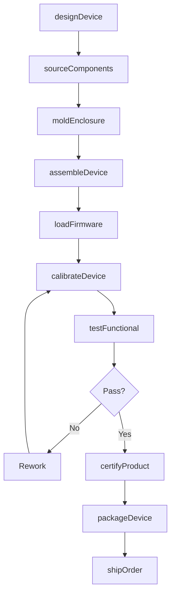
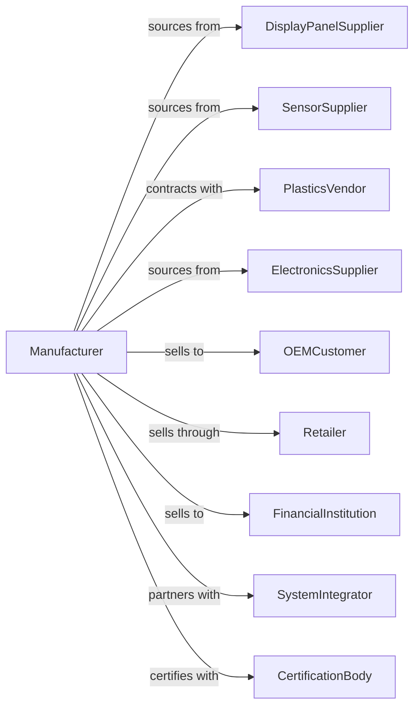

# Computer Terminal and Other Computer Peripheral Equipment Manufacturing

> Business-as-Code definition for computer peripheral manufacturing operations. Models the production of terminals, monitors, keyboards, mice, scanners, ATMs, and other input/output devices.

## Overview

Computer peripheral manufacturing produces devices that extend computer functionality including monitors, keyboards, pointing devices, scanners, printers, ATMs, and point-of-sale terminals. This definition covers product design, component sourcing, assembly, quality testing, and distribution for both consumer and commercial markets.

## Actors

| Actor | Description |
|-------|-------------|
| DisplayPanelSupplier | Provides LCD, OLED, and other display panels |
| SensorSupplier | Supplies optical sensors, touch panels, and input components |
| PlasticsVendor | Manufactures enclosures and mechanical housings |
| ElectronicsSupplier | Provides controllers, cables, and interface chips |
| OEMCustomer | Computer manufacturers bundling peripherals |
| Retailer | Sells peripherals to consumers and businesses |
| FinancialInstitution | Banks deploying ATMs and payment terminals |
| SystemIntegrator | Configures and deploys commercial terminal solutions |
| CertificationBody | Tests and certifies product safety and compliance |

## Roles

| Role | Description |
|------|-------------|
| ProductDesigner | Creates ergonomic and functional device designs |
| ElectricalEngineer | Designs circuitry and interface electronics |
| MechanicalEngineer | Engineers enclosures and mechanical assemblies |
| FirmwareEngineer | Develops embedded software and drivers |
| QualityEngineer | Ensures product reliability and user safety |
| AssemblyTechnician | Performs device assembly and integration |
| TestTechnician | Validates functionality and performance |
| ProductManager | Manages product lifecycle and market requirements |

## Entities

| Entity | Description |
|--------|-------------|
| Peripheral | Complete device such as monitor, keyboard, or scanner |
| DisplayPanel | Screen component with specific resolution and technology |
| InputSensor | Touch, optical, or mechanical sensing element |
| Controller | Electronics managing device operation and interface |
| Firmware | Embedded software controlling device functions |
| Enclosure | Protective housing and user-facing shell |
| Cable | Connection interface to host computer |
| Driver | Software enabling host system communication |
| Certification | Safety and regulatory compliance documentation |
| Warranty | Service terms for product support |

## Actions

| Action | Description |
|--------|-------------|
| designDevice | Create product specifications and engineering designs |
| sourceComponents | Procure panels, sensors, and electronic parts |
| moldEnclosure | Produce plastic or metal device housings |
| assembleDevice | Integrate components into complete peripheral |
| loadFirmware | Program device controller with embedded software |
| calibrateDevice | Adjust sensors and displays for accuracy |
| testFunctional | Validate all device features and interfaces |
| certifyProduct | Obtain safety and regulatory certifications |
| packageDevice | Prepare with cables, drivers, and documentation |
| shipOrder | Dispatch to customers or distribution channels |
| provideDriver | Release and update device driver software |
| processReturn | Handle defective units and warranty claims |

## Events

| Event | Description |
|-------|-------------|
| deviceDesigned | Product design approved for production |
| componentsSourced | All parts procured and available |
| enclosureMolded | Device housing manufactured |
| deviceAssembled | Complete unit assembled |
| firmwareLoaded | Embedded software programmed |
| deviceCalibrated | Sensors and displays adjusted |
| testPassed | Unit passed functional validation |
| productCertified | Regulatory compliance achieved |
| devicePackaged | Product ready for shipment |
| orderShipped | Products dispatched to customer |
| driverReleased | Software update published |
| returnProcessed | Warranty claim resolved |

## Searches

| Search | Description |
|--------|-------------|
| findDevices | List peripherals by type, interface, or features |
| getInventory | Check stock levels by SKU or location |
| getOrders | Retrieve orders by customer or status |
| findSuppliers | List approved component vendors |
| getCertifications | Retrieve compliance documents by product |
| getDefectRate | Calculate failure rates by model |
| getDrivers | List available software drivers by product |

## Workflow

## Actor Relationships

