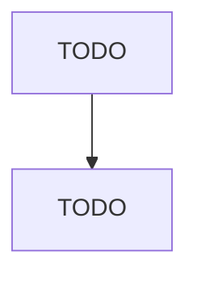

# Computer Terminal and Other Computer Peripheral Equipment Manufacturing

> TODO: Business-as-Code definition

## Overview

This U.S. industry comprises establishments primarily engaged in manufacturing computer terminals and other computer peripheral equipment (except storage devices). Illustrative Examples: Automated teller machines (ATM) manufacturing Computer terminals manufacturing Joystick devices manufacturing Keyboards, computer peripheral equipment, manufacturing Monitors, computer peripheral equipment, manufacturing Mouse devices, computer peripheral equipment, manufacturing Optical readers and scanners man

## Actors

| Actor | Description |
|-------|-------------|
| TODO | TODO |

## Roles

| Role | Description |
|------|-------------|
| TODO | TODO |

## Entities

| Entity | Description |
|--------|-------------|
| TODO | TODO |

## Actions

| Action | Description |
|--------|-------------|
| TODO | TODO |

## Events

| Event | Description |
|-------|-------------|
| TODO | TODO |

## Searches

| Search | Description |
|--------|-------------|
| TODO | TODO |

## Workflow

## Actor Relationships

