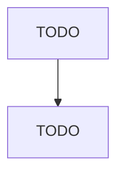

# Telephone Apparatus Manufacturing

> TODO: Business-as-Code definition

## Overview

This industry comprises establishments primarily engaged in manufacturing wire telephone and data communications equipment. These products may be stand-alone or board-level components of a larger system. Examples of products made by these establishments are central office switching equipment, cordless and wire telephones (except cellular), PBX equipment, telephone answering machines, LAN modems, multi-user modems, and other data communications equipment, such as bridges, routers, and gateways. C

## Actors

| Actor | Description |
|-------|-------------|
| TODO | TODO |

## Roles

| Role | Description |
|------|-------------|
| TODO | TODO |

## Entities

| Entity | Description |
|--------|-------------|
| TODO | TODO |

## Actions

| Action | Description |
|--------|-------------|
| TODO | TODO |

## Events

| Event | Description |
|-------|-------------|
| TODO | TODO |

## Searches

| Search | Description |
|--------|-------------|
| TODO | TODO |

## Workflow

## Actor Relationships

