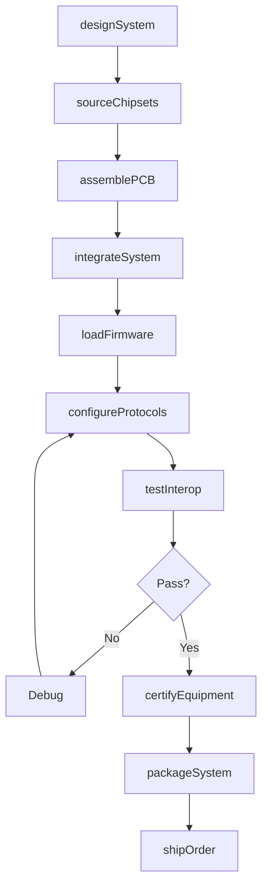
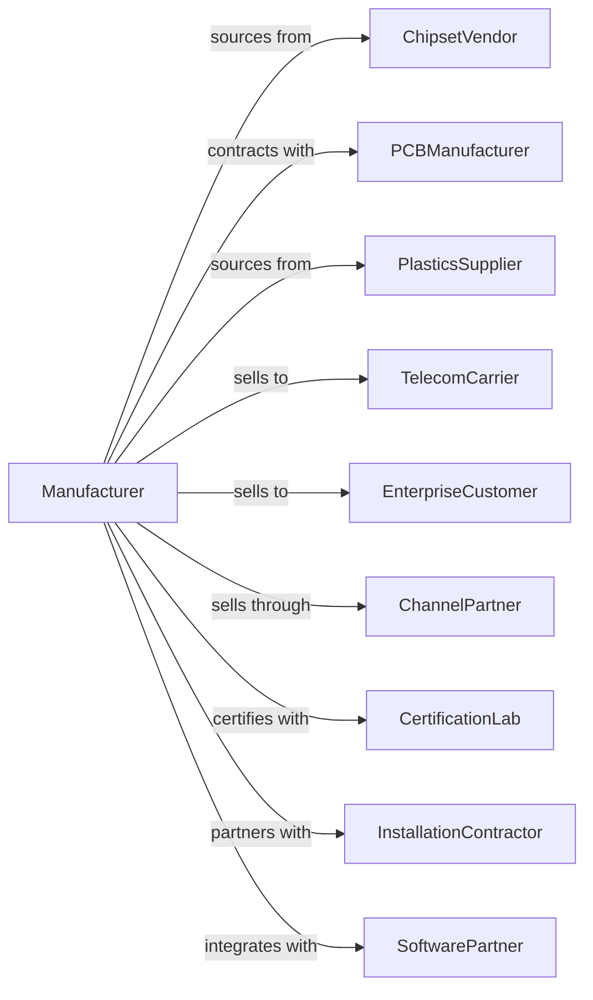

# Telephone Apparatus Manufacturing

> Business-as-Code definition for telephone apparatus manufacturing operations. Models the production of wired telephones, PBX systems, modems, routers, and data communications equipment.

## Overview

Telephone apparatus manufacturing produces wire-based communications equipment including landline phones, PBX systems, answering machines, modems, routers, bridges, and gateways. This definition covers product design, component integration, firmware development, and carrier certification for telecommunications infrastructure.

## Actors

| Actor | Description |
|-------|-------------|
| ChipsetVendor | Provides DSP, codec, and networking chipsets |
| PCBManufacturer | Fabricates circuit boards for equipment |
| PlasticsSupplier | Provides enclosures and handset housings |
| TelecomCarrier | Purchases switching and network equipment |
| EnterpriseCustomer | Organizations deploying PBX and VoIP systems |
| ChannelPartner | Distributors and value-added resellers |
| CertificationLab | Tests FCC, CE, and carrier compliance |
| InstallationContractor | Deploys and configures equipment on-site |
| SoftwarePartner | Provides unified communications applications |

## Roles

| Role | Description |
|------|-------------|
| SystemsArchitect | Designs overall equipment architecture |
| RFEngineer | Develops analog and digital signal circuits |
| FirmwareEngineer | Creates embedded software and protocols |
| NetworkEngineer | Implements routing and switching functions |
| QualityEngineer | Ensures reliability and compliance |
| TestEngineer | Validates functionality and interoperability |
| ProductManager | Defines features and market positioning |
| TechnicalWriter | Creates user and installation documentation |

## Entities

| Entity | Description |
|--------|-------------|
| Telephone | Wired or cordless phone handset |
| PBXSystem | Private branch exchange for enterprise telephony |
| Modem | Modulator-demodulator for data transmission |
| Router | Network routing equipment for data packets |
| Gateway | Protocol converter between network types |
| Firmware | Embedded operating software for equipment |
| Protocol | Communication standard such as SIP or H.323 |
| Certification | Regulatory approval for carrier networks |
| Configuration | Equipment settings and programming |
| Warranty | Service and support coverage terms |

## Actions

| Action | Description |
|--------|-------------|
| designSystem | Create equipment architecture and specifications |
| sourceChipsets | Procure DSP, codec, and networking components |
| assemblePCB | Mount components on circuit boards |
| integrateSystem | Combine modules into complete equipment |
| loadFirmware | Program embedded operating software |
| configureProtocols | Set up communication protocols and features |
| testInterop | Validate compatibility with carrier networks |
| certifyEquipment | Obtain FCC and carrier certifications |
| packageSystem | Prepare equipment with cables and documentation |
| shipOrder | Dispatch to carriers or enterprise customers |
| provisionRemote | Configure equipment remotely after deployment |
| updateFirmware | Deploy software updates to field equipment |

## Events

| Event | Description |
|-------|-------------|
| systemDesigned | Equipment architecture approved |
| chipsetsSourced | Key components procured |
| pcbAssembled | Circuit boards completed |
| systemIntegrated | Complete equipment assembled |
| firmwareLoaded | Embedded software programmed |
| protocolsConfigured | Communication settings applied |
| interopTested | Carrier compatibility validated |
| equipmentCertified | Regulatory approval obtained |
| systemPackaged | Equipment ready for shipment |
| orderShipped | Products dispatched to customer |
| remoteProvisioned | Field equipment configured |
| firmwareUpdated | Software update deployed |

## Searches

| Search | Description |
|--------|-------------|
| findEquipment | List products by type, capacity, or protocol |
| getInventory | Check stock levels by SKU or warehouse |
| getOrders | Retrieve orders by customer or status |
| findCertifications | List regulatory approvals by market |
| getDeployments | Track installed equipment locations |
| getInteropResults | Retrieve carrier compatibility test data |
| getFirmwareVersions | List available software versions |

## Workflow

## Actor Relationships

