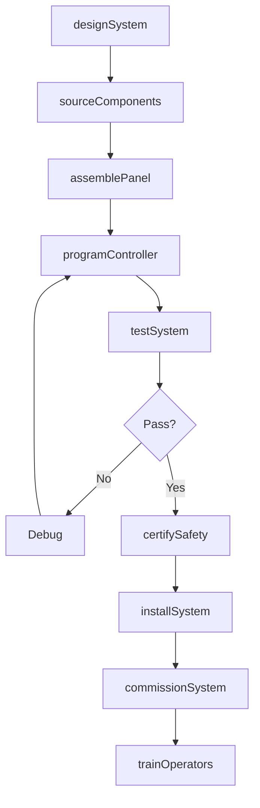
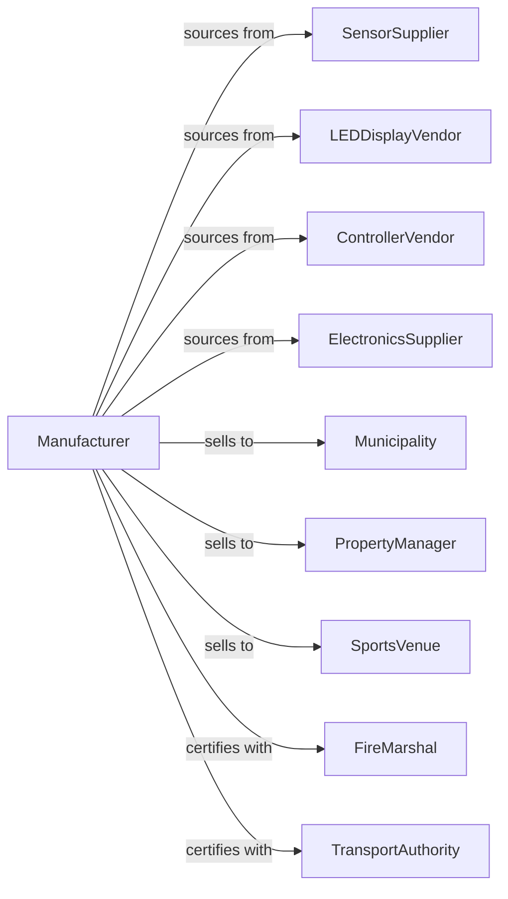

# Other Communications Equipment Manufacturing

> Business-as-Code definition for specialized communications equipment manufacturing. Models the production of fire alarms, traffic signals, intercom systems, and stadium displays.

## Overview

This industry manufactures communications equipment not classified elsewhere, including fire detection and alarm systems, traffic and railway signals, intercom and PA systems, and video-based stadium displays. This definition covers system design, safety certification, installation coordination, and ongoing maintenance support.

## Actors

| Actor | Description |
|-------|-------------|
| SensorSupplier | Provides smoke, heat, and motion detection sensors |
| LEDDisplayVendor | Manufactures LED panels and video boards |
| ControllerVendor | Supplies programmable logic and signal controllers |
| ElectronicsSupplier | Provides audio amplifiers and interface electronics |
| Municipality | Purchases traffic signals and public safety systems |
| PropertyManager | Deploys fire alarms and intercom systems |
| SportsVenue | Installs stadium displays and PA systems |
| FireMarshal | Certifies fire alarm system compliance |
| TransportAuthority | Specifies and approves traffic signal equipment |

## Roles

| Role | Description |
|------|-------------|
| SystemsEngineer | Designs integrated communications solutions |
| ElectronicsEngineer | Develops control and interface circuits |
| SoftwareEngineer | Creates programming for controllers and displays |
| SafetyEngineer | Ensures compliance with fire and traffic codes |
| InstallationEngineer | Plans and oversees field deployment |
| QualityEngineer | Validates reliability and performance |
| ProjectManager | Coordinates custom system delivery |
| TechnicalSupport | Provides maintenance and troubleshooting |

## Entities

| Entity | Description |
|--------|-------------|
| FireAlarmSystem | Detection and notification equipment for fire safety |
| TrafficSignal | Lights and controllers for traffic management |
| IntercomSystem | Two-way voice communication equipment |
| PASystem | Public address audio distribution system |
| StadiumDisplay | Large-format LED video display |
| Controller | Programmable unit managing system operations |
| Sensor | Detection device for smoke, motion, or presence |
| Notification | Alert output such as sirens, lights, or messages |
| Installation | Deployed system at customer site |
| MaintenanceContract | Ongoing service and support agreement |

## Actions

| Action | Description |
|--------|-------------|
| designSystem | Create specifications for communications solution |
| sourceComponents | Procure sensors, displays, and controllers |
| assemblePanel | Build control panels and interface units |
| programController | Load software logic for system operation |
| testSystem | Validate functionality and alarm response |
| certifySafety | Obtain fire marshal or DOT approval |
| installSystem | Deploy equipment at customer location |
| commissionSystem | Activate and verify field operation |
| trainOperators | Instruct users on system operation |
| provideSupport | Deliver maintenance and repair services |
| upgradeSystem | Enhance existing installations with new features |
| monitorRemote | Track system status through network connection |

## Events

| Event | Description |
|-------|-------------|
| systemDesigned | Solution specifications approved |
| componentsSourced | All parts procured and received |
| panelAssembled | Control equipment built |
| controllerProgrammed | Software logic loaded |
| systemTested | Functionality validated in factory |
| safetyCertified | Regulatory approval obtained |
| systemInstalled | Equipment deployed at site |
| systemCommissioned | Field operation verified |
| operatorsTrained | Users instructed on operation |
| supportProvided | Maintenance service delivered |
| systemUpgraded | New features deployed |
| alertTriggered | System detected event and notified |

## Searches

| Search | Description |
|--------|-------------|
| findSystems | List products by type or application |
| getInstallations | Retrieve deployed systems by customer or location |
| getAlerts | Review triggered events and notifications |
| findCertifications | List safety approvals by jurisdiction |
| getMaintenanceSchedule | Retrieve service visit schedules |
| getInventory | Check stock levels for components |
| getProjects | Track custom system deliveries in progress |

## Workflow

## Actor Relationships

