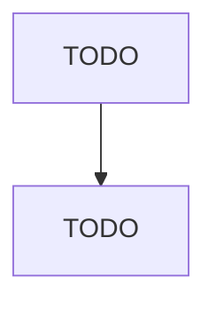

# Other Communications Equipment Manufacturing

> TODO: Business-as-Code definition

## Overview

This industry comprises establishments primarily engaged in manufacturing communications equipment (except telephone apparatus, radio and television broadcast equipment, and wireless communications equipment). Illustrative Examples: Fire detection and alarm systems manufacturing Signals (e.g., highway, pedestrian, railway, traffic) manufacturing Intercom systems and equipment manufacturing Video-based stadium displays manufacturing Cross-References. Establishments primarily engaged in--

## Actors

| Actor | Description |
|-------|-------------|
| TODO | TODO |

## Roles

| Role | Description |
|------|-------------|
| TODO | TODO |

## Entities

| Entity | Description |
|--------|-------------|
| TODO | TODO |

## Actions

| Action | Description |
|--------|-------------|
| TODO | TODO |

## Events

| Event | Description |
|-------|-------------|
| TODO | TODO |

## Searches

| Search | Description |
|--------|-------------|
| TODO | TODO |

## Workflow

## Actor Relationships

