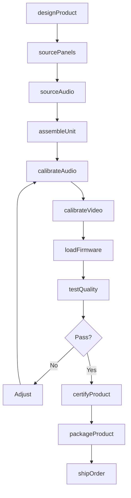
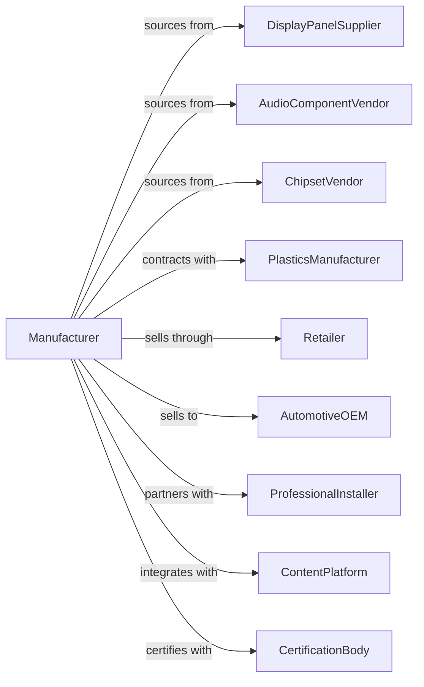

# Audio and Video Equipment Manufacturing

> Business-as-Code definition for audio and video equipment manufacturing. Models the production of televisions, stereo systems, speakers, amplifiers, and home entertainment devices.

## Overview

Audio and video equipment manufacturing produces consumer electronics for home entertainment, automotive audio, and professional sound reinforcement. This includes televisions, digital video recorders, stereo receivers, speaker systems, amplifiers, and video cameras. This definition covers industrial design, acoustic engineering, display technology, and consumer electronics distribution.

## Actors

| Actor | Description |
|-------|-------------|
| DisplayPanelSupplier | Provides LCD, OLED, and LED television panels |
| AudioComponentVendor | Supplies speakers, drivers, and amplifier modules |
| ChipsetVendor | Provides video processing and audio codec chips |
| PlasticsManufacturer | Produces enclosures and speaker cabinets |
| Retailer | Sells to consumers through stores and online |
| AutomotiveOEM | Integrates audio systems into vehicles |
| ProfessionalInstaller | Deploys commercial and venue systems |
| ContentPlatform | Streaming services requiring compatible devices |
| CertificationBody | Tests safety, energy, and emissions compliance |

## Roles

| Role | Description |
|------|-------------|
| IndustrialDesigner | Creates product aesthetics and ergonomics |
| AcousticsEngineer | Designs speaker systems and sound reproduction |
| VideoEngineer | Develops display processing and image quality |
| ElectronicsEngineer | Designs amplifiers and interface circuits |
| FirmwareEngineer | Creates embedded software for smart features |
| QualityEngineer | Ensures reliability and sound/picture quality |
| ProductManager | Defines features for market segments |
| BrandManager | Manages product positioning and marketing |

## Entities

| Entity | Description |
|--------|-------------|
| Television | Display device with video processing and tuner |
| StereoReceiver | Audio amplifier with source selection |
| Speaker | Transducer converting electrical signals to sound |
| Amplifier | Electronics boosting audio signal power |
| Soundbar | Compact speaker system for TV audio |
| VideoRecorder | Device for recording and playing video content |
| VideoCamera | Consumer camcorder for home video capture |
| RemoteControl | Wireless device for operating equipment |
| Firmware | Embedded software enabling smart features |
| Warranty | Consumer protection and service terms |

## Actions

| Action | Description |
|--------|-------------|
| designProduct | Create industrial and electronic designs |
| sourcePanels | Procure display panels and optical components |
| sourceAudio | Procure speakers, drivers, and amplifier modules |
| assembleUnit | Integrate components into finished product |
| calibrateAudio | Tune speaker response and amplifier settings |
| calibrateVideo | Adjust color, contrast, and image processing |
| loadFirmware | Program smart features and streaming apps |
| testQuality | Validate sound and picture performance |
| certifyProduct | Obtain safety and energy certifications |
| packageProduct | Prepare with remote, cables, and documentation |
| shipOrder | Dispatch to retailers or direct customers |
| updateFirmware | Deploy software updates for smart features |

## Events

| Event | Description |
|-------|-------------|
| productDesigned | Design approved for production |
| panelsSourced | Display components received |
| audioSourced | Speaker and amplifier parts received |
| unitAssembled | Product integration completed |
| audioCalibrated | Sound quality optimized |
| videoCalibrated | Picture quality optimized |
| firmwareLoaded | Smart software programmed |
| qualityPassed | Performance tests validated |
| productCertified | Compliance approvals obtained |
| productPackaged | Ready for distribution |
| orderShipped | Products dispatched |
| firmwareUpdated | Field units received software update |

## Searches

| Search | Description |
|--------|-------------|
| findProducts | List equipment by type, size, or features |
| getInventory | Check stock levels by SKU or warehouse |
| getOrders | Retrieve orders by retailer or status |
| findSuppliers | List approved component vendors |
| getQualityMetrics | Retrieve defect and return rates |
| getCertifications | List compliance approvals by market |
| getFirmwareVersions | Track software releases by model |

## Workflow

## Actor Relationships

