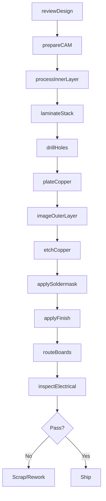
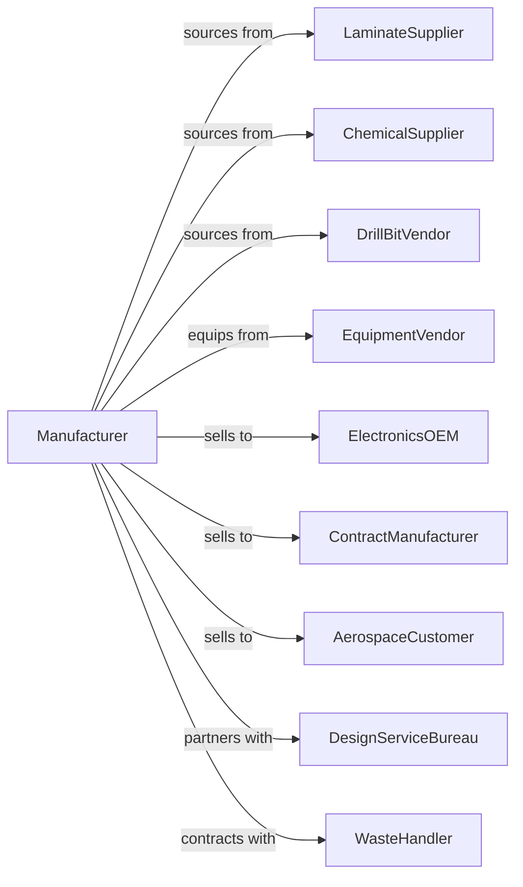

# Bare Printed Circuit Board Manufacturing

> Business-as-Code definition for bare printed circuit board fabrication. Models the production of rigid and flexible PCBs without mounted components.

## Overview

Bare printed circuit board manufacturing produces rigid and flexible boards with copper traces that interconnect electronic components. This definition covers laminate processing, drilling, plating, etching, and quality inspection for single-sided through complex multilayer HDI boards.

## Actors

| Actor | Description |
|-------|-------------|
| LaminateSupplier | Provides copper-clad FR-4, polyimide, and specialty materials |
| ChemicalSupplier | Supplies etchants, plating solutions, and photoresists |
| DrillBitVendor | Provides micro-drills and routing tools |
| EquipmentVendor | Supplies exposure, plating, and inspection systems |
| ElectronicsOEM | Purchases boards for assembly into products |
| ContractManufacturer | Assembles components onto boards for OEMs |
| AerospaceCustomer | Requires high-reliability boards with certifications |
| DesignServiceBureau | Provides PCB layout and engineering services |
| WasteHandler | Manages chemical and metal waste disposal |

## Roles

| Role | Description |
|------|-------------|
| ProcessEngineer | Develops and optimizes fabrication processes |
| CAMEngineer | Prepares design data for manufacturing |
| ChemistryTechnician | Manages plating and etching bath chemistry |
| DrillOperator | Programs and operates drilling machines |
| PlatingOperator | Runs electroless and electrolytic plating lines |
| EtchOperator | Operates inner layer and outer layer etching |
| QualityInspector | Performs AOI and electrical testing |
| ProductionPlanner | Schedules jobs and manages capacity |

## Entities

| Entity | Description |
|--------|-------------|
| Board | Finished PCB with specified layer count and features |
| Laminate | Base material with copper foil layers |
| InnerLayer | Etched copper pattern on internal layers |
| Prepreg | Bonding material between laminate layers |
| DrillFile | CNC data specifying hole locations and sizes |
| PhotoTool | Film or LDI data defining copper patterns |
| Panel | Production panel containing multiple boards |
| Via | Plated hole connecting layers |
| Trace | Copper conductor on board surface |
| Gerber | Industry standard design file format |

## Actions

| Action | Description |
|--------|-------------|
| reviewDesign | Validate customer Gerber files for manufacturability |
| prepareCAM | Generate tooling and optimize panel layout |
| processInnerLayer | Image and etch copper on inner layers |
| laminateStack | Bond inner layers with prepreg under heat and pressure |
| drillHoles | Create vias and mounting holes with CNC |
| plateCopper | Deposit copper in holes and on surface |
| imageOuterLayer | Apply and expose photoresist for outer traces |
| etchCopper | Remove unwanted copper to form traces |
| applySoldermask | Coat board with protective solder resist |
| applyFinish | Apply HASL, ENIG, or other surface finish |
| routeBoards | Separate individual boards from panel |
| inspectElectrical | Test continuity and isolation |

## Events

| Event | Description |
|-------|-------------|
| designReviewed | Gerber files validated for production |
| camPrepared | Tooling and panel layout generated |
| innerLayerProcessed | Internal copper patterns etched |
| stackLaminated | Multilayer stack bonded |
| holesdrilled | Vias and holes created |
| copperPlated | Hole and surface copper deposited |
| outerLayerImaged | Photoresist pattern applied |
| copperEtched | Traces formed on outer layers |
| soldermaskApplied | Protective coating applied |
| finishApplied | Surface finish completed |
| boardsRouted | Panels separated into boards |
| electricalPassed | Continuity testing verified |

## Searches

| Search | Description |
|--------|-------------|
| findJobs | List orders by customer, status, or due date |
| getCapacity | Check production line availability |
| getYield | Calculate defect rates by process step |
| findMaterials | List approved laminates and chemicals |
| getTestResults | Retrieve electrical test data by lot |
| getLeadTime | Estimate delivery for board specifications |
| getCertifications | List quality certifications held |

## Workflow

## Actor Relationships

