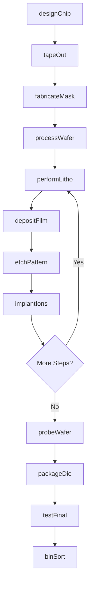
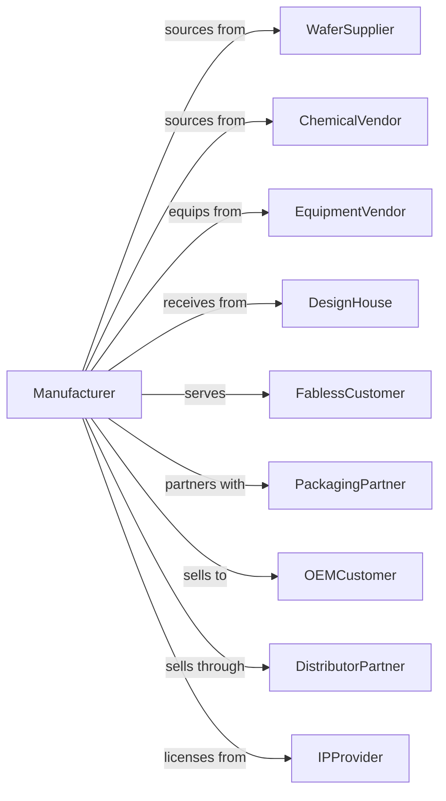

# Semiconductor and Related Device Manufacturing

> Business-as-Code definition for semiconductor fabrication. Models the production of integrated circuits, memory chips, microprocessors, and discrete devices.

## Overview

Semiconductor manufacturing produces integrated circuits, microprocessors, memory chips, diodes, transistors, and optoelectronic devices. This definition covers wafer fabrication in cleanroom environments, photolithography, ion implantation, and rigorous testing for chips powering modern electronics.

## Actors

| Actor | Description |
|-------|-------------|
| WaferSupplier | Provides silicon wafers and substrates |
| ChemicalVendor | Supplies process gases, photoresists, and etchants |
| EquipmentVendor | Sells lithography, deposition, and etch systems |
| DesignHouse | Creates chip designs using EDA tools |
| FablessCustomer | Designs chips manufactured by foundries |
| PackagingPartner | Assembles and packages tested dice |
| OEMCustomer | Purchases chips for electronic products |
| DistributorPartner | Stocks and sells chips to diverse markets |
| IPProvider | Licenses reusable design blocks |

## Roles

| Role | Description |
|------|-------------|
| ProcessEngineer | Develops and maintains fabrication recipes |
| DeviceEngineer | Optimizes transistor and circuit performance |
| YieldEngineer | Analyzes defects and improves manufacturing yield |
| LithographyEngineer | Manages photomask imaging and exposure |
| IntegrationEngineer | Coordinates multi-step process flows |
| TestEngineer | Develops wafer probe and final test programs |
| CleanroomTechnician | Operates equipment in controlled environment |
| EquipmentTechnician | Maintains and repairs fab tools |

## Entities

| Entity | Description |
|--------|-------------|
| Wafer | Silicon substrate for device fabrication |
| Die | Individual chip on wafer before packaging |
| Mask | Photomask defining circuit patterns |
| ProcessRecipe | Parameters for each fabrication step |
| Lot | Batch of wafers processed together |
| Defect | Manufacturing flaw affecting yield |
| Yield | Percentage of good dice per wafer |
| Bin | Test classification for chip performance |
| Package | Protective housing with external leads |
| Datasheet | Electrical specifications for device |

## Actions

| Action | Description |
|--------|-------------|
| designChip | Create circuit layout and verify functionality |
| tapeOut | Release final design to mask fabrication |
| fabricateMask | Produce photomasks from design data |
| processWafer | Execute fabrication steps on silicon wafer |
| performLitho | Pattern photoresist using stepper or scanner |
| depositFilm | Apply thin films via CVD, PVD, or ALD |
| etchPattern | Remove material to form circuit features |
| implantIons | Dope silicon regions with dopant atoms |
| probeWafer | Electrically test dice before packaging |
| packageDie | Assemble die into protective package |
| testFinal | Validate packaged chip performance |
| binSort | Classify chips by speed and power grade |

## Events

| Event | Description |
|-------|-------------|
| chipDesigned | Circuit layout completed and verified |
| tapedOut | Design released to manufacturing |
| maskFabricated | Photomasks produced and qualified |
| waferProcessed | Fabrication steps completed on lot |
| lithoCompleted | Photolithography step finished |
| filmDeposited | Thin film layer applied |
| patternEtched | Circuit features formed |
| ionsImplanted | Doping completed |
| waferProbed | Electrical test data collected |
| diePackaged | Chips assembled into packages |
| finalTestPassed | Performance validated |
| chipsBinned | Grades assigned and inventory updated |

## Searches

| Search | Description |
|--------|-------------|
| findProducts | List chips by type, process node, or application |
| getWaferStatus | Track lots through fabrication |
| getYieldData | Retrieve defect and yield metrics |
| findMasks | List masks by design version |
| getTestResults | Retrieve probe and final test data |
| getInventory | Check chip stock by bin and package |
| getCapacity | View fab loading and availability |

## Workflow

## Actor Relationships

