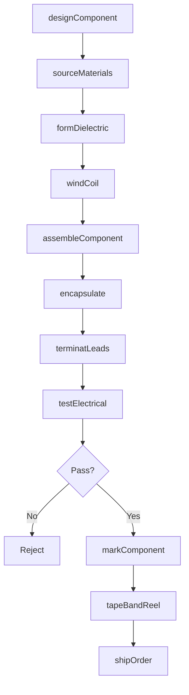
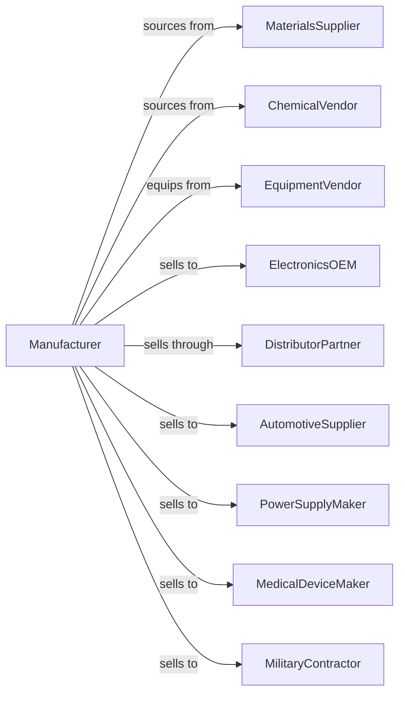

# Capacitor, Resistor, Coil, Transformer, and Other Inductor Manufacturing

> Business-as-Code definition for passive component manufacturing. Models the production of capacitors, resistors, inductors, coils, and transformers.

## Overview

This industry manufactures passive electronic components including capacitors, resistors, inductors, transformers, and ferrite cores. These fundamental building blocks enable power management, signal filtering, and energy storage in virtually all electronic circuits. This definition covers materials processing, winding, assembly, and precision testing.

## Actors

| Actor | Description |
|-------|-------------|
| MaterialsSupplier | Provides ceramics, foils, ferrites, and wire |
| ChemicalVendor | Supplies dielectrics, coatings, and encapsulants |
| EquipmentVendor | Sells winding, assembly, and test machinery |
| ElectronicsOEM | Purchases components for product assembly |
| DistributorPartner | Stocks and distributes components globally |
| AutomotiveSupplier | Integrates components into vehicle electronics |
| PowerSupplyMaker | Uses components in power conversion products |
| MedicalDeviceMaker | Requires high-reliability qualified components |
| MilitaryContractor | Demands components meeting defense specifications |

## Roles

| Role | Description |
|------|-------------|
| MaterialsEngineer | Develops and qualifies dielectric and magnetic materials |
| DesignEngineer | Creates component specifications and models |
| ProcessEngineer | Optimizes manufacturing techniques and yields |
| WindingOperator | Operates coil and transformer winding equipment |
| AssemblyTechnician | Performs component assembly and encapsulation |
| TestTechnician | Measures electrical characteristics |
| QualityEngineer | Ensures specifications and reliability |
| ApplicationsEngineer | Supports customers with component selection |

## Entities

| Entity | Description |
|--------|-------------|
| Capacitor | Component storing electrical charge |
| Resistor | Component limiting current flow |
| Inductor | Component storing energy in magnetic field |
| Transformer | Component transferring energy between circuits |
| Coil | Wound wire creating inductance |
| FerriteCores | Magnetic material for inductors and transformers |
| Dielectric | Insulating material in capacitors |
| Specification | Electrical and mechanical requirements |
| Lot | Production batch for traceability |
| TestData | Measured electrical parameters |

## Actions

| Action | Description |
|--------|-------------|
| designComponent | Create specifications for component values and ratings |
| sourceMaterials | Procure ceramics, foils, wire, and ferrites |
| formDielectric | Process ceramic or film dielectric materials |
| windCoil | Wind wire onto cores or bobbins |
| assembleComponent | Combine elements into finished component |
| encapsulate | Apply protective coating or molding |
| terminatLeads | Attach and form component terminals |
| testElectrical | Measure capacitance, resistance, or inductance |
| markComponent | Apply value and date code markings |
| tapeBandReel | Package in tape and reel for pick and place |
| shipOrder | Dispatch components to customers |
| qualifyReliability | Conduct life testing for critical applications |

## Events

| Event | Description |
|-------|-------------|
| componentDesigned | Specification created and approved |
| materialsSourced | Raw materials received and inspected |
| dielectricFormed | Ceramic or film processed |
| coilWound | Winding operation completed |
| componentAssembled | Elements combined into component |
| componentEncapsulated | Protective coating applied |
| leadsTerminated | Terminals attached |
| electricalTested | Parameters measured and recorded |
| componentMarked | Identification applied |
| componentPackaged | Tape and reel completed |
| orderShipped | Products dispatched |
| reliabilityQualified | Life testing passed |

## Searches

| Search | Description |
|--------|-------------|
| findComponents | List components by type, value, or package |
| getInventory | Check stock levels by part number |
| getOrders | Retrieve orders by customer or status |
| getTestData | Retrieve electrical measurements by lot |
| findMaterials | List approved raw material suppliers |
| getQualifications | Retrieve reliability test reports |
| getCapacity | Check production line availability |

## Workflow

## Actor Relationships

