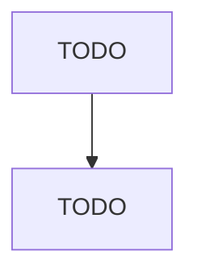

# Capacitor, Resistor, Coil, Transformer, and Other Inductor Manufacturing

> TODO: Business-as-Code definition

## Overview

This U.S. industry comprises establishments primarily engaged in one or more of the following: (1) manufacturing electronic fixed and variable capacitors and condensers; (2) manufacturing electronic resistors, such as fixed and variable resistors, resistor networks, thermistors, and varistors; and (3) manufacturing electronic inductors, such as coils and transformers. Cross-References. Establishments primarily engaged in--

## Actors

| Actor | Description |
|-------|-------------|
| TODO | TODO |

## Roles

| Role | Description |
|------|-------------|
| TODO | TODO |

## Entities

| Entity | Description |
|--------|-------------|
| TODO | TODO |

## Actions

| Action | Description |
|--------|-------------|
| TODO | TODO |

## Events

| Event | Description |
|-------|-------------|
| TODO | TODO |

## Searches

| Search | Description |
|--------|-------------|
| TODO | TODO |

## Workflow

## Actor Relationships

