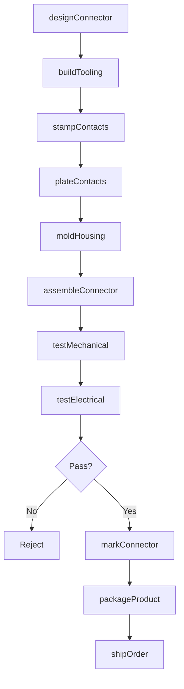
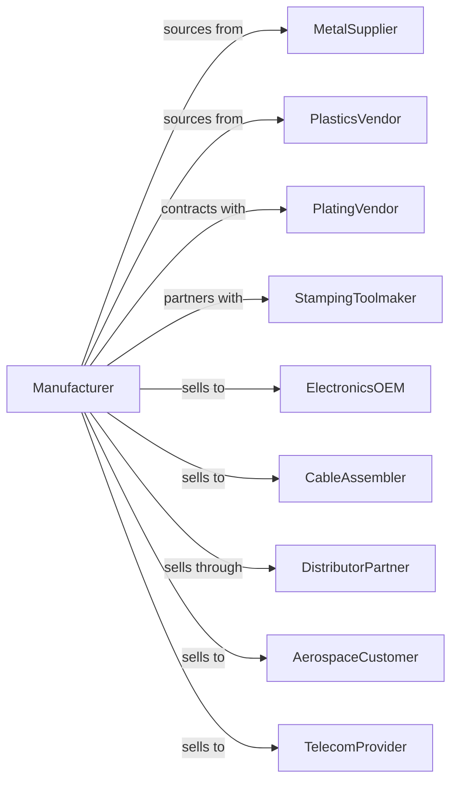

# Electronic Connector Manufacturing

> Business-as-Code definition for electronic connector manufacturing. Models the production of coaxial, cylindrical, PCB, fiber optic, and other interconnect solutions.

## Overview

Electronic connector manufacturing produces interconnection devices including coaxial connectors, D-sub connectors, board-to-board connectors, wire-to-board headers, and fiber optic interfaces. This definition covers precision stamping, plating, molding, and assembly for reliable electrical and optical connections.

## Actors

| Actor | Description |
|-------|-------------|
| MetalSupplier | Provides copper, phosphor bronze, and precious metals |
| PlasticsVendor | Supplies engineering thermoplastics for housings |
| PlatingVendor | Provides gold, tin, and nickel plating services |
| StampingToolmaker | Manufactures precision stamping dies |
| ElectronicsOEM | Purchases connectors for product assembly |
| CableAssembler | Terminates connectors onto cables |
| DistributorPartner | Stocks and distributes connector inventory |
| AerospaceCustomer | Requires MIL-spec qualified connectors |
| TelecomProvider | Deploys fiber optic and RF connectors |

## Roles

| Role | Description |
|------|-------------|
| ConnectorEngineer | Designs contact geometry and housing |
| ToolingEngineer | Creates stamping and molding tooling |
| PlatingEngineer | Develops contact plating specifications |
| StampingOperator | Runs high-speed progressive dies |
| MoldingOperator | Operates injection molding equipment |
| AssemblyTechnician | Combines contacts and housings |
| QualityEngineer | Validates mechanical and electrical performance |
| ApplicationsEngineer | Supports customer design-in activities |

## Entities

| Entity | Description |
|--------|-------------|
| Connector | Complete interconnect assembly |
| Contact | Metal element making electrical connection |
| Housing | Insulating body holding contacts |
| Terminal | Wire termination point on connector |
| Plating | Surface finish on contacts for reliability |
| StampingDie | Tool for forming metal contacts |
| MoldTool | Tool for producing plastic housings |
| Specification | Mechanical and electrical requirements |
| MatingCycles | Number of insertions connector can withstand |
| ContactResistance | Electrical resistance of connection |

## Actions

| Action | Description |
|--------|-------------|
| designConnector | Create contact and housing specifications |
| buildTooling | Manufacture stamping dies and mold tools |
| stampContacts | Form metal contacts using progressive dies |
| plateContacts | Apply gold, tin, or other finish to contacts |
| moldHousing | Produce plastic insulators and shells |
| assembleConnector | Insert contacts into housings |
| testMechanical | Validate insertion force and retention |
| testElectrical | Measure contact resistance and isolation |
| markConnector | Apply part numbers and orientation marks |
| packageProduct | Prepare connectors for shipment |
| shipOrder | Dispatch to customers or distributors |
| qualifyReliability | Conduct environmental and life testing |

## Events

| Event | Description |
|-------|-------------|
| connectorDesigned | Design specifications approved |
| toolingBuilt | Dies and molds completed |
| contactsStamped | Metal contacts formed |
| contactsPlated | Surface finish applied |
| housingMolded | Plastic parts produced |
| connectorAssembled | Complete product built |
| mechanicalTested | Insertion and retention validated |
| electricalTested | Resistance and isolation verified |
| connectorMarked | Identification applied |
| productPackaged | Ready for shipment |
| orderShipped | Products dispatched |
| reliabilityQualified | Environmental testing passed |

## Searches

| Search | Description |
|--------|-------------|
| findConnectors | List connectors by type, pitch, or pin count |
| getInventory | Check stock levels by part number |
| getOrders | Retrieve orders by customer or status |
| getTestData | Retrieve mechanical and electrical test results |
| findTooling | List available dies and molds |
| getQualifications | Retrieve reliability test reports |
| getLeadTime | Estimate delivery for custom connectors |

## Workflow

## Actor Relationships

