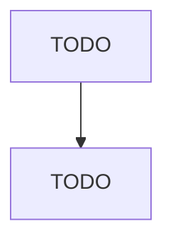

# Printed Circuit Assembly (Electronic Assembly) Manufacturing

> TODO: Business-as-Code definition

## Overview

This U.S. industry comprises establishments primarily engaged in loading components onto printed circuit boards or who manufacture and ship loaded printed circuit boards. Also known as printed circuit assemblies, electronics assemblies, or modules, these products are printed circuit boards that have some or all of the semiconductor and electronic components inserted or mounted and are inputs to a wide variety of electronic systems and devices. Cross-References. Establishments primarily engaged i

## Actors

| Actor | Description |
|-------|-------------|
| TODO | TODO |

## Roles

| Role | Description |
|------|-------------|
| TODO | TODO |

## Entities

| Entity | Description |
|--------|-------------|
| TODO | TODO |

## Actions

| Action | Description |
|--------|-------------|
| TODO | TODO |

## Events

| Event | Description |
|-------|-------------|
| TODO | TODO |

## Searches

| Search | Description |
|--------|-------------|
| TODO | TODO |

## Workflow

## Actor Relationships

