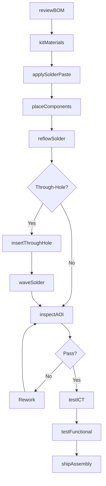
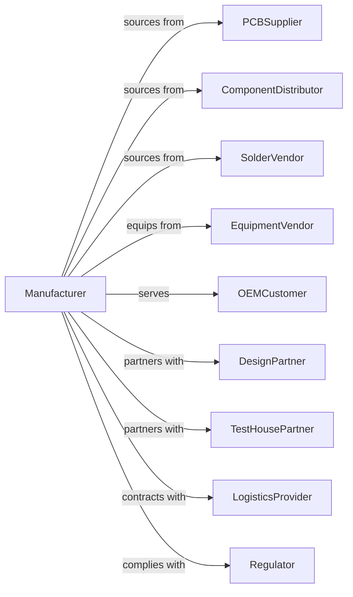

# Printed Circuit Assembly (Electronic Assembly) Manufacturing

> Business-as-Code definition for printed circuit assembly manufacturing. Models the loading of electronic components onto PCBs to create functional assemblies and modules.

## Overview

Printed circuit assembly manufacturing involves mounting semiconductors and electronic components onto bare printed circuit boards using surface mount technology (SMT) and through-hole processes. This definition covers solder paste application, pick-and-place, reflow, wave soldering, inspection, and functional testing for electronics contract manufacturing.

## Actors

| Actor | Description |
|-------|-------------|
| PCBSupplier | Provides bare printed circuit boards |
| ComponentDistributor | Supplies semiconductors and passive components |
| SolderVendor | Provides solder paste, bar solder, and flux |
| EquipmentVendor | Sells SMT lines, ovens, and inspection systems |
| OEMCustomer | Contracts for assembly of designed products |
| DesignPartner | Provides engineering and DFM support |
| TestHousePartner | Offers specialized testing services |
| LogisticsProvider | Handles component kitting and fulfillment |
| Regulator | Enforces RoHS and environmental compliance |

## Roles

| Role | Description |
|------|-------------|
| ProcessEngineer | Develops and maintains assembly processes |
| SMTOperator | Operates pick-and-place and reflow equipment |
| ThroughHoleOperator | Performs manual insertion and wave soldering |
| AOIOperator | Runs automated optical inspection systems |
| TestTechnician | Executes in-circuit and functional testing |
| QualityEngineer | Ensures workmanship and reliability standards |
| MaterialsCoordinator | Manages component kitting and inventory |
| ProgramManager | Coordinates customer projects and timelines |

## Entities

| Entity | Description |
|--------|-------------|
| PCBA | Printed circuit board assembly with components |
| BillOfMaterials | List of components for assembly |
| SolderPaste | Flux and solder alloy for SMT attachment |
| Stencil | Mask for applying solder paste to pads |
| PickAndPlace | Machine placing components on boards |
| ReflowOven | Equipment melting solder for SMT joints |
| WaveSolder | Equipment for through-hole soldering |
| AOIResult | Automated optical inspection data |
| TestFixture | Equipment for functional verification |
| WorkOrder | Production order with quantity and schedule |

## Actions

| Action | Description |
|--------|-------------|
| reviewBOM | Validate bill of materials for manufacturability |
| kitMaterials | Gather components and boards for production |
| applySolderPaste | Screen print paste onto PCB pads |
| placeComponents | Mount parts using pick-and-place machines |
| reflowSolder | Melt paste in reflow oven to form joints |
| insertThroughHole | Place leaded components manually or automated |
| waveSolder | Solder through-hole components |
| inspectAOI | Run automated optical inspection |
| inspectXray | Examine hidden joints with X-ray |
| testICT | Perform in-circuit testing for shorts and opens |
| testFunctional | Validate assembly operation and performance |
| shipAssembly | Dispatch completed boards to customer |

## Events

| Event | Description |
|-------|-------------|
| bomReviewed | Materials validated for production |
| materialsKitted | Components gathered for work order |
| solderPasteApplied | Paste printed onto pads |
| componentsPlaced | Parts mounted on board |
| solderReflowed | SMT joints formed |
| throughHoleInserted | Leaded components placed |
| waveSoldered | Through-hole joints completed |
| aoiPassed | Optical inspection approved |
| xrayPassed | Hidden joints verified |
| ictPassed | In-circuit test successful |
| functionalPassed | Assembly operates correctly |
| assemblyShipped | Products dispatched to customer |

## Searches

| Search | Description |
|--------|-------------|
| findWorkOrders | List jobs by customer, status, or due date |
| getInventory | Check component stock levels |
| getYield | Calculate defect rates by product or line |
| findSuppliers | List approved component sources |
| getTestResults | Retrieve ICT and functional test data |
| getCapacity | View SMT line loading and availability |
| getShipments | Track outbound deliveries |

## Workflow

## Actor Relationships

