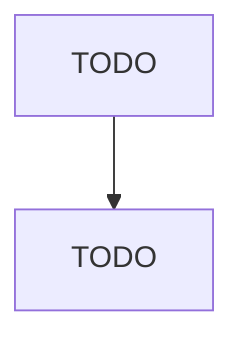

# Other Electronic Component Manufacturing

> TODO: Business-as-Code definition

## Overview

This U.S. industry comprises establishments primarily engaged in manufacturing electronic components (except bare printed circuit boards; semiconductors and related devices; electronic capacitors; electronic resistors; coils, transformers, and other inductors; connectors; and loaded printed circuit boards). Illustrative Examples: Crystals and crystal assemblies, electronic, manufacturing Electron tubes manufacturing LCD (liquid crystal display) unit screens manufacturing Microwave components man

## Actors

| Actor | Description |
|-------|-------------|
| TODO | TODO |

## Roles

| Role | Description |
|------|-------------|
| TODO | TODO |

## Entities

| Entity | Description |
|--------|-------------|
| TODO | TODO |

## Actions

| Action | Description |
|--------|-------------|
| TODO | TODO |

## Events

| Event | Description |
|-------|-------------|
| TODO | TODO |

## Searches

| Search | Description |
|--------|-------------|
| TODO | TODO |

## Workflow

## Actor Relationships

