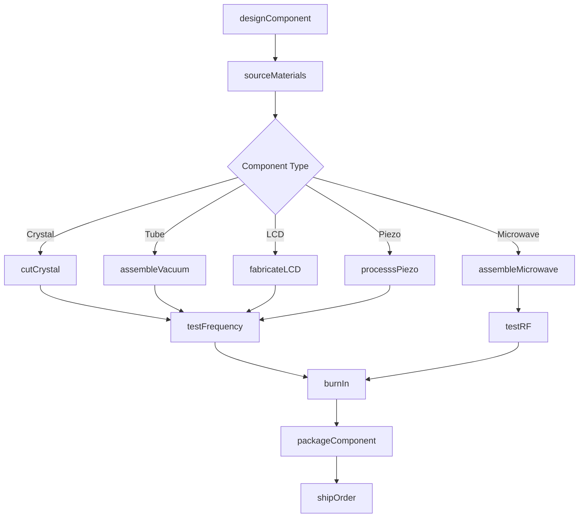
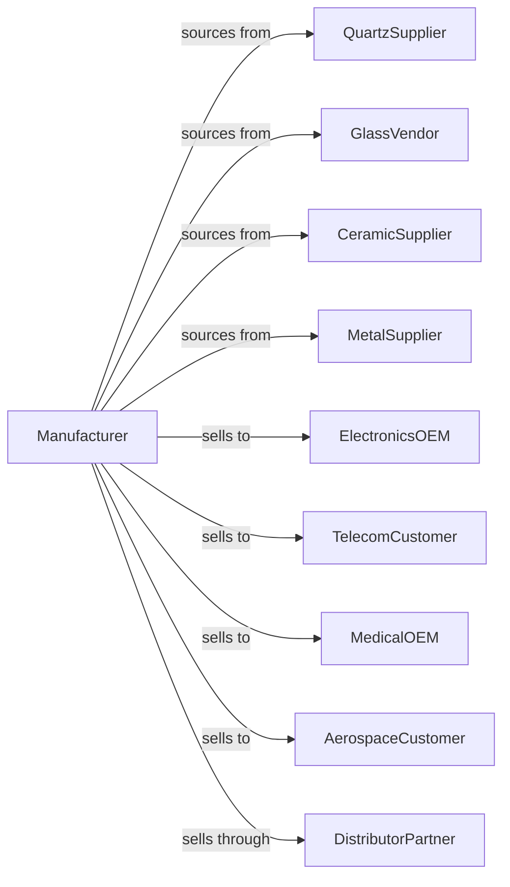

# Other Electronic Component Manufacturing

> Business-as-Code definition for specialized electronic component manufacturing. Models the production of crystals, electron tubes, LCD screens, microwave components, and piezoelectric devices.

## Overview

This industry manufactures electronic components not classified elsewhere, including quartz crystals, electron tubes, LCD unit screens, microwave components, piezoelectric devices, and transducers. This definition covers precision machining, vacuum processing, and specialized assembly for niche electronic applications.

## Actors

| Actor | Description |
|-------|-------------|
| QuartzSupplier | Provides raw quartz crystals and blanks |
| GlassVendor | Supplies specialty glass for tubes and displays |
| CeramicSupplier | Provides piezoelectric ceramics and substrates |
| MetalSupplier | Supplies precision metal parts and electrodes |
| ElectronicsOEM | Purchases components for integration |
| TelecomCustomer | Requires crystals and microwave components |
| MedicalOEM | Uses transducers and piezoelectric devices |
| AerospaceCustomer | Demands high-reliability specialty components |
| DistributorPartner | Stocks and distributes components |

## Roles

| Role | Description |
|------|-------------|
| CrystalEngineer | Designs frequency control and timing devices |
| VacuumEngineer | Develops electron tube processes |
| DisplayEngineer | Creates LCD panel designs |
| MicrowaveEngineer | Designs RF and microwave components |
| ProcessEngineer | Optimizes manufacturing techniques |
| AssemblyTechnician | Performs precision component assembly |
| TestEngineer | Validates electrical performance |
| QualityEngineer | Ensures specifications and reliability |

## Entities

| Entity | Description |
|--------|-------------|
| Crystal | Quartz resonator for frequency control |
| ElectronTube | Vacuum device for amplification or display |
| LCDScreen | Liquid crystal display module |
| MicrowaveComponent | RF filter, coupler, or waveguide device |
| PiezoelectricDevice | Component converting mechanical to electrical energy |
| Transducer | Device converting one energy form to another |
| Oscillator | Crystal-based frequency source |
| Filter | Frequency-selective component |
| Resonator | Component defining resonant frequency |
| Specification | Performance and environmental requirements |

## Actions

| Action | Description |
|--------|-------------|
| designComponent | Create specifications for specialized device |
| sourceMaterials | Procure quartz, glass, ceramics, and metals |
| cutCrystal | Machine quartz blanks to frequency specification |
| assembleVacuum | Build electron tubes with vacuum sealing |
| fabricateLCD | Process liquid crystal layers and drivers |
| assembleMicrowave | Build RF filters and waveguide components |
| processsPiezo | Form and polarize piezoelectric elements |
| testFrequency | Measure resonant frequency and stability |
| testRF | Validate microwave performance parameters |
| burnIn | Age components to ensure stability |
| packageComponent | Seal and prepare for shipment |
| shipOrder | Dispatch components to customers |

## Events

| Event | Description |
|-------|-------------|
| componentDesigned | Specifications approved |
| materialsSourced | Raw materials received |
| crystalCut | Quartz machined to specification |
| vacuumAssembled | Electron tube sealed |
| lcdFabricated | Display module completed |
| microwaveAssembled | RF component built |
| piezoProcessed | Piezoelectric element formed |
| frequencyTested | Resonance validated |
| rfTested | Microwave parameters verified |
| burnInCompleted | Aging stabilization finished |
| componentPackaged | Ready for shipment |
| orderShipped | Products dispatched |

## Searches

| Search | Description |
|--------|-------------|
| findComponents | List devices by type or specification |
| getInventory | Check stock levels by part number |
| getOrders | Retrieve orders by customer or status |
| getTestData | Retrieve frequency or RF test results |
| findMaterials | List approved raw material suppliers |
| getQualifications | Retrieve reliability data |
| getLeadTime | Estimate delivery for custom components |

## Workflow

## Actor Relationships

