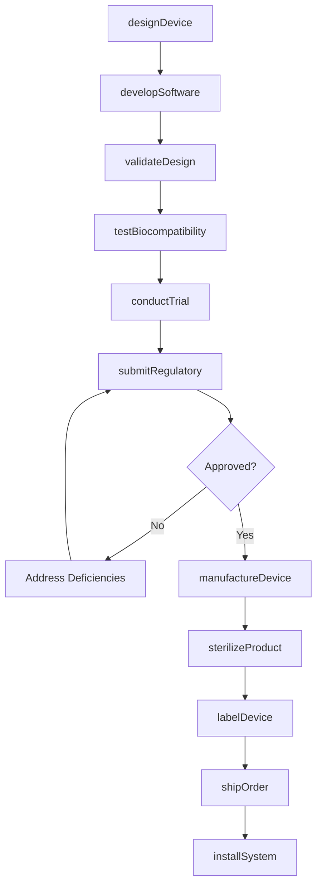
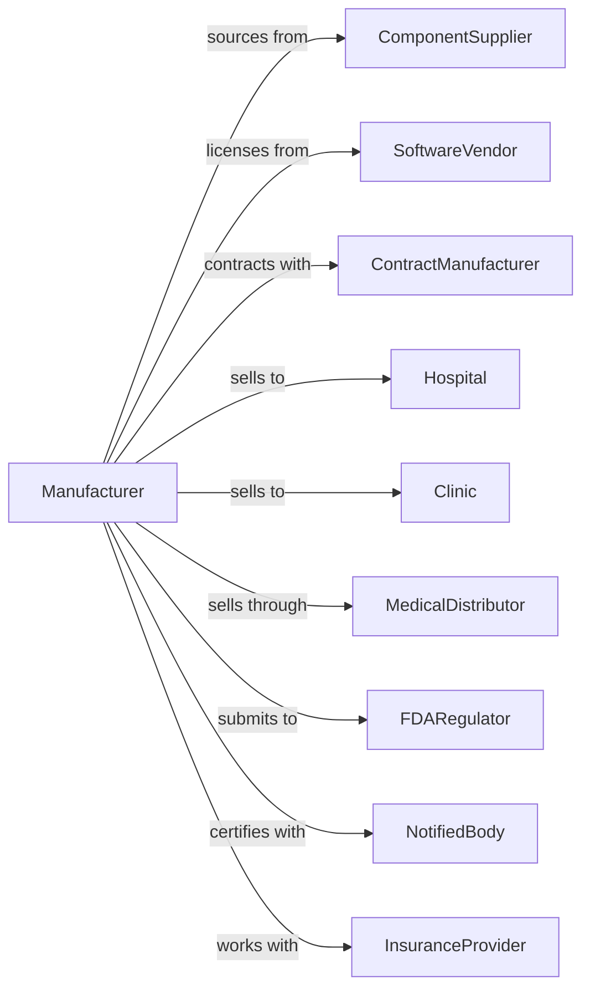

# Electromedical and Electrotherapeutic Apparatus Manufacturing

> Business-as-Code definition for electromedical device manufacturing. Models the production of MRI systems, ultrasound equipment, pacemakers, hearing aids, and diagnostic instruments.

## Overview

Electromedical manufacturing produces diagnostic and therapeutic medical devices including MRI scanners, ultrasound systems, pacemakers, defibrillators, hearing aids, and electrocardiographs. This definition covers product development under FDA regulations, clinical validation, and quality management systems required for medical device manufacturing.

## Actors

| Actor | Description |
|-------|-------------|
| ComponentSupplier | Provides sensors, transducers, and electronic parts |
| SoftwareVendor | Supplies medical imaging and diagnostic software |
| ContractManufacturer | Provides specialized assembly services |
| Hospital | Purchases and deploys diagnostic equipment |
| Clinic | Acquires therapeutic and monitoring devices |
| MedicalDistributor | Channels products to healthcare facilities |
| FDARegulator | Approves devices and enforces quality standards |
| NotifiedBody | Provides CE marking for international markets |
| InsuranceProvider | Influences reimbursement and adoption |

## Roles

| Role | Description |
|------|-------------|
| BiomedicalEngineer | Designs medical device systems |
| SoftwareEngineer | Develops device firmware and applications |
| RegulatorySpecialist | Manages FDA submissions and compliance |
| QualityEngineer | Maintains ISO 13485 quality systems |
| ClinicalEngineer | Conducts trials and validates clinical efficacy |
| ManufacturingEngineer | Develops production processes for medical devices |
| ServiceEngineer | Provides installation and maintenance support |
| ProductManager | Manages product lifecycle and clinical requirements |

## Entities

| Entity | Description |
|--------|-------------|
| MedicalDevice | Complete diagnostic or therapeutic apparatus |
| ImagingSystem | MRI, CT, ultrasound, or X-ray equipment |
| ImplantableDevice | Pacemaker, defibrillator, or neurostimulator |
| DiagnosticInstrument | ECG, EEG, or patient monitor |
| HearingAid | Amplification device for hearing impairment |
| Software | Device operating system and clinical applications |
| ClinicalData | Trial results supporting device efficacy |
| Submission | FDA 510(k), PMA, or CE technical file |
| DeviceHistory | Complete manufacturing record for traceability |
| ServiceContract | Maintenance and support agreement |

## Actions

| Action | Description |
|--------|-------------|
| designDevice | Create medical device specifications and architecture |
| developSoftware | Build firmware and clinical applications |
| validateDesign | Verify device meets clinical requirements |
| submitRegulatory | File FDA 510(k), PMA, or CE marking application |
| manufactureDevice | Produce devices under quality management system |
| sterilizeProduct | Process devices requiring sterile packaging |
| testBiocompatibility | Validate materials for patient contact |
| conductTrial | Execute clinical study for device validation |
| labelDevice | Apply UDI and regulatory labeling |
| shipOrder | Dispatch devices to healthcare customers |
| installSystem | Deploy and configure equipment at facility |
| serviceDevice | Perform maintenance and calibration |

## Events

| Event | Description |
|-------|-------------|
| deviceDesigned | Specifications approved for development |
| softwareDeveloped | Firmware and applications completed |
| designValidated | Device meets clinical requirements |
| regulatoryApproved | FDA clearance or CE marking obtained |
| deviceManufactured | Production completed under QMS |
| productSterilized | Sterile processing completed |
| biocompatibilityPassed | Material testing validated |
| trialCompleted | Clinical study finished |
| deviceLabeled | UDI and labeling applied |
| orderShipped | Products dispatched to customer |
| systemInstalled | Equipment deployed and operational |
| deviceServiced | Maintenance completed |

## Searches

| Search | Description |
|--------|-------------|
| findDevices | List products by type, indication, or regulatory status |
| getSubmissions | Retrieve FDA or CE submissions by status |
| getTrialData | Access clinical study results |
| getDeviceHistory | Retrieve manufacturing records by serial number |
| findComplaints | Review adverse events and customer complaints |
| getServiceRecords | Track maintenance history by device |
| getInventory | Check stock levels by product |

## Workflow

## Actor Relationships

